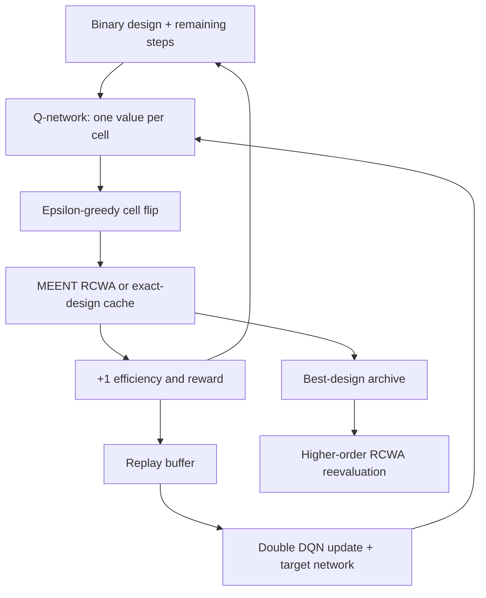

# DQN–MEENT inverse design

A runnable, modern reconstruction of the **DQN-centered optimization loop** in Seo et al., *Structural Optimization of a One-Dimensional Freeform Metagrating Deflector via Deep Reinforcement Learning*, ACS Photonics 9, 452–458 (2022). This package uses **real MEENT RCWA evaluations** and PyTorch Double DQN. It is a starting framework, not a claim of matching the paper's optimization performance.

## Start here

Linux, Python 3.12 or 3.13, and [uv](https://docs.astral.sh/uv/) are required. From this directory:

```bash
uv sync --frozen --extra dev
uv run dqn-meent train --config configs/smoke.json --output runs/smoke
uv run dqn-meent evaluate --run runs/smoke --orders 5 15 25 40
uv run dqn-meent design --run runs/smoke --output runs/smoke/design.png
uv run pytest -q
```

The lock file pins the environment. PyTorch's default Linux distribution can download several GB of CUDA dependencies even when using CPU. A GPU is **not required**. This setup uses NumPy/complex128 for MEENT and CPU PyTorch by default; `training.device="cuda"` moves only the Q-network, not the optical solver. Small Q-networks and 1D RCWA are often suitable for CPU. The CLI limits BLAS to one thread; training likewise defaults to one PyTorch thread.

The included configurations serve different purposes:

| Config | Cells | RCWA truncation F / harmonics | Interactions | Purpose |
|---|---:|---:|---:|---|
| `smoke.json` | 16 | 5 / 11 | 256 | Verify installation, replay updates, checkpoints and evaluation |
| `starter.json` | 64 | 15 / 31 | 10,000 | Explore training at moderate cost; reevaluate at higher F |
| `validation64.json` | 64 | 40 / 81 | 4,096 | Short full-geometry run executed for this delivery |
| `paper_geometry.json` | 64 | 40 / 81 | 200,000 | Larger experiment retaining the paper's geometry; still a modified learning algorithm/budget |

None is a promise that its interaction count is enough to learn a competitive design. F is the **maximum Fourier order**, not the total number of retained harmonics. The number of binary design cells and the RCWA basis size are independent.

## What the agent controls

The default device has a 325 nm patterned silicon layer, 64 binary cells per period, and normally incident TM light from a glass half-space (`n=1.45`). Light exits into air (`n=1`). At wavelength 1100 nm and target angle 50°, the period is `1100/sin(50°)` nm. The objective is **absolute transmitted power in diffraction order +1, divided by incident power**; it is not the fraction of total transmitted power.

The default real silicon index, 3.551726470588235, comes from interpolation of the authors' material table at 1100 nm. Their released simulator discards absorption. Changing wavelength requires supplying the corresponding index too; documented values for 900 and 1000 nm appear in `docs/paper-mapping.md`. Alternatively select `physics.material="meent_green"` for the wavelength-dependent complex Green-2008 table included with MEENT. That is a different material model and includes absorption.

| Component | Implementation |
|---|---|
| Design/state | Binary Si/air array; network receives ±1 cells plus remaining episode fraction |
| Action | Choose a cell and flip its material; repeated flips are legal |
| Initial design | All silicon, at each episode reset |
| Forward model | MEENT 0.13.2, NumPy complex128, continuous integration of piecewise-constant cells, TM |
| Reward | `eta(next)^3`, matching the article's reward |
| Episode | 128 actions for the 64-cell configuration; clock is observed; terminal transition does not bootstrap |
| Agent | MLP 128–128 with ReLU, epsilon-greedy actions, replay, Double DQN, target network, Huber loss, Adam, gradient clipping |
| Output | Best design encountered during search, final policy, full checkpoint, CSV metrics, high-order evaluation |



DQN does not differentiate through RCWA. Only the Q-network's regression loss is differentiated; each discrete design is evaluated by the forward solver. This avoids requiring eigenvalue gradients but does not remove forward-solver accuracy requirements.

The default reward favors repeated occupancy of high-efficiency states; it does **not** optimize only final-state efficiency or the best state seen. We therefore preserve the best discovered design separately and evaluate the final greedy policy separately. The optional `training.reward_mode="difference"`, with `gamma=1`, makes the episode return telescope to final efficiency minus initial efficiency. It changes the objective and is not the paper's reward.

The observed clock and terminal treatment intentionally differ from the original released code, which bootstraps across episode cutoffs. Double DQN is also a deliberate change. See `docs/paper-mapping.md` for the full correspondence and original hyperparameters.

## Run an experiment and compare searches

```bash
uv run dqn-meent train --config configs/starter.json --output runs/dqn-s0 --seed 0
uv run dqn-meent baseline --config configs/starter.json --output runs/random-s0 --method random --budget 10000 --seed 0
uv run dqn-meent baseline --config configs/starter.json --output runs/hillclimb-s0 --method hillclimb --budget 10000 --seed 0
uv run dqn-meent evaluate --run runs/dqn-s0 --orders 15 25 40 60
uv run dqn-meent evaluate --run runs/random-s0 --orders 15 25 40 60
uv run dqn-meent evaluate --run runs/hillclimb-s0 --orders 15 25 40 60
uv run dqn-meent plot --runs runs/dqn-s0 runs/random-s0 runs/hillclimb-s0 --output runs/comparison.png
```

Random search generates independent uniform binary designs after the initial all-Si design. Hill climbing proposes a random single-cell change and restarts after `2*N` rejected moves; it is not the article's exhaustive depth-1/depth-2 greedy baseline. Use several seeds for each algorithm before making comparative claims. Train a separate model for each wavelength/angle; this initial framework does not claim cross-condition generalization.

A DQN training budget counts actions. Baseline budgets count evaluation requests, including the initial design. DQN also evaluates the initial design on each episode reset; after the first reset these normally hit the cache. The CSV logs both actual RCWA calls and cache hits, so compare actual solver calls and wall time as well as action count. Baseline and training each have separate caches. Higher-order evaluation uses fresh solvers and is a separate validation expense.

**Always reevaluate the discovered geometry.** Training-order conservation of energy does not demonstrate Fourier convergence. `evaluate` reports each order, all transmitted/reflected diffraction efficiencies, and the last-two-order difference. Its 0.005 default tolerance is 0.5 percentage points; passing that one diagnostic is not a proof of convergence. For publication, increase orders further, examine more than one geometry, and compare with an independent solver.

## Outputs and resume

A training run produces:

- `config.json`: exact resolved physics and learning configuration.
- `metrics.csv`: per-action efficiency, best-so-far efficiency, reward, exploration, loss, solver calls, cache hits and wall time.
- `best_design.npy` and `best_design.json`: the best encountered geometry (0 = air, 1 = silicon).
- `checkpoint.pt`: online/target networks, optimizer, replay and resumable state.
- `summary.json`: final run counts and timing.
- `evaluation.json` after evaluation: high-order best-design results and a separate greedy-policy rollout.

To resume an **interrupted run with the same configuration and original total-step schedule**:

```bash
uv run dqn-meent train --config configs/starter.json --output runs/dqn-s0 --seed 0 --resume runs/dqn-s0/checkpoint.pt
```

Do not modify the step count to extend a completed checkpoint: that changes the exploration schedule. Start a new run for a new experimental budget. Checkpoints contain Python/PyTorch objects; load only checkpoints you trust. New runs reject nonempty output directories to protect existing results.

## Code map

- `src/dqn_meent/config.py`: validated experiment configuration.
- `physics.py`: MEENT adapter, material resolution, physical checks and bounded LRU cache.
- `environment.py`: binary design MDP and Gymnasium interface.
- `dqn.py`: Q-network, replay, action selection and Double DQN targets.
- `training.py`: experiment loop, logging and checkpoint/resume.
- `experiments.py`: baselines, high-order evaluation and plots.
- `tests/`: Fresnel/energy/symmetry/material checks, environment semantics, Bellman targets and restart behavior.
- `docs/paper2agent-assessment.md`: the actual Paper2Agent attempt and its limits.
- `docs/validation.md`: measured results and remaining limitations for this delivered setup.

## Paper2Agent and source provenance

[Paper2Agent](https://github.com/jmiao24/Paper2Agent) was actually run on the requested PDF: preparation, seven-page extraction, and review-aid generation succeeded. The extraction was not promoted to a fully reviewed reading skill. Its paper-ingestion tooling helped; the scientific training framework was implemented directly around MEENT. This delivery does not require an LLM service or MCP server during numerical training.

Sources: [paper](https://www.janglab.org/documents/publications/2022ACSPhotonics.pdf), [authors' code](https://github.com/dongjin-seo2020/1DFreeFormDQN), [MEENT](https://github.com/kc-ml2/meent), [Double DQN](https://arxiv.org/abs/1509.06461), [Gymnasium termination semantics](https://gymnasium.farama.org/tutorials/gymnasium_basics/handling_time_limits/).

The published reference design in `tests/fixtures/` comes from the authors' MIT-licensed repository; its license and source attribution accompany it. A reference-design agreement validates the solver mapping, not the success of a newly trained agent. The article PDF and third-party repositories are not redistributed in this package.
