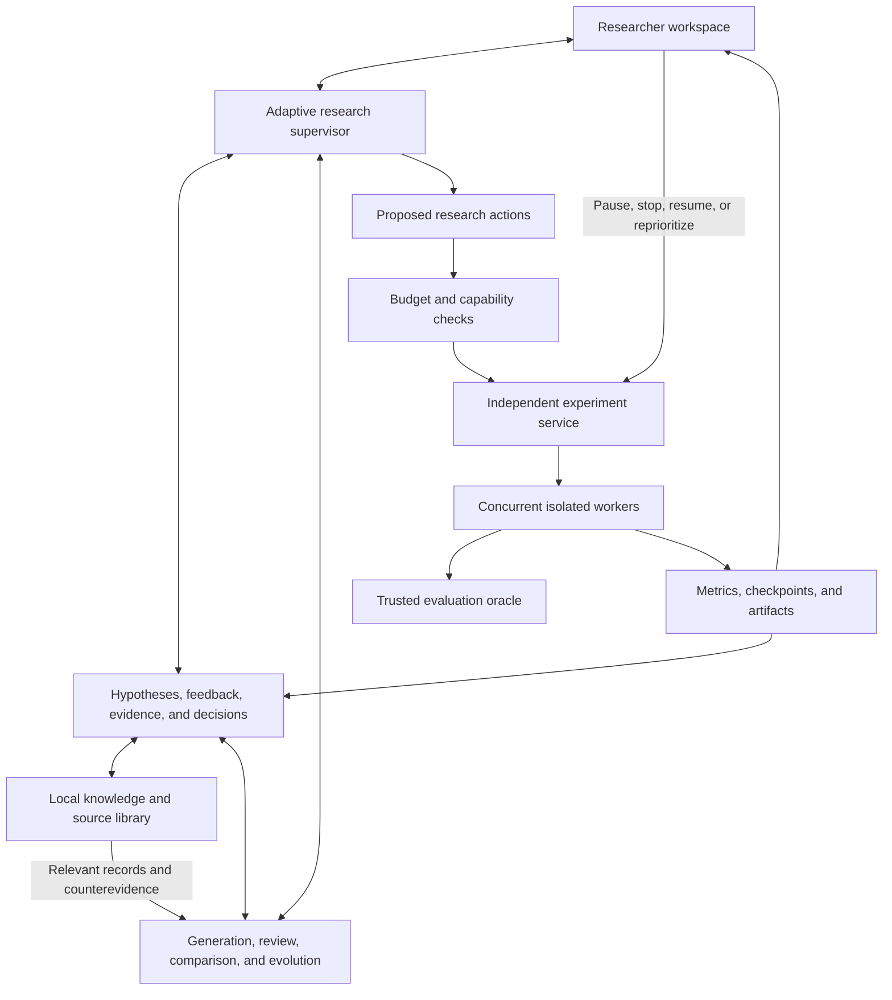

# Researcher-guided algorithm discovery for 1D grating design

Plan revision: 2026-09-23. This revision adds researcher-guided idea regeneration, explanatory finalist assessments, and persistent knowledge shared across related local research workspaces. These additions are planned features; their delivery status is recorded separately in [implementation status](implementation-status.md).

## 1. Purpose and operating principles

Build an interactive research workspace that helps a researcher discover, understand, and improve optimization strategies for 1D grating inverse design. The primary outcome is the quality of the **researcher–system partnership**: better solutions, better experimental decisions, and useful explanations at an acceptable combined cost.

The system should propose original approaches, expose disagreements, run selected experiments, and make it easy for the researcher to redirect the work. Algorithm selection remains revisable as evidence and scientific priorities change.

Initial scope:

- Run a local pilot with multiple concurrent experiments.
- Compare algorithms across a researcher-defined family of optical targets and resource budgets.
- Keep the feasible physical designs shared across competitors; initially use the existing binary Si/air grating specification.
- Treat random search, restart hill climbing, and the existing DQN as reference baselines.
- Permit new methods, representations, hybrids, and algorithm portfolios from the start.
- Provide a dashboard and research interaction surfaces as first-class features. Existing CLI compatibility is not a requirement.
- Let the researcher choose a handful of finalists when the evidence and reasoning justify it. There is no mandatory candidate count, elimination ladder, or one-shot end to exploration.
- Support repeated idea generation and researcher assessment before, between, or after experiments. Retained ideas, rejected ideas, and the researcher's comments inform subsequent proposals.
- Turn finalist evaluations into explanations of when and why methods work across the problem family, alongside their measured performance.
- Accumulate reusable findings, references, and background knowledge locally. Prepare evidence for eventual sharing; Internet publication and synchronization are deferred.

Three distinctions guide the design:

1. **Scientific promise:** whether a strategy has a credible mechanism, suitable assumptions, and sufficient potential to investigate.
2. **Empirical evidence:** what particular experiments actually establish about quality, cost, reliability, and generalization.
3. **Research decisions:** what to investigate next, combining that evidence with researcher judgment and available resources.

A strong rationale can justify implementation, a longer trial, or a finalist allocation before substantial empirical evidence exists. It cannot by itself establish measured superiority. The interface should make both statements easy to understand.

The enduring outputs are useful algorithms **and** reusable scientific understanding. A method that loses a comparison can still reveal a problem characteristic, failure mechanism, or complementary operating regime worth preserving.

## 2. Formulate and revise the problem with the researcher

The first interaction produces an editable, versioned experiment charter. The system presents a concrete proposed formulation, its consequences, and unresolved choices.

| Topic | Researcher decision | Initial proposal |
|---|---|---|
| Physical objective | Which optical quantity matters? | Absolute transmitted efficiency in diffraction order +1 |
| Feasible designs | What materials, geometry, and fabrication constraints apply? | Existing 64-cell binary geometry with fixed thickness |
| Task family | Which wavelength/angle configurations must the algorithm solve? | A supplied configuration set or a declared sampling domain |
| Generalization | What kinds of unseen cases matter? | Previously unseen target conditions within that domain |
| Practical value | Is the emphasis on quick designs, exceptional designs, or both? | Quality–cost frontier, including long-budget performance |
| Resources | What compute, LLM spending, and elapsed-time limits apply? | Separate campaign caps and bounded experiment allocations |
| Collaboration | Which decisions may the system make independently? | Routine research and small probes within delegated limits; escalate consequential uncertainty |
| Evidence standard | What supports a research decision versus a publication claim? | Explicit labels for rationale, preliminary results, and confirmed results |

For each task $t$, define the physical optimization problem:

$$
\max_{x\in\mathcal X_t} \eta_t(x).
$$

For an algorithm $A$, budget $b$, task distribution $D$, and random seed $s$, summarize validated performance as:

$$
Q(A,b)=\mathbb E_{t\sim D,\,s}
\left[\eta_t^{\mathrm{validated}}\!\left(A(t,b,s)\right)\right].
$$

Each task produces its own grating. A single device that must work across multiple wavelengths requires a different physical objective.

The researcher can revise the charter as the work develops. Changes to physics, feasibility, task weights, or scoring create a new version and mark which earlier comparisons remain valid. Routine changes in research direction do not require restarting the project.

Keep the physical objective distinct from internal rewards, surrogate losses, and relaxations. Alternative representations are allowed, but final designs must satisfy the common physical constraints. Wavelength changes must use the intended material dispersion; changing the material model creates a separately identified comparison.

## 3. Harness choice and system architecture

### Recommendation

**LangGraph and Deep Agents are not established optimal choices for this application.** They solve different infrastructure problems, and neither supplies the scientific reasoning protocol, experiment scheduler, or research dashboard.

For the expanded requirements, the recommended starting architecture is:

- **LangGraph for the research supervisor's persistent state and resumable interactions.**
- **Small, explicitly defined agent tools and structured outputs**, with model calls behind an interchangeable adapter.
- **An independent Python experiment service** that owns jobs, processes, checkpoints, resource allocation, and cancellation.
- **FastAPI plus a React/TypeScript dashboard**, with server-sent events for progress and ordinary HTTP commands for researcher actions.
- **SQLite and artifact directories** for the single-machine pilot. Serialize application metadata writes through the service; workers report events rather than writing database state independently.
- **A persistent local knowledge library**, linked to workspace records, with canonical sources, versioned claims, applicability conditions, researcher feedback, and retrieval history. Use SQLite metadata/full-text search and document artifacts initially; add semantic retrieval only if measured retrieval failures justify it.

This recommendation is an engineering judgment based on the interaction and recovery requirements, not a measured claim of framework optimality. LangGraph supports persistent state, human interruption, and dynamic routing. A graph can repeatedly select different research actions; it need not encode a fixed scientific sequence. [LangGraph overview](https://docs.langchain.com/oss/python/langgraph/overview), [Graph API](https://docs.langchain.com/oss/python/langgraph/graph-api), [interrupts](https://docs.langchain.com/oss/python/langgraph/interrupts).

| Option | Fit and tradeoff | Position in this plan |
|---|---|---|
| Plain Python event loop with typed model calls | Maximum control and few dependencies; requires custom persistence, recovery, and resumable decisions | Credible alternative if a small prototype shows framework overhead outweighs its benefits |
| LangGraph | Supplies stateful orchestration and interaction primitives; still needs application-specific scheduling and evaluation | Preferred starting runtime for the research supervisor |
| Pydantic AI | Supports structured agent interactions, deferred tools, and integrations with durable runtimes | Credible alternative for a team preferring that ecosystem; avoid combining orchestration stacks without a concrete need |
| Deep Agents | Provides filesystem/context tools and delegation useful for extensive research or coding | Optional specialist-worker harness; not required for the supervisor or experiment service |
| Temporal | Durable execution and recovery suited to longer-lived distributed services | Reconsider when moving beyond the local pilot |
| Ray Tune or similar trial tooling | Useful for bounded parameter sweeps and trial scheduling | Optional execution component; do not make its pruning policy the research policy |

The alternative capabilities above are documented in [Pydantic AI deferred tools](https://pydantic.dev/docs/ai/tools-toolsets/deferred-tools/), [durable execution](https://pydantic.dev/docs/ai/capabilities/durable_execution/overview/), [Deep Agents](https://docs.langchain.com/oss/python/deepagents/overview), [Temporal](https://docs.temporal.io/workflow-execution), and [Ray ASHA](https://docs.ray.io/en/latest/tune/api/doc/ray.tune.schedulers.ASHAScheduler.html).

Before committing to the runtime, implement one narrow integration prototype: propose a probe, start two independent jobs, request researcher input, restart the supervisor, reconnect the dashboard, and cancel one job without affecting the other. Verify that completed actions are not duplicated. Keep domain records independent of framework-specific state so a runtime change remains possible.

### Model provider and deferred setup

Use a provider-neutral result contract for role output, provider/model identity, usage, and failures. **The current selection is Codex with `gpt-6-sol` for every role**, including generation, critique, comparison, and synthesis. Separate prompts, context, and evidence define the roles; distinct model providers are not required. Claude and Pi are deferred.

Model execution stays disabled until the researcher configures and enables Codex. The local Python adapter invokes Codex noninteractively, so the workspace does not depend on an open interactive coding session. Failed calls or exhausted allowance return control to the researcher. There is no automatic paid fallback and no use of an existing API key in Codex mode.

Keep subscription call/token usage separate from paid API dollar estimates. Call limits and bounded outputs still apply to subscription research; an API spending cap does not represent a subscription quota. Retain explicit API adapters for later use without coupling scientific roles to one transport. The dashboard must show the chosen model, deferred or enabled status, and the relevant accounting mode. See [provider setup](workspace.md) for the implemented configuration.

### Architecture

The diagram describes responsibilities and communication. It does not prescribe the order in which research activities must occur.

### Core interfaces

- **`ProblemSpec` and `CampaignSpec`:** physical definitions, task pool, comparison rules, spending envelopes, and delegated autonomy.
- **`HypothesisCard`:** mechanism, assumptions, supporting sources, counterarguments, predictions, lineage, and suggested tests.
- **`ResearchAction`:** proposed action, purpose, expected information, estimated cost, stopping condition, and dependencies.
- **`ExperimentSpec`:** immutable algorithm version, task, seed, resource allocation, fidelity, and the question the run addresses.
- **`Optimizer.run(problem, oracle, budget, seed, checkpoint, control)`:** emits designs, progress, and checkpoints; observes cooperative pause/cancellation requests.
- **`EvaluationOracle`:** validates geometry, computes physical values, and meters numerical work. Any relaxation/gradient capability is explicit.
- **`TrialRecord` and `DecisionRecord`:** measurements, artifacts, interventions, decisions, justifications, and unresolved uncertainty.
- **`ResearchFeedback`:** hypothesis/version, researcher disposition, original comment, reason category, scope, revision, and any explicit revival. Preserve an LLM's interpretation separately from the researcher's words.
- **`AssessmentRecord`:** method and problem versions, comparison protocol, measured observations, proposed explanations, counterevidence, uncertainty, and follow-up questions.
- **`KnowledgeRecord`:** a reusable background claim, finding, mechanism hypothesis, or scoped preference, with evidence links, applicability, review state, and version history.
- **`SourceRecord` and `RetrievalRecord`:** canonical source identity and document versions; the exact knowledge/source versions supplied to each research call, why they were selected, and any unresolved information gap.

Retain reliable physics checks and useful experiment code from the repository, while freely restructuring its CLI, configuration, and control flow to support the workspace.

## 4. Algorithm design as a collection of collaborating activities

The supplied Co-Scientist paper describes specialized Generation, Reflection, Ranking, Evolution, Proximity, and Meta-review agents, coordinated asynchronously with scientist input. Its evolutionary process creates new hypotheses while preserving prior versions. That provides a useful architectural precedent; its biomedical results do not establish effectiveness for grating optimization. [Gottweis et al., *Accelerating scientific discovery with Co-Scientist*](https://www.nature.com/articles/s41586-026-10644-y).

The following is a proposed adaptation to optimization research. Roles define separate reasoning tasks and outputs; they need not each have a permanently running process or a unique underlying model.

| Activity / role | Concrete contribution |
|---|---|
| Problem analyst and physics specialist | Identify objective structure, symmetries, constraints, numerical sensitivities, and questionable assumptions |
| Literature investigator | Build source-backed method cards; distinguish established results from suggested extensions |
| Independent strategy generators | Develop competing approaches from combinatorial, surrogate/statistical, differentiable, and learned-search perspectives |
| Assumption reviewer | Check whether the claimed advantage follows from the mechanism; identify the smallest assumption whose failure would undermine it |
| Comparative reviewer | Compare two strategies for a specified task and budget; document both the stronger case and unresolved disagreement |
| Diversity curator | Group duplicates by mechanism and behavior; identify missing approaches and preserve useful minority ideas |
| Strategy evolution specialist | Produce new variants through refinement, recombination, simplification, representation changes, or a new search principle |
| Experiment designer | Select a diagnostic question, informative task, budget, controls, and decision criteria |
| Implementation and verification engineer | Build the runnable method and establish that it implements the intended strategy |
| Evidence analyst | Analyze learning curves, costs, failures, solver reliability, and uncertainty |
| Research synthesizer | Summarize recurring lessons and suggest changes in research direction; retain counterevidence |
| Feedback interpreter | Turn researcher decisions into inspectable, scoped guidance for the next generation; preserve original comments and uncertainty |
| Method–problem analyst | Explain individual and comparative behavior using problem characteristics, trajectories, and targeted diagnostics |
| Knowledge curator | Consolidate repeated sources and findings, preserve contradictions, and propose reusable records with explicit scope |
| Research supervisor | Select the next activities in consultation with the researcher and maintain continuity across them |

Generation should include independently prepared ideas before shared critique. Review should use relevant literature, code, and numerical evidence rather than persona agreement alone. Different prompts or model families can help diversify perspectives, but do not establish statistical independence.

Use pairwise discussion when it clarifies a specific disagreement. If a tournament rating is used, label it as **review priority**, keep its supporting arguments visible, and never present it as a probability of algorithmic superiority. Preserve dissent and allow the researcher to revive low-ranked ideas.

Evolution creates new candidate identities with explicit parent links. A failed revision cannot overwrite a working parent. Meta-review proposes updated research guidance; the researcher can inspect or reject it, and revisions retain their evidence provenance.

These activities can be skipped, repeated, or run concurrently. A well-supported idea can go directly to implementation; an expensive, speculative one may receive further analysis or researcher review first. Cap agent calls and debate rounds so reasoning itself remains cost-effective.

### Repeated idea generation from researcher feedback

Within a research workspace, support this repeatable interaction: **generate ideas → researcher assesses them → interpret feedback → generate or revise ideas → assess again**. The researcher can enter or leave this loop at any point, and no experiment is required between rounds.

| Researcher action | Meaning and effect on later work |
|---|---|
| Keep | Retain the idea for consideration; this is neither an execution order nor evidence that it works |
| Revise | Request a descendant addressing stated concerns while preserving the original version |
| Defer | Retain the idea without spending further resources on it now; record a revisit condition if provided |
| Reject proposal | Exclude this version; a materially changed proposal may be considered if it addresses the reason |
| Kill branch | Suspend the selected idea or explicitly selected lineage until the researcher revives it |

Allow bulk assessment with a shared comment and individual overrides. Encourage a short rationale with optional categories such as questionable mechanism, unsuitable problem regime, duplication, implementation effort, computation cost, or research priority. Comments are valuable but not mandatory; an uncommented rejection records **reason unspecified**, rather than an invented explanation.

The feedback interpreter summarizes what to preserve, change, avoid, and investigate, with links to the original decisions. Show its interpretation for correction. Scope each instruction to the proposal, lineage, workspace, or declared problem regime; do not infer a permanent ban on an entire algorithm family from one rejection. Researcher preference and scientific evidence remain different record types.

Each new card identifies relevant feedback, parents, what materially changed, and which objection the change addresses. The diversity curator checks mechanisms and assumptions as well as wording, so a renamed rejected idea cannot silently re-enter the pool. Preserve independent proposals and alternative directions instead of requiring all generators to converge on the same revision. A killed branch may be reconsidered only after explicit revival; the system can explain new evidence supporting a revival request.

Feedback creates a versioned generation brief containing retained ideas, scoped exclusions, relevant comments, evidence, and knowledge references. It becomes part of the call/checkpoint identity. A review arriving during generation makes the outstanding result a draft requiring reconciliation with the latest brief; stale output cannot authorize experiments. Applying a kill immediately prevents new dispatch and invalidates conflicting queued actions. The same interaction lists any running trials and lets the researcher stop them or explicitly allow them to finish. Candidate decisions never erase completed evidence.

The interface offers **Generate from this feedback**, **Explore another direction**, and **Revive** actions. Further rounds run on request or within explicitly delegated call limits, never as an unbounded regeneration loop. A researcher decision to reject or kill an idea must never be recorded as a measured algorithm failure.

### Strategy dossiers and initial suggestions

Every proposed algorithm should explain:

- What mechanism could improve performance, and on which kinds of tasks or budgets.
- Which assumptions are established, plausible, or currently unsupported.
- What is known, adapted, or potentially novel.
- Expected startup cost, scaling behavior, and principal failure modes.
- The cheapest useful check and what outcome would change the recommendation.
- Why the next action is worth the researcher's time or compute.

The following are initial hypotheses, not a fixed menu or a prediction of winners:

| Candidate | Rationale for this problem | Cheapest useful check / main reservation |
|---|---|---|
| Adaptive block or boundary moves with tabu memory | Coordinated changes may escape a single-cell local optimum; memory may reduce revisiting structures | Probe matched small neighborhoods around archived stalled designs; multi-cell moves may instead destroy useful structure |
| Surrogate-guided discrete search with local refinement | A model may learn recurring interactions between binary cells and direct expensive solver calls toward useful regions | Test ranking of unseen designs using existing development data, including prospective samples; a surrogate may extrapolate poorly |
| Relaxed differentiable search followed by binary repair | Gradients may provide coordinated proposals across many variables, followed by exact evaluation of feasible designs | Check derivatives and projection damage on a few cases; relaxed optima and unstable gradients may offer little binary benefit |
| Population search that learns reusable pattern fragments | Good designs may contain recurring groups of cells that independent bit mutation misses | Examine whether recombined fragments retain value in controlled probes; useful effects may be strongly nonlocal |
| Fourier-informed proposal generation with exact binary evaluation | Targeting a diffraction order suggests investigating proposals organized by spatial-frequency structure | Compare proposal quality against matched uninformed moves; Fourier descriptors alone do not capture the full electromagnetic response |
| Adaptive portfolio of complementary optimizers | Some mechanisms may be useful early and others near a good design, or differ across target regimes | Check whether strengths cross over across tasks or budgets; switching and model-training costs must be included |

Combinatorial surrogate optimization has relevant precedents such as [BOCS](https://proceedings.mlr.press/v80/baptista18a.html). Differentiable proposals are technically plausible because [MEENT supports differentiable simulation](https://arxiv.org/abs/2406.12904), although this repository currently uses its NumPy forward backend. Other entries are proposed research directions whose applicability must be assessed.

The researcher can select a strategy on the strength of its dossier without first requiring a large benchmark campaign. The system should support informed judgment while keeping untested claims clearly labeled.

## 5. Adaptive research control and researcher interaction

### Choose the next useful action

At any event that materially changes knowledge or priorities, the supervisor reviews the evidence and proposes useful next actions. Events include new findings, a completed probe, meaningful progress, a failed assumption, a researcher assessment batch, a revised feedback brief, a finalist assessment, a changed knowledge record, a researcher message, and a budget change.

Possible actions include:

- Search literature, seek a conflicting explanation, or check an analytical claim.
- Generate another strategy or revise an existing one.
- Build a minimal implementation, run a diagnostic probe, or check numerical fidelity.
- Extend a promising trial, add seeds, change the probe task, or compare a specific pair.
- Pause a branch, revive an archived idea, request researcher judgment, or nominate finalists.
- Conduct a controlled comparison, summarize current knowledge, or stop the campaign.

A useful organizing principle is the expected value of an action given the present evidence:

$$
a^* \in \arg\max_a
\left[
\mathbb E\!\left[\Delta U_{\mathrm{researcher}}\mid a,\mathcal E\right]
-\lambda_c C(a)-\lambda_h H(a)
\right],
$$

where $C(a)$ represents computational cost and $H(a)$ researcher attention. This is a design principle, not a calibrated quantity the LLM can simply invent. Initially use explicit arguments, rough cost estimates, uncertainty labels, and researcher preferences. Learn whether those estimates are useful from later outcomes.

Deterministic code enforces budgets, allowed actions, job lifecycle rules, and evaluator integrity. Research prioritization combines model recommendations, measured evidence, and researcher direction. A numerical ranking alone does not control the entire campaign.

Maintain separate compute and LLM caps, a maximum size for independently launched actions, and a researcher-selected reserve for substantial finalist runs and physical validation. Allocations can be revised; there is no fixed percentage split or mandatory short-to-long progression.

### Ask when expert judgment is valuable

Ask the researcher when:

- A short trial cannot reveal the proposed mechanism or has not passed startup.
- Methods offer materially different cost–quality tradeoffs.
- A promising idea requires a larger allocation than previously delegated.
- Scientific assumptions conflict or a change to the task would alter the research claim.
- A proposed probe is unusual enough that its relevance is uncertain.
- Reasoning favors a method that current measurements do not yet distinguish.

Each request includes the evidence, unresolved issue, available choices, incremental costs, and a recommendation. For example:

> The surrogate strategy has spent most of its allocation collecting its initial data. Its current result does not test whether model-guided proposals are effective. We can extend through a specified number of guided proposals, test a smaller initialization, or defer the method. The extension costs X and would answer Y.

Compute X from the local trial record; do not invent a duration. If the researcher is unavailable, keep the dependent decision pending and continue independent authorized work. Routine actions within delegated limits need no repeated confirmation.

### Interaction surfaces

| Surface | Researcher capabilities |
|---|---|
| Problem workbench | Edit the objective and task family, inspect assumptions, compare charter revisions |
| Hypothesis board | Read strategy dossiers, inspect critiques and lineage, compare ideas, contribute an idea or paper |
| Idea review and next-generation brief | Keep, revise, defer, reject, or kill ideas in a batch; comment, inspect interpreted guidance, and request another round |
| Decision inbox | Resolve concrete questions with alternatives, costs, and consequences; explain an override |
| Live experiment dashboard | Track parallel trials, curves, resource use, solver fidelity, checkpoints, and emerging findings |
| Comparative analysis workspace | Compare methods against problem characteristics and budgets; inspect mechanisms, uncertainty, counterexamples, and proposed diagnostic tests |
| Knowledge library | Find reusable background and findings, inspect citations and contradictions, correct scope, and connect approved local collections to a workspace |
| Research notebook and export | Review the decision history, unresolved questions, negative results, and reproducible reports |

The dashboard shows measured and extrapolated quantities separately, along with the latest update time. It includes queue state, worker health, per-trial and campaign costs, actual solver calls, cache hits, and validated design previews.

Researchers can reprioritize queued work, pause/resume supported runs, stop any run, extend its budget, fork a strategy, or ask why it is being pursued. Natural-language requests and explicit controls act on the same backend records. A generic agent trace viewer is useful for debugging but does not replace this scientific workspace.

### Stop, pause, and recovery semantics

- The experiment service handles control commands directly; stopping work must not wait for an LLM turn.
- A pause requests a checkpoint at the next safe boundary. Expose checkpoint support and pending status honestly.
- A stop first requests cooperative termination, then terminates the owned worker process group if it does not respond within the configured grace period. It must not affect other trials.
- Preserve completed observations, costs, and valid checkpoints. Record whether a run stopped by researcher choice, budget, numerical error, or infrastructure failure.
- Stopped trials remain visible as incomplete/censored results; do not quietly drop them or treat a partial curve as full-budget performance.
- A researcher stop overrides stale supervisor plans. Automatic retry must not restart deliberately stopped work.
- Changes to code or scientific configuration create a new trial/version. Resume only compatible checkpoints and retain schedules and random state.
- Closing the browser does not stop jobs. Service recovery reconciles existing workers and checkpoints before deciding whether resumption is needed.

## 6. Select informative problem configurations

The system should choose probes from the development pool rather than distribute every early experiment uniformly across all configurations.

**Difficulty is one useful signal; discriminatory power is the main goal.** A hard instance on which all methods make indistinguishable progress may be less useful than a moderately hard instance that separates their proposed mechanisms. Low absolute efficiency can also reflect physical limitations or solver problems, not search difficulty.

Use this adaptive approach:

1. Inspect configuration metadata, known solutions, available trajectories, physical constraints, and evaluation costs before running new simulations.
2. Form a specific comparison question, such as whether coordinated moves escape traps or whether a surrogate pays back its startup cost.
3. Choose the configuration expected to expose that difference, documenting why it is relevant and what result would change the decision.
4. Run the smallest credible probe with comparable resource limits and appropriate controls.
5. Update the task map and choose whether to deepen, repeat, switch, or broaden the investigation.

Initial probe criteria include baseline plateau behavior, evidence of local traps, disagreement between candidate predictions, outcome variability, solver reliability, task-family coverage, and cost. Start with a transparent rubric and small paired pilots; do not require an expensive learned task selector.

When most supplied configurations are easy, prioritize a harder, numerically reliable one and keep a cheap representative case as a sanity check. The system may choose one probe at a time. Later add cases that challenge different assumptions rather than repeatedly selecting the same difficult configuration.

Example: if hill climbing quickly solves most cases but repeatedly stalls on one, that stalled case is a plausible probe for a block-move proposal. It does not automatically become the best probe for a method whose claimed advantage is lower per-iteration overhead.

Show the researcher:

- Why this configuration was chosen.
- Which competing explanations the probe could separate.
- Its expected cost and numerical risks.
- The scope of the conclusion: one case, one regime, or the broader task family.
- Alternatives if the chosen probe is inconclusive.

Adaptive probes create selection bias. Keep their results labeled as development evidence. Evaluate frozen finalists on a separately declared, representative test set with fresh seeds. If a test result informs further design, retain the useful insight and use fresh confirmation evidence for subsequent generalization claims.

Maintain a versioned **problem-characteristic profile** for each configuration. Separate declared physical features (cell count, wavelength, angle, thickness, material model, constraints) from measured diagnostics (solver cost, fidelity sensitivity, neighborhood improvement rates, perturbation interactions, or plateau behavior). A proposed descriptor is not an established cause of difficulty. Record how and when diagnostics were measured, their uncertainty, and their evaluation cost. A selector that uses such diagnostics must include their cost and use only information available at selection time, rather than treating the eventual winner's trajectory as a free predictive feature.

Use the profile to retrieve related prior findings and to select cases that challenge their applicability. Transfer findings can motivate a probe; they cannot replace measurement on a new regime.

## 7. Measure performance without constraining exploration

### Numerical and statistical evidence

Track validated efficiency at common budgets, quality–cost curves, threshold-reaching reliability, variation across tasks and seeds, failure rates, and resource overhead. Also report exceptional individual devices separately from typical algorithm performance.

Use matched task/seed sets where appropriate, clear per-task comparisons, and interval estimates. Small or adaptively chosen samples support exploratory decisions with explicit uncertainty. Confirmatory comparisons use a frozen protocol; repeated informal significance checks during exploration must not be presented as confirmatory evidence. [Agarwal et al. on uncertainty in algorithm comparisons](https://arxiv.org/abs/2108.13264).

Distinguish:

1. **Per-design execution cost:** solver work, gradient work, surrogate or policy training, optimizer overhead, memory, and elapsed time.
2. **Total research cost:** generation, review, implementation, failed experiments, tuning, validation, and researcher attention.
3. **Reusable training cost:** any shared surrogate, learned policy, or accumulated dataset; state its allowed provenance and amortization assumptions.

Standardize worker allocations and BLAS/thread settings. Show interactive wall time and resource usage during concurrent exploration; reserve controlled resource allocations for final timing comparisons so contention does not determine the winner. Equal solver-call counts alone are inadequate when fidelity or gradient work differs.

Use independent per-trial caches for comparative trials. Any shared pretrained model, starting-design archive, or dataset is an explicit experimental condition. Do not give later algorithms an undeclared advantage from earlier discoveries.

### Physical reliability

The repository documents a coarse-resolution design scoring 64.6% that fell to 3.25% at higher resolution. Cheap scores therefore need numerical scrutiny before they guide strong conclusions. [Existing validation report](validation.md).

- Archive multiple promising and structurally distinct designs, with a common submission/validation allowance for formal comparisons.
- Reevaluate at common higher fidelity and assess convergence over increasing Fourier orders.
- Test fidelity-induced ranking changes on diverse designs before using low-order scores for elimination.
- Prefer fewer well-chosen tasks or shorter credible runs when reducing fidelity would invalidate the comparison.
- Evaluate feasible binary designs after any continuous relaxation.
- Use independent solver checks for leading physical claims, with numerical uncertainty below the claimed improvement.

Published designs remain useful references and regression tests. Any use as search initialization must be disclosed and consistently available under the comparison rules.

### Finalists and continued collaboration

The researcher selects finalists from the current evidence and strategy dossiers. The system explains each nomination, objections, expected behavior at larger budgets, and remaining uncertainty.

Provide substantial resources to those selected methods, with comparable tuning opportunities for formal comparisons and all asymmetric allocations reported. The number of finalists and timing of selection remain researcher-controlled.

Large runs can reveal new mechanisms, bugs, or combinations. Feed those discoveries back into research when useful. Freeze only the code and protocol involved in a particular confirmatory comparison; the broader research workspace remains active.

### Explain finalist performance and learn about the problem family

A finalist evaluation is complete as a research activity only when its evidence has been assessed, or when the remaining assessment is explicitly recorded as inconclusive or deferred. The assessment should answer **what happened, what might explain it, where that explanation applies, and what would test it**. Sufficient computation means enough to exercise the method's claimed mechanism and assess the intended outcome; it is not a universal fixed run length. If startup, numerical reliability, or sampling prevents that assessment, ask the researcher whether to extend, change the diagnostic, or defer judgment.

Analyze evidence at three levels:

| Level | Questions and required output |
|---|---|
| One method on one problem/regime | When did improvement occur? Did the intended mechanism activate? What caused overhead, stagnation, instability, or success? Produce a method–problem assessment linked to trajectories and diagnostics |
| Multiple methods on the same problems | Which mechanisms differ under matched conditions? Where do rankings cross over with budget? Do methods fail together or in different regimes? Produce comparative findings, counterexamples, and explanations to investigate |
| Related problems and workspaces | Which relationships repeat, and which break under changed geometry, physics, constraints, or budgets? Produce conditional transfer claims with an explicit applicability range and prospective tests |

For each assessment, retain frozen implementations, tuning opportunities, seeds, initialization, budgets, numerical fidelity, validation results, failures, and selection history. Describe successful methods and unsuccessful finalists. Distinguish an unsuitable mechanism from an implementation bug, insufficient startup, poor tuning, a noisy estimate, or a misleading low-fidelity score. A failure to improve is not enough to choose among those explanations.

Separate four kinds of statements in the assessment:

1. **Observation:** a reproducible measurement or computed comparison, with linked runs, plots, sample counts, and uncertainty.
2. **Mechanism hypothesis:** an explanation consistent with those observations, with its assumptions and competing explanations.
3. **Supported conditional finding:** a relationship supported across the stated tested conditions, with counterexamples and limits on transfer.
4. **Open question:** an unresolved interpretation and the cheapest useful way to discriminate between explanations.

The evidence analyst computes summaries; the method–problem analyst proposes explanations; the comparative reviewer checks alternatives and confounding; the experiment designer proposes targeted probes; the researcher decides which claims to accept, revise, or test. These activities can repeat or be skipped when evidence is sufficient. Multiple agents repeating the same explanation do not strengthen its empirical support.

Use existing artifacts first. When needed, propose bounded ablations, controlled perturbations, matched initializations, extra seeds, or a configuration varying one suspected factor. Explain what each diagnostic could establish before allocating it. Account for adaptive task choice, uneven tuning, concurrent runtime contention, and multiple exploratory comparisons. Without a discriminating test, label a post-hoc causal explanation as a hypothesis.

For example, if block moves outperform single-cell moves on some cases, test whether coordinated changes cross measured local plateaus, and consider alternative explanations such as different restart rates or cache behavior. If a surrogate wins only after a large budget, separate initialization and fitting overhead from later proposal quality. These are example questions, not findings about the current implementation. Do not attribute either outcome to cell count or a physical regime without actually measuring or varying the relevant characteristics.

Produce a locally editable **discussion draft** organized around findings rather than a leaderboard: shared successes and failures, contrasts between methods, likely mechanisms, problem characteristics, cost tradeoffs, negative results, limitations, and next experiments. Every substantive claim links to observations, source passages, or an explicitly labeled hypothesis. Keep contrary evidence visible. The draft should provide material for a scientific paper's discussion without asserting novelty or generality that has not been established.

The researcher can promote reviewed findings to the knowledge library, correct their scope, or retain unresolved explanations for later tests. Promote atomic claims with their evidence rather than an entire narrative as unquestioned truth. New discoveries may reopen idea generation or a previously rejected direction.

### Persistent knowledge and reusable references

Here, **learned knowledge means durable, retrievable research records**. It does not imply model fine-tuning or that a Codex session remembers previous work. The application assembles relevant knowledge before each reasoning call and records that context explicitly.

Maintain these distinct types in a local library:

| Record type | Contents and interpretation |
|---|---|
| Canonical source | DOI/arXiv identifier or normalized URL, bibliographic metadata, document version, retrieval date, and available local snapshot/hash |
| Background or method note | A reusable explanation with precise source locations, assumptions, and verified or unverified interpretation status |
| Experimental finding | A measured relationship, including problem profile, method/version, budget, numerical conditions, supporting runs, and counterevidence |
| Mechanism hypothesis | A proposed explanation and its predictions; kept distinct from an established finding |
| Researcher guidance | Scoped decisions, priorities, objections, and comments; used to guide work rather than prove scientific claims |

Use one canonical source identity per work, with related versions retained separately. Several papers with similar titles are not automatically duplicates; a preprint revision and published paper may contain materially different claims. Multiple idea cards should reference the same source and relevant passage records instead of duplicating a search result. Repeated retrieval, citations, or LLM agreement must not count as independent corroboration.

A knowledge record includes its claim, origin, author/agent, timestamps, versions, problem-family tags, applicability conditions, source/evidence links, contradictions, review history, and confirmation-exposure provenance. Keep **review state** (draft, reviewed, contested, superseded) separate from **evidence type and strength**: researcher approval alone does not turn a hypothesis into an empirical result. Scope records to a workspace initially, with an explicit action to make suitable records available to related local workspaces through a shared collection. Personal preferences stay scoped unless the researcher chooses broader reuse.

For each research action:

1. Retrieve relevant existing findings, background notes, source passages, and researcher feedback using the problem profile, mechanism, budget, and question.
2. Apply compatibility and evidence-access filters before ranking; return counterevidence and important limitations as well as supporting material.
3. Build a bounded context package containing record IDs/versions and concise summaries, with links to the underlying evidence. Record the package in the call's retrieval history and checkpoint.
4. Request external search only for an identified gap, conflicting evidence, a needed document update, or an explicit researcher request. Reuse available source content; metadata-only records cannot stand in for a paper that has not been read.
5. Reconcile new material into canonical sources and proposed knowledge revisions. Preserve superseded conclusions and the reasons they changed; avoid silent overwrite.

A reused source should appear as **from the knowledge library**, with its provenance, rather than as a new discovery. The researcher can inspect what was retrieved, correct a summary, request a fresh search, or exclude a record. Corrections and retractions flag dependent findings and future context packages; previously completed run records retain the exact versions they used. Search savings, retrieval relevance, missed counterevidence, and incorrect transfer are tracked to evaluate whether memory is helping.

Implement this initially as structured records and typed links such as `supports`, `contradicts`, `derived_from`, `supersedes`, and `addresses_feedback`, stored in SQLite with local artifacts. The backend owns retrieval and any separately authorized search. Codex receives the resulting bounded context; it does not need unrestricted filesystem access, an open interactive session, or a new provider. All added reasoning roles retain the selected GPT6-sol configuration.

### Learn from confirmation without contaminating later claims

Finalist outcomes may be analyzed and learned from after the declared assessment is released for interpretation. Before release, keep locked evidence and summaries derived from it out of development retrieval. After release, record which observations, findings, and subsequent proposals used that evidence. Exposure follows derived summaries and descendants, not only raw trial IDs.

When linked workspaces reuse those findings, carry exposure provenance across their shared library using physical-condition identities and evidence lineage. Renaming a task, changing a workspace ID, or paraphrasing a finding must not make previously learned information appear unseen. Freeze the knowledge versions available to candidates for a formal comparison. Reuse is valuable, but subsequent generalization claims need fresh, declared confirmation conditions and seeds appropriate to the claim. Human knowledge or external findings outside the connected library remain an explicit limit of this tracking.

### Prepare for future sharing

Keep findings, source identities, assessment versions, dependencies, and reproducibility links portable so selected knowledge can eventually be shared. For now, provide local review and Markdown/JSON export with an evidence manifest. Internet publishing, automatic uploading, public accounts, synchronization, and importing community findings are future work. A later sharing feature should let researchers select and review the package, distinguish their findings from third-party source content, and retain attribution and revision history.

## 8. Implementation increments and acceptance criteria

These are engineering increments for building the product, not mandatory stages of every scientific campaign.

### Increment A: an interactive experimental workspace

Implement the problem workbench, trial service, live dashboard, baseline adapters, trusted evaluator, persistent records, and reliable job controls. Researchers can manually launch, compare, stop, and resume supported experiments before any autonomous algorithm invention is added.

Acceptance: two concurrent jobs remain observable after browser reconnection; stopping one leaves the other running; a restarted service neither loses completed evidence nor duplicates work.

### Increment B: collaborative algorithm design

Add the hypothesis board, independent proposal generation, assumption review, comparative critique, diversity tracking, evolution, decision inbox, and evidence-linked research memory. Extend the review surface with batch dispositions, optional comments, explicit kill/revival scope, and a versioned brief for subsequent generation.

Acceptance: a researcher can inject an idea, challenge a review, request a different probe, and choose a strategy based on a dossier. Demonstrate at least two feedback-to-generation rounds without requiring numerical trials: new cards explain which comments they address and what changed, a killed branch remains blocked until revival, and original comments and parents survive revisions. An uncommented rejection does not create a scientific failure claim. A decision arriving during generation invalidates conflicting pending actions before they can dispatch.

### Increment C: adaptive experiment selection

Add the supervisor's action selection, task/probe selection, budget delegation, escalation for inconclusive evidence, and integration between numerical findings and strategy evolution.

Acceptance: a simulated slow-start method is not automatically discarded by a short-run cutoff; an uninformative hard task can be replaced; a researcher override invalidates conflicting queued decisions.

### Increment D: substantial comparisons and evaluation of the partnership

Support selected finalists, representative confirmation sets, physical audits, explanatory assessments, and reproducible exports. Add individual method–problem dossiers, comparisons across methods and regimes, and an editable discussion draft. Offer targeted diagnostics when the current evidence cannot distinguish explanations. Evaluate whether the tool improves researcher outcomes under a fixed total resource envelope.

Acceptance: given multiple finalist methods and configurations, produce both individual and comparative assessments. Every substantive claim resolves to a measurement, source, or labeled hypothesis. Include an inconclusive or unsuccessful case, a competing explanation, and a diagnostic that could change the interpretation. A one-configuration result remains scoped to that configuration; no general causal conclusion is manufactured from a leaderboard. The researcher can revise the discussion and promote selected claims with their evidence to the knowledge library.

Compare researcher-led work using the basic dashboard with researcher-plus-agents. System-only operation is a useful ablation, not the primary product goal. Record achieved design quality, cost to useful findings, researcher time, changes prompted by interaction, and reproducibility. Distinguish algorithm quality from interface satisfaction.

### Increment E: persistent knowledge and reuse across related workspaces

Add canonical source/version records, claim-level background notes, experimental findings, contradictions, retrieval history, and explicit connections between local workspaces and shared collections. Start by reusing existing references and researcher-reviewed notes; add assessment-derived findings as they become available. This increment supports earlier activities rather than imposing a final knowledge-writing phase on every campaign.

Acceptance:

- Two hypotheses referencing the same paper use one canonical source record, while different paper versions and distinct supported claims remain inspectable.
- A later research call retrieves a relevant stored background note without repeating external search. A documented gap or researcher request can still trigger a fresh search.
- A related workspace retrieves an applicable finding and its counterevidence; a changed physical formulation or budget flags incompatible lessons instead of presenting them as established advice.
- A corrected source interpretation marks dependent claims for review while prior calls retain their exact source and knowledge versions.
- Findings derived from released confirmation evidence carry exposure provenance into linked workspaces and later proposals. Renaming the workspace or task cannot restore unseen status.
- A local discussion export includes claim IDs, source versions, evidence links, and limitations. It causes no upload or publication.

For the next implementation work, prioritize canonical records and feedback capture, then retrieval and feedback-driven generation, then explanatory assessment and reviewed knowledge promotion. Add linked-workspace reuse after provenance and exposure rules work locally. Internet sharing remains a separate future increment, outside the present feature request.

Additional verification:

- Small problems with known outcomes check objective handling and accounting.
- Malformed candidates, solver failures, stale worker events, and cancellation races cannot corrupt records or exceed allocations silently.
- Candidate workers cannot change the evaluator or access locked test evidence.
- Compatible pause/resume retains random state, optimizer state, and schedules; unsupported resumption is clearly identified.
- Gradient interfaces pass finite-difference checks before supporting scientific conclusions.
- Researcher-stopped and failed trials remain in reports.
- Charter edits mark affected comparisons; exposing test results changes their eligibility for future confirmation.
- Live estimates and numerical validation labels remain distinguishable.
- Exported reports link every substantive claim to sources, observations, or an explicitly identified assumption.
- Retrieval includes scoped researcher guidance and relevant contrary findings without turning preferences or repeated citations into experimental evidence.
- Knowledge-context changes are recorded in generation briefs and checkpoint identities; resumed reasoning cannot silently use a different evidence package.

A repository-specific issue must be addressed: DQN exploration depends on its configured total-step schedule. Budget extensions must preserve an explicitly declared schedule or become a new experiment; silently changing the schedule would change the method being compared.

The deliverable is a working research partnership: an evolving set of understandable strategies, actionable experiments, researcher decisions, validated designs, reusable knowledge about the problem family, and a reproducible evidence trail. State-of-the-art performance is a research outcome to investigate under matched conditions, while the system's success is measured by how effectively it helps the researcher reach the best attainable result and make better decisions on subsequent related problems.
