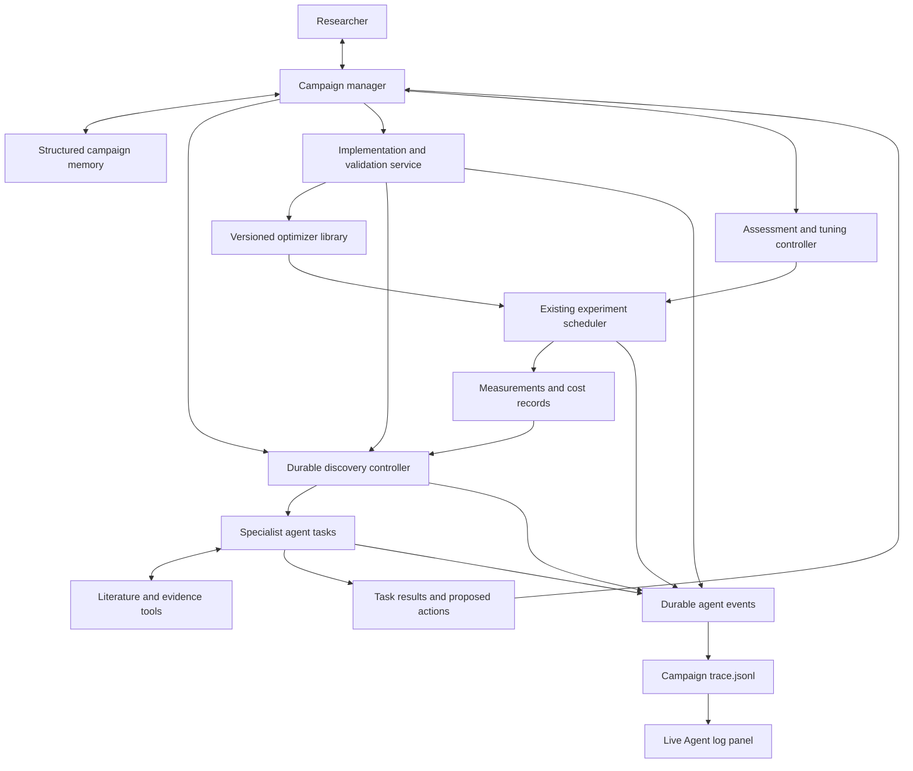

# LLM-driven optimizer discovery and agent debugging: development plan

Date: 2026-09-28

Status: implementation in progress. This document specifies the target; [discovery development status](discovery-development-status.md) records completed work and its evidence. R0's debugger has local qualification; the scientific discovery loop remains under development.

Build a persistent research process that uses LLM agents to understand an executable optimization problem, study relevant methods, propose candidates, experiment and tune, interpret evidence, and refine its proposals. Make that process inspectable through an agent work log saved to a file and a minimal live viewer.

This plan replaces the research-generation portion of the [consolidation plan](architecture-consolidation-plan.md). It preserves the existing campaign manager, command boundary, scientific scheduler, separate implementation service, frozen experiments, accounting and recovery contracts. The [current development status](current-development-status.md) distinguishes those foundations from the discovery capabilities proposed here. Historical migration and final product acceptance remain necessary; neither the previous infrastructure tests nor this document establish discovery quality.

## 1. Product requirements and scope

The product is a general harness that helps a user and capable LLMs develop a good optimizer for the problem at hand. An optimizer may be specialized to that problem. Reusable implementations are useful assets, but producing a universal optimizer is not a goal.

The following requirements determine the architecture:

- Scientific discovery requires model calls. Analysis, literature interpretation, proposal generation, criticism, experimental interpretation and synthesis must involve actual LLM work. Deterministic code executes tools, validates contracts, computes statistics and enforces limits.
- Discovery is an ongoing process with multiple specialist personas, repeated proposal batches and empirical feedback. A short conversation ending with several cards is insufficient.
- Methodologies receive meaningful quick tests and rough hyperparameter tuning before performance-based rejection. A failed default configuration is evidence about that configuration.
- The researcher can steer any stage through one campaign manager. Unexpected questions and unresolved issues reach the researcher through that manager.
- Campaign state and scientific memory survive weeks, service restarts and many experiments. Structured text exports remain readable without a model session.
- Implementation and correctness validation remain a separate service. Scientific effectiveness is assessed by experiments, independently of correctness acceptance.
- Agent activity is recorded even when no browser is open. A simple live file-content panel is part of the first delivery.

The entry point for this update is an **already runnable evaluator** with a problem contract, objective and resource constraints. Developing an evaluator from a prose problem description is outside this update; existing evaluator commissioning remains available. New discovery campaigns do not silently enlarge permissions or replace the evaluator while searching for an optimizer.

Success means an auditable, functioning research loop that uses literature and measurements to improve its decisions. It does not require the first release to discover the best possible algorithm, beat every baseline, or produce a novel method. Established methods can be the right outcome.

## 2. What the current implementation is missing

| Current behavior | Consequence | Required change |
|---|---|---|
| Campaign creation in `execution/service.py` injects adapter seeds or registered algorithms as hypothesis cards. | Proposals can appear before the system has analyzed the problem or read literature. | Stop automatic scientific proposal seeding for new discovery campaigns. Expose compatible implementations as resources for agents to select with a reason. |
| `research/engine.py` starts a small, mostly sequential role queue. Generation currently starts with combinatorial and statistical generators, reviewers and a synthesizer. | There are useful personas and independent generator inputs, but no durable, extensive discovery process. | Retain useful prompts and independence rules; move scheduling and task state into a persistent discovery controller. |
| Model calls, checkpoints and result receipts are durable, while a discussion has a small call allowance. | A discussion can recover, but it cannot itself manage a campaign-length research agenda. | Separate session allocations from task and call limits; let completed evidence drive subsequent tasks. |
| Source retrieval mainly captures metadata and abstracts. | Agents cannot reliably examine methods, assumptions or tuning procedures in the papers they cite. | Add readable full-text acquisition, passage retrieval and explicit coverage limitations. |
| Experiments accept algorithm configurations, but there is no methodology-level tuning and adequacy controller. | A weak initial configuration can be mistaken for a weak methodology. | Introduce versioned assessment plans, tuning batches and evidence-adequacy decisions. |
| The notebook shows run records; manager journals chiefly identify record changes. `provider_progress` is not journaled. `/api/events` sends update notifications. | There is no complete, independently tail-able account of requests, outputs, tool operations and agent handoffs. | Add rich immutable agent events, an append-only JSONL projection and a dedicated live log view. |

Existing curated cards, measurements, discussions and implementations remain historical records. Their provenance stays visible. Do not fabricate past model activity or relabel curated material as LLM-generated evidence.

## 3. Architecture and ownership

Keep the current two-service deployment. Add the discovery controller within the workspace service; it does not require another server or a new orchestration platform. Retain FastAPI, React, SQLite and the existing agent runtime. LangGraph can execute a task, but domain records outside its internal state determine recovery and scheduling.



| Component | Responsibility |
|---|---|
| Campaign manager | Own the research agenda, synthesis, allocations, authoritative decisions and researcher communication. Serialize changes to campaign direction while workers operate independently. |
| Discovery controller | Persist tasks, dependencies, leases, attempts and wakeups. Dispatch authorized work, reconcile completions and enforce task limits. It coordinates research work; numerical jobs still have one scheduler. |
| Specialist task runtime | Execute a versioned persona brief using a configured model and scoped tools. Save intermediate work and a typed result with evidence references. |
| Literature/evidence service | Own retrieval, source captures, passage references and evidence access. Return readable material and retrieval failures to agents. |
| Assessment/tuning controller | Validate parameter spaces, select reproducible configurations, materialize frozen experiments and track whether a methodology received the planned assessment. |
| Implementation service | Reuse, adapt, build and independently validate exact optimizer versions. Return acceptance or repair evidence and costs. |
| Experiment scheduler | Own numerical execution, grants, measurements, cancellation and recovery. Discovery submits through existing commands. |
| Agent event recorder/projector | Preserve observable work and causal links, write campaign log files, and serve bounded live reads. It does not decide science or own accounting. |

An agent is a task execution with an identity, persona, model configuration, inputs and tool permissions. It is not necessarily a permanent process or a different model. Multiple personas can use the same model; per-role model overrides are supported and recorded. Initial defaults inherit the campaign's enabled provider. There is no silent substitution of a different paid provider.

The manager may create methodology-specific briefs after understanding the problem—for example, a specialist in constrained local search or surrogate-assisted optimization. The permanent vocabulary describes responsibilities, rather than assuming every problem needs the same algorithm families.

### Two linked research loops

The **outer loop** compares, revises and combines methodology families: which mechanism is promising for this problem, and what evidence would distinguish the alternatives?

The **inner loop** assesses one family through implementation choices, configurations, training horizons, diagnostics and rough tuning. Its output includes both promising configurations and evidence about the limits of the assessment.

Branches can occupy different stages at the same time. An unexpected experiment can reopen problem analysis or literature search. These stages define evidence-producing responsibilities, not a single campaign-wide ladder that every branch must traverse in lockstep.

## 4. Scientific stages and agent collaboration

| Stage | Personas | Work and persistent output |
|---|---|---|
| Analyze | Problem analyst; skeptical domain analyst | Inspect the evaluator contract and relevant documentation; characterize representation, constraints, noise, available gradients, costs and structure. Produce a problem dossier separating observations, assumptions and unknowns. Propose bounded characterization experiments when needed. |
| Search and study | Literature investigator; methodology analyst | Search application-specific literature and analogous problem structures. Read methods, assumptions, failure cases and tuning guidance. Produce a cited applicability map and unresolved coverage gaps. |
| Generate | Methodology specialists; cross-domain explorer | Independently generate batches of candidates with mechanisms, applicability arguments, implementation requirements, hyperparameters and discriminating experiments. Established methods, adaptations and combinations are all eligible. |
| Critique and prepare | Assumption challenger; diversity reviewer; experiment designer | Challenge claims, inspect source support, group overlapping mechanisms while preserving useful variants, and define assessments. Identify reuse, adaptation or missing implementation. |
| Experiment and tune | Experimentalist; tuning specialist | Launch authorized assessments, inspect diagnostics and refine configurations within allocation. Record actual measurements and explain each next test. |
| Evaluate | Quantitative analyst; mechanism diagnostician | Compare cost-quality behavior and variability. Distinguish implementation defects, invalid comparisons, poor configurations, insufficient training and evidence against the proposed mechanism. |
| Review and synthesize | Independent scientific reviewer; synthesis specialist | Audit evidence adequacy, competing explanations and disagreement. Recommend promotion, refinement, more evidence, scoped deprioritization or a new branch. |
| Iterate | Campaign manager; evolution specialists | Allocate the next round, create child revisions or combinations, revisit assumptions, and issue periodic researcher summaries. Continue autonomously within the existing delegation. |

### Initial proposals

1. Validate the executable problem binding and capture the initial campaign/context revision. Check provider readiness and the delegated allocation.
2. Run analysis, including criticism of the initial interpretation. Save a dossier even when some properties remain unknown.
3. Search and read relevant sources. Create a methodology map explaining what transfers to this problem and what does not.
4. The manager selects specialist briefs and a proposal-batch target. The initial default is two methodology specialists and one cross-domain explorer, each asked for up to three distinct proposals when the allocation permits. Counts are configurable and recorded; they are not a hardcoded algorithm roster.
5. Generators receive the same approved starting evidence, but not each other's new proposals. Once their results are saved, reviewers can compare them and request follow-up work.
6. The manager commissions the most informative feasible assessments, retaining alternatives and reasons for the allocation.

Each proposal records its family, mechanism, problem-specific rationale, sources or explicitly novel conjectures, assumptions, predicted behavior, failure modes, parameter space, startup requirements, implementation needs and the cheapest useful tests. It also records parent proposals and the evidence motivating any revision. A bare algorithm name and generic endorsement are insufficient.

No active model provider means a visible `waiting_for_provider` state and a manager issue. New discovery does not fall back to curated generation. Existing registry entries, historical findings and user-supplied ideas remain usable inputs, with their original provenance.

### Tools and agent messages

Use a common typed tool interface for searching/reading sources, inspecting contracts and implementations, retrieving permitted evidence, proposing tasks, preparing assessments and requesting existing commands. Support native model tool calls where available and a validated structured-action envelope for providers that return ordinary text/JSON. Both paths create the same receipts and log events.

A task can alternate model calls and tools, wait for a source, implementation or experiment, then resume. Its persisted state includes the tool request, result, call usage and next dependency. Malformed responses and tool errors consume their actual resources and lead to bounded correction attempts; they never become successful scientific output by default.

Agent interactions are explicit, durable messages: assignment, question, critique, response, evidence handoff and synthesis. Each names its sender, recipient, task and referenced artifacts. Specialists can request another specialist's input through the controller. Only the manager commits a changed research agenda or opens an unexpected researcher conversation. Routine work already covered by delegation does not require another researcher approval.

Review independence is enforced in context assembly. An author does not review its own proposal under a renamed persona; use a separate invocation and brief. Initial reviewers form their assessment before seeing the manager's preferred outcome or other reviewers' conclusions. Later synthesis can see those judgments and retain disagreement. Using different models is optional, and persona separation alone is not treated as proof of correctness.

### Literature grounding

Extend `research/sources.py` and `research/evidence.py` with search, readable HTML/PDF acquisition, text extraction, passage retrieval and reference following. Preserve query terms, retrieval time, stable source identity, captured-content hash and page/section locations where available. Prefer primary papers and relevant technical documentation for methodological claims.

Distinguish metadata-only, abstract-read and method/full-text-read sources. A citation must resolve to a captured source and, for a specific technical claim, the relevant passage. Source availability and extraction limits are explicit. Agents may continue a branch with qualified assumptions or seek another source, but cannot manufacture support for an unread method. Source contents are tool data and cannot grant execution authority.

## 5. Meaningful quick experiments and rough tuning

Before using a batch for comparison, save a versioned **assessment plan**. It specifies:

- The family and exact candidate revision, executable evaluator, data/instances, fidelity, feasibility rules, objective and comparison cost axis.
- Mechanistic predictions and the observations that would support or challenge them.
- Parameter types, ranges, scales, conditional relationships, constraints, initial configurations and their rationale.
- Startup and training requirements, minimum informative horizon, diagnostics and any applicable replication or seed-pairing rules.
- Tuning strategy and allowance, extension rules, early stopping conditions, and the meaning of adequate versus insufficient evidence.
- References to earlier evidence used to design the assessment, including any reasons to reuse prior measurements.

An LLM tuning specialist proposes ranges and adaptations using literature and measured behavior. A deterministic controller validates and samples configurations reproducibly, applies declared conditional constraints, avoids unintended duplicates and schedules ordinary frozen experiments. The first release supports explicit configurations and seeded random or small grid batches, followed by LLM-guided refinement. More sophisticated search strategies can be added through the same controller contract.

Parameter-free methods can have a documented tuning waiver. Expensive or slow-learning methods still need an assessment of startup/training adequacy. Equal short runs alone are not a fair basis for eliminating every type of method. If a cheaper fidelity is used, record what it measures and validate any extrapolation before claiming full-fidelity effectiveness.

Use separate outcomes for:

| Outcome | Interpretation and next action |
|---|---|
| Implementation invalid | Return to the independent implementation/validation service. Retain the failed work and its costs. |
| Assumptions incompatible | Record the specific contract or measured incompatibility. A branch may be excluded without unnecessary tuning. |
| Configuration unpromising | Refine parameters or the implementation according to the assessment plan. Do not generalize this result to the whole family. |
| Under-evaluated | More configurations, startup/training time, replications or diagnostics are needed for the intended conclusion. |
| Unaffordable within allocation | Stop allocating to this branch with that resource limitation recorded; do not label it empirically ineffective. |
| Adequately assessed, deprioritized | Cite completed adequacy checks and measured evidence, with the conclusion scoped to the tested problem, variants and allocation. |
| Promising | Refine, combine, extend or nominate for separate confirmation, with uncertainty retained. |

A performance-based family rejection requires an adequacy review against the plan. An amendment creates a new revision before the next batch; it cannot retrospectively make an inadequate earlier test adequate. The manager can revise priorities for resource reasons while preserving the distinction between allocation choices and scientific conclusions.

Show both the selected optimizer's execution performance and the total costs of developing/selecting it. Failed configurations, implementation work, tuning, source retrieval and model calls remain attributable. Reusing an earlier result requires compatible provenance and an explicit reference; selecting the best configuration does not erase the rest of the search.

Development evidence supports exploration. Final confirmation uses the existing frozen procedure and protected evidence rules. Neither repeated tuning nor an LLM preference ranking establishes confirmatory superiority.

## 6. Durable state, authority and researcher interaction

### Records

Add versioned records under the current store and command contracts:

| Record | Essential contents |
|---|---|
| Discovery session and policy | Goal, executable problem binding, agenda, authority revision, role/model assignments, allocations, concurrency limits, stopping policy and state. |
| Problem dossier and literature map | Versioned interpretation, facts/assumptions/unknowns, methodology applicability, source captures and gaps. |
| Methodology family and candidate revision | Mechanism, parameter space, implementation requirement/binding, parentage and assessment references. Existing hypothesis cards become views of candidate revisions. |
| Research task, attempt, message and result | Persona/brief version, dependencies, input/context snapshot, tool permissions, model configuration, checkpoints, call receipts, usage and typed output. |
| Assessment plan and tuning batch | Intended evidence, configuration selection, grants, actual experiment references, results and adequacy state. |
| Review and synthesis decision | Claims, dissent, evidence, limitations, next actions and allocation rationale. |
| Agent event and payload reference | Observable operation, causal IDs, redacted content, projection cursor and content hashes. Defined in section 7. |

SQLite remains authoritative. Extend the existing versioned campaign JSON/Markdown memory with the research agenda, active branches, assumptions, conclusions, unresolved issues and next actions. Export detailed task/result records as structured text. Summaries cite immutable records and can be rebuilt; they do not overwrite negative findings or become the sole evidence for a claim.

The manager assembles bounded context from current requirements plus retrieved history. Specialists receive only the relevant permitted subset. The raw debug log is not automatically inserted into model context: its size, repeated content and evidence visibility differ from scientific memory.

### Scheduling and recovery

Use task states `queued`, `running`, `waiting`, `completed`, `failed`, `cancelled` and `superseded`, with explicit wait reasons and immutable attempt identities. Dependencies include source receipts, implementation acceptance, experiment completion and other task results. Independent tasks can run concurrently within configured limits. Manager decisions remain serialized.

Persist intent and resource reservations before dispatch. Save outputs before projecting findings or actions. Accept domain commands once through the existing idempotent boundary; retries reconcile the original receipts. An uncertain external call retains its reservation and uncertainty instead of being automatically repeated. Research task recovery must preserve these existing manager-lifecycle guarantees.

Research sessions have explicit allocations for model usage, retrieval, implementation work and numerical experiments. Per-task and per-call limits sit inside those allocations. Subscription call usage and API charges remain distinct. A session cannot treat each new task as a fresh independent campaign budget. Reserve some remaining allocation for evaluation and synthesis so a campaign can explain its state before stopping.

The manager schedules its next cycle on meaningful evidence completion or researcher input. Unchanged failures cannot trigger an unlimited model loop. Stops include the declared goal, resource limits, explicit researcher stop, or a reviewed lack of useful next work. Branch-specific issues allow independent authorized branches to continue.

### Researcher controls

Add discovery start, pause, resume and stop through the shared application-command boundary, plus policy amendment and task/candidate/assessment operations. Preserve existing guided and delegated campaign modes. Starting delegated discovery grants only the displayed scope and allocation; older campaigns do not acquire new authority during migration.

Pause prevents new discovery dispatch and new experiment submissions. Already dispatched model/tool calls finish into saved receipts; existing numerical jobs are identified in the UI and retain their own pause/stop controls. Stop also requests cancellation of session-owned work through the existing service controls and retains partial results. Neither operation deletes history or makes an uncertain external call safe to replay.

The UI shows the agenda, branch status, proposals, experiments, assessments and synthesis. A comment on any item sends a message to the manager with that item's ID. Updated guidance invalidates affected unissued work, and each following action rechecks authority. In-flight results remain recorded against the old context revision and are reconsidered before use. Specialists do not initiate separate researcher conversations.

New candidate cards separate scientific assessment from implementation readiness. A missing implementation permits an experiment draft and a build request; execution waits for an eligible exact version. Display that reason and the next action instead of an unexplained disabled button.

## 7. Agent work log and live debug panel

### What the panel exposes

The panel answers: **Who is doing what, what information did they receive, what did they return, what tools did they use, and how did their work affect another agent or decision?**

Record agent-authored plans, progress reports and concise rationales as ordinary task outputs, alongside prompts, tool activity, responses, critiques and handoffs. These are inspectable explanations, not a claim to expose private model chain-of-thought. Do not request, reconstruct or simulate hidden reasoning. If a provider only returns a completed answer, show the real request start, elapsed time and eventual response; do not invent a stream of thoughts.

Log the manager and all specialist roles, including implementation builders and validators for linked jobs. Every event identifies its agent/task. A static role label is insufficient when several instances of that role are active.

### Files and event format

Use this campaign directory:

```text
<workspace>/campaigns/<campaign_id>/agents/
  trace.jsonl                 # append-only UTF-8 event stream
  payloads/<sha256>.json       # large redacted prompts, responses and tool results
```

The path is displayed in the panel and works with ordinary tools:

```bash
tail -n 100 -F /path/to/workspace/campaigns/CAMPAIGN_ID/agents/trace.jsonl
```

One complete JSON object occupies each line. Newlines inside messages are escaped. The first release keeps a single growing file per campaign and performs no automatic deletion or rotation; bounded reads and payload sidecars keep the viewer usable. Any future retention policy must explicitly preserve or declare lost history. Existing manager `journal.jsonl` and `context.md` keep their own meanings.

| Field group | Contents |
|---|---|
| Identity/order | `schema_version`, immutable `event_id`, monotonically increasing campaign `seq`, `occurred_at` and `recorded_at` in UTC. Sequence is workspace ingestion order, not a claim about simultaneous remote clocks. |
| Ownership | `campaign_id`, optional `discovery_session_id`, `task_id`, `attempt_id`, `agent_id`, `role`, provider/model identity and originating service. Legacy runs use their existing run IDs. |
| Causality | `parent_event_id`, `message_id`, `in_reply_to`, `from_agent`, `to_agent`, and applicable call/command/job/experiment IDs. Multiple dependencies are retained as references. |
| Meaning | `event_type`, severity, summary, context/guidance revision and artifact/evidence references. |
| Content | Inline `payload` or `payload_ref`, byte count, content hash and any redaction/omission metadata. |
| Deduplication | Stable operation/event key; imported service events retain `origin_service` and `origin_event_id`. |

Required fields identify the event, campaign, actor, time, type and content. Other fields are present when meaningful, rather than filled with invented values. Scheduler and transport events identify those components as their actors.

Illustrative JSONL handoff; IDs and text below are examples, not evidence of an actual run:

```jsonl
{"schema_version":1,"event_id":"evt-41","seq":41,"occurred_at":"2026-09-28T03:00:00Z","recorded_at":"2026-09-28T03:00:00Z","campaign_id":"campaign-example","task_id":"task-tune","agent_id":"manager-1","role":"campaign_manager","event_type":"task.assigned","from_agent":"manager-1","to_agent":"tuner-2","summary":"Assess whether the initial parameter scale explains weak progress","payload":{"assessment_id":"assessment-3","evidence_ids":["experiment-7"]}}
{"schema_version":1,"event_id":"evt-42","seq":42,"occurred_at":"2026-09-28T03:00:10Z","recorded_at":"2026-09-28T03:00:10Z","campaign_id":"campaign-example","task_id":"task-tune","agent_id":"tuner-2","role":"tuning_specialist","event_type":"agent.report","parent_event_id":"evt-41","from_agent":"tuner-2","to_agent":"manager-1","summary":"Propose a bounded scale sweep before judging the family","payload":{"rationale":"The first configuration does not cover the declared parameter range.","proposed_batch_id":"batch-4"}}
```

### Events to capture

| Event family | Required information |
|---|---|
| Assignment/context | Task brief, persona/prompt version, dependency IDs, exact context supplied after redaction, permitted tools and resource allowance. |
| Provider calls | Normalized outgoing messages, model settings, reservation/call ID, dispatch, completion/failure, ordinary returned content, structured output and usage receipt. Store the response before parsing so malformed output remains inspectable. |
| Agent reports | Reported intent, progress, concise rationale, uncertainty, findings, critique, proposed action and completed output. |
| Tool operations | Tool name and validated arguments, start, result or error, duration and source/artifact references. Include searches, pages/passages read, code/build operations and actual experiment commands. |
| Interactions | Assignment, question, answer, disagreement, reviewer feedback and evidence handoff with sender, recipient and causal references. Record actual communication, not a reconstructed fictional conversation. |
| Decisions/execution | Proposed action, accepted/rejected command receipt and reason, implementation status, experiment start/completion and returned metric/artifact references. Large numerical traces stay in their existing artifacts. |
| Lifecycle | Wait reason, cancellation, retry, lease recovery, superseded/stale output, authority/budget rejection, uncertainty and service/projection errors. |

Record observable progress as it happens. Persist a throttled liveness event, at most once per 30 seconds for a quiet active call, explicitly labeled as runtime liveness. It proves the caller is waiting, not that the model has produced new reasoning. Token-by-token output capture is not required for the first panel; any later public response streaming must be labeled partial and retain a canonical completed response.

Capture every framework-mediated tool call. Also capture ordinary tool/progress events supplied by a provider adapter, with that origin identified. Each attempt declares its trace coverage: a provider that hides its internal tool operations cannot yield a complete internal transcript, and the panel must show that limitation. Logging starts and ends at the framework's observable boundaries.

Inline content is capped at 64 KiB per event. Larger allowed content is stored as an immutable payload file, with a preview, byte count and hash in the event. Preserve full permitted content rather than silently truncating it. Resolve existing artifacts by reference instead of copying numerical datasets into every agent event.

### Durability and service boundaries

1. Commit a rich immutable agent event to SQLite alongside the corresponding state change or outbox intent. Save redacted payload bytes once in a content-addressed payload table before committing references to them; the on-disk sidecars are rebuildable exports of those bytes. Trace rows are separate from the lightweight application update events. Diagnostic chatter must not repeatedly wake the scientific manager.
2. A single projector per campaign, owned by the workspace scheduler lease, appends committed events in sequence. Payload files are materialized before their referencing lines. Flush durable bytes before advancing the projection cursor or publishing live lines.
3. Recovery checks the file's last complete event against the authoritative store and replays missing events. A crash after append but before cursor update must not duplicate that line. An incomplete final line may be discarded and regenerated; completed events are never silently edited. Unexpected corruption is preserved for diagnosis and causes a visible projection issue before a rebuild.
4. The implementation service records its own job events durably. Its cursor-based trace API exposes only events covered by the workspace's campaign/job grant. The workspace mirrors them using `(origin_service, origin_event_id)` for deduplication and adds local ingestion sequence. Standalone library work keeps its own service log. Referencing a reusable implementation does not expose unrelated campaigns' logs.
5. A disconnected library can later supply missing events. Retain origin time and causal IDs so late delivery is visible. Do not invent a global real-time order across services.

Saving a dispatch intent and its diagnostic request event is a precondition for a new external action. If the database cannot persist them, dispatch stops. A file projection failure after a provider returns leaves the durable result intact, reports log lag/error, and retries projection; it must not cause another model call. Existing uncertain-call handling and cost accounting stay authoritative.

Credentials, authorization headers, session tokens and process environment dumps are excluded before durable trace storage. Capture the actual messages the framework sends and receives with explicit redactions, not provider credential files or internal authentication traffic. Payloads follow the same access and confirmation-evidence visibility as their records. Agent tool access cannot use the log to bypass protected evidence. Render content as text, and resolve payload IDs through the campaign scope rather than accepting arbitrary filesystem paths.

### Minimal live interface

Add an **Agent log** tab to the campaign notebook. The first version is a monospace text viewer with:

- The file path, connection state, newest sequence and any projection lag/error.
- A raw JSONL view, with optional line wrapping and pretty-print expansion for one event.
- Auto-follow and pause-scrolling controls; pausing the viewer does not pause research.
- Basic agent/task/type filters and a text search over loaded lines, labeled with its loaded-history scope.
- Load-older, copy and download controls, plus links to large payloads and referenced tasks/results.

Start with the latest 200 events. Bound the browser buffer to 2,000 events or 2 MiB, whichever is reached first; older data remains available on disk. Batch updates rather than rerendering the whole campaign on every log event. If new events arrive while scrolling is paused, retain a visible pending count and cursor; do not silently drop the skipped range when following resumes.

Add read-only routes consistent with the current campaign API:

| Route | Behavior |
|---|---|
| `GET /api/campaigns/{id}/agent-log` | Bounded initial tail or history page using exclusive `after`/`before` sequence cursors, event/byte limits, next cursor and projection status. |
| `GET /api/campaigns/{id}/agent-log/stream` | SSE of the actual projected JSONL lines. Support `Last-Event-ID`, heartbeat and reconnect from the last delivered sequence. |
| `GET /api/campaigns/{id}/agent-log/download` | Stream the permitted log through a fixed high-water mark, without loading it all into memory. |
| `GET /api/campaigns/{id}/agent-log/payloads/{artifact_id}` | Return a scoped immutable payload with its redaction metadata. |

The file is the viewer's projection: live lines are published only after they are written. Maintain a rebuildable sequence-to-byte-offset index for bounded file reads. A slow client catches up from its cursor instead of causing an unbounded server queue. Refresh and reconnect deduplicate by event identity and never skip a range silently. Reading, filtering or downloading the log creates no model calls, command deliveries or scientific work.

The initial log panel can instrument today's role runner before the discovery controller exists. Subsequent deliveries use the same schema and panel. Existing historical run traces may be exposed through their current notebook records; any imported log summary must be labeled historical and must not pretend to contain unavailable prompts or messages.

## 8. Implementation sequence

Use `R0`–`R5` for this work so the earlier consolidation deliveries retain their original meaning. Each increment has a concrete review artifact and preserves completed D1/D2 behavior.

| Delivery | Work and likely code boundary | Exit artifact |
|---|---|---|
| R0: observable existing agents | Add event schema/storage and a recorder/projector module under `research/`; instrument `engine.py`, `coordinator.py`, provider boundaries, manager turns and linked implementation jobs. Add bounded API routes and the minimal panel in `frontend/src/research.tsx`. | Run the existing workflow and inspect requests, outputs, tools, role handoffs and failures live in the browser and with `tail -F`; restart without duplicate completed log lines. |
| R1: persistent discovery foundation | Add session/task/message/attempt records, discovery controller, dependency wakeups, role configuration, typed tool envelopes, command handlers and memory projections. Apply allocations and recovery through existing campaign/accounting contracts. Stop automatic proposal seeding for new discovery campaigns when this entry point is enabled. | A persisted, resumable multi-agent task graph with visible waits, guidance revisions and causal logs; no provider means no generated discovery proposals. |
| R2: analysis, literature and proposal batches | Add dossier and literature-map schemas, full-text tools, dynamic specialist briefs, independent generation and evidence-aware review. Connect source and proposal views to task/log records. | A runnable problem produces a cited methodology map and multiple concrete proposals grounded in its actual contract. Another problem produces appropriately different analysis and candidates. |
| R3: implementation and empirical assessment | Add family/candidate/assessment/batch records and tuning controller. Connect missing code to the separate service, then exact accepted versions to existing experiment commands. Implement adequacy review and cost views. | A candidate proceeds through reuse or build/validation, quick tests, rough tuning and an evidence-qualified assessment; failed defaults do not automatically eliminate the family. |
| R4: autonomous iteration and researcher steering | Connect completion-driven evaluation, independent review, synthesis, proposal evolution and reallocation. Add agenda/branch views and item-specific comments through the manager. | Multiple experiment/refinement cycles continue without a separate user request per stage, within delegation; steering at any stage changes subsequent work and remains auditable. |
| R5: integrated qualification and migration | Run fault/concurrency/browser checks and bounded real-model discovery scenarios. Rehearse numbered migrations, historical imports and rollback with the new schemas on copied data. Update acceptance evidence and release documentation. | A reviewable source/data snapshot with actual discovery traces, limitations, cost totals and migration evidence. Researcher validation precedes the previously planned live cutover. |

Historical migration work can proceed on copied data alongside these deliveries. Final E reconciliation and F acceptance must include the new discovery records and logs. Do not reset completed consolidation work or use its fixture model outputs to claim these new research stages are qualified.

The minimal debugger is an early working deliverable, not a final UI-polish task. No graph dashboard, external telemetry service or elaborate agent animation is required for this cycle.

## 9. Acceptance and evidence

Use deterministic fixtures for control-flow and failure tests; use explicitly labeled real-provider scenarios to establish that model reasoning, source study and empirical feedback actually occur. Fixture pass counts alone cannot satisfy the latter.

| Scenario | Required evidence |
|---|---|
| Different executable problems | MEENT and a materially different continuous problem each produce a problem-specific dossier, source-backed methodology choices and concrete proposals. Record the full inputs; no fixed seed list is injected as generated output. |
| Iterative discovery | At least two autonomous experiment/evaluation/refinement cycles, with more than one proposal batch and parent/evidence links explaining revisions. |
| Literature limits | Actual searches and readable source passages inform proposals. An inaccessible or abstract-only paper remains explicitly limited, and unsupported claims trigger further work or qualification. |
| Fair tuning | A method with a poor default receives a justified bounded configuration search before a family-level performance conclusion. |
| Slow or expensive methods | An inadequate horizon or exhausted tuning allowance produces under-evaluated/unaffordable status, with actual costs preserved. |
| Missing implementation | A generated candidate remains designable, reaches the separate build/correctness workflow, and only executes after an eligible exact version is bound. |
| Scientific review | Independent critique can change an assessment or next action. Conflicting measurements and reviewer dissent survive synthesis. |
| Researcher steering | Comments during analysis, tuning and synthesis route through the manager; stale work is retained but cannot dispatch under obsolete authority. |
| Recovery and concurrency | Concurrent completions, lost responses, service restarts and duplicate events preserve exactly-once command acceptance and saved results. Uncertain model dispatch is not blindly retried. |
| Visible live work | While a real call or tool operation is in progress, the panel and file show its identity and status. On completion, ordinary output and handoffs appear without waiting for the entire research session. |
| File independence | Agents run and log with the browser closed; opening the panel catches up. Pausing scrolling leaves execution unchanged. Downloaded lines match the file projection through the declared cursor. |
| Log recovery | Reconnect, refresh, slow consumers, partial final writes and projector restart lose no committed event and duplicate no completed line. Projection lag/errors are visible. |
| Service trace reconciliation | Delayed implementation-service events arrive once with origin IDs; an unrelated campaign's job trace cannot be read through this campaign. |
| Payload handling | Large prompts/tool results remain accessible through sidecars; secret fixtures are redacted before persistence; loaded-history search and partial/absent provider output are labeled honestly. |
| Bounded viewer cost | A large synthetic log uses bounded server/browser memory. Merely viewing, filtering and downloading adds no scientific executions or model usage. |
| Confirmation and migration | Protected confirmation evidence stays outside development-agent context, including through trace access. Old campaigns and logs retain provenance and permissions after repeat import and rollback rehearsal. |

For real-model qualification, record the exact provider/model configuration, source retrieval receipts, evaluator/implementation versions, grants, task results, assessments, costs and trace paths. Evaluate whether the loop followed evidence and respected limits; report any discovered optimizer improvement separately, with only the measurements that support it. Run the existing relevant recovery/accounting tests and the final integrated regression/browser checks after behavior is in place.

## 10. Research references and deliberate adaptations

[Accelerating scientific discovery with Co-Scientist](https://www.nature.com/articles/s41586-026-10644-y) describes asynchronous specialist agents, persistent context, literature grounding, critique and iterative hypothesis refinement. Those are useful architectural patterns here. Our adaptation couples proposal revision to executable optimizer assessments and tuning adequacy; prose tournament scores do not determine measured effectiveness.

[Towards end-to-end automation of AI research](https://www.nature.com/articles/s41586-026-10265-5) describes an experimental process with initial investigation, hyperparameter tuning, research agenda execution and ablations, using recorded experiment branches. That supports making tuning and empirical refinement explicit. This product retains its commissioned evaluator, separate correctness service and existing scientific execution contracts.

These studies motivate selected design patterns. The ownership, persistence, assessment and diagnostic interfaces above are engineering decisions for this repository, and require their own validation.
