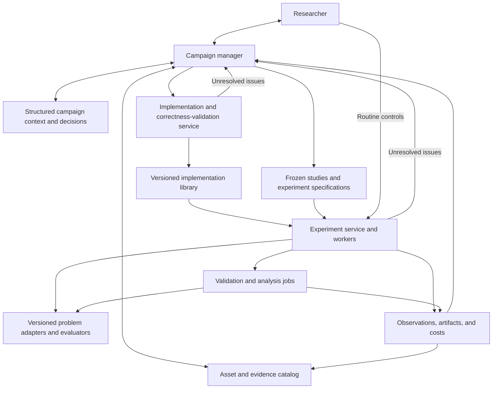

# Optimization research harness: consolidation and development plan

Date: 2026-09-27

Implementation checkpoint update, 2026-09-28: D1's remaining controls and local/connected CLI paths, and D2's durable manager lifecycle now have local operational qualification. See [current development status](current-development-status.md) and the [acceptance matrix](consolidation-acceptance-matrix.md). E historical migration and F real-model/researcher/release acceptance remain open. The dated baseline and delivery descriptions below retain their original planning context; completed D1/D2 work should not be restarted.

Research architecture update, 2026-09-28: the [LLM-driven discovery and agent-debugging plan](agentic-discovery-redesign-plan.md) replaces this plan's research-generation design and adds deliveries R0–R5. It requires sustained analysis, literature study, proposal generation, tuning, empirical review and iteration, with a persistent agent work log and live viewer delivered first. Implementation is underway; the [discovery status](discovery-development-status.md) records the debugger, persistent tasks, literature tools and assessment foundations already present, and the remaining empirical-loop work. Preserve the consolidation foundations; final E/F qualification must include the new discovery behavior.

Status: architecture resolved; consolidation is partially implemented and needs further integration and qualification. No additional researcher input is required to continue development. The plan incorporates the [annotated architecture questions](architecture-consolidation-questions.md) and subsequent clarification that generality belongs to the harness, while optimizers may be specific to the problem at hand. These directions are requirements; the concrete interfaces and delivery sequence are engineering choices made to implement them. Descriptions below specify the target product, not a claim that every capability is implemented.

Reading guide: the delivery brief below summarizes the remaining work. Sections 1–6 define the product and consolidation choices, section 7 retains the original roadmap, section 8 defines completion, and sections 9–11 specify implementation boundaries, migration, and validation handoff. [Section 12](#12-further-development-from-the-current-branch) records the current foundation, architectural decisions, dependencies and acceptance gates. Its [implementation handoff](#implementation-handoff-for-the-remaining-cycle) breaks the remaining work into reviewable deliveries. It governs the next development cycle; completed increments should not be restarted.

The current [development status](current-development-status.md) links D1/D2's full regression, CLI interruption/restart, browser and two-service manager evidence. All **23 compatibility mutations** now use the shared command boundary. The earlier [experiment, idea and implementation command checkpoint](consolidation-progress.md#experiment-idea-and-implementation-command-checkpoint--2026-09-27) retains its **477-test / 40-browser** baseline, 325-file source manifest, and replay of 76 commands without new work after both services restarted. Those historical browser results describe their original source; the current increment adds 19 browser cases. Model responses and semantic reviews remain fixtures. Numerical processes, isolation, commands and HTTP/browser interactions are real. The [acceptance matrix](consolidation-acceptance-matrix.md) distinguishes this local qualification from E/F's remaining delivery gates.

The working foundation includes reproduction drafts, readiness, launch and frozen result comparison, the common scheduler, captured-source execution, bounded storage, trusted supervision and cost receipts. The [reproduction handoff](imported-reproduction.md) defines supported historical conversions and missing measurements. Browser and CLI controls share commands and retained receipts. Durable manager inputs, completed model results and proposed actions survive restart; typed context exports retain campaign history while bounded model views preserve current constraints. Text projections and external deliveries follow commit through the outbox. Preserve these locally verified capabilities through historical migration and final qualification.

No further architectural input is needed. Continue this branch as the integration base and incorporate the sibling's numerical methods, diagnostics and scientific protocols through the general contracts. Keep two owning services, one scientific scheduler, one campaign manager, frozen scientific records and an explicit asset/cost ledger. The reusable product is the harness; an optimizer may be specialized to the current problem. These are the selected engineering decisions for development. Researcher validation will review working behavior and configurable details rather than an unanswered architectural questionnaire.

| Delivery and current status | Concrete result to review |
|---|---|
| Shared web and manager controls (D1, locally qualified) | All compatibility mutations use shared commands; original receipts reconcile retries and lost acknowledgements. |
| CLI integration (D1, locally qualified) | Local and connected commands retain common campaign records, grants, attempts and costs. Actual interruption, resume and restart replay are recorded. |
| Campaign manager lifecycle (D2, locally qualified) | Durable structured context, serialized inbox consumption, saved model output and action delivery survive restart. Independent work proceeds around scoped issues; uncertain model calls require reconciliation. |
| LLM-driven discovery and debugging (R0–R5, in progress) | Persistent specialist tasks connect literature-grounded proposals to implementation, experiments, rough tuning and iterative synthesis. An append-only agent log and minimal live panel make the work inspectable from R0. |
| Import history and rehearse migration (E) | Both repositories' useful records and assets survive dry-run, import, repeated import and rollback on copied data. Reference access and optimizer inputs remain explicit separate uses. |
| Qualify the product and release (F) | MEENT and the continuous application complete browser and bounded real-model scenarios. Researcher validation reviews working behavior and release evidence before cutover. |

Preserve A, B1–B4, C1–C4 and D1/D2 as regression foundations. R0 is locally qualified; the remaining discovery work is tracked in the linked status; E migration work can proceed on copied data, and F depends on both consolidation and discovery acceptance. Keep the existing two-service deployment, agent runtime and persistence backend for this cycle. Dated source reviews later in this plan describe their earlier checkpoints; this delivery brief, the discovery plan and the linked development status identify current remaining work.

A confirmation design may freeze named method slots whose bindings are determined later by an already frozen selection rule. This lets the sibling's controls start alongside development without retrospectively changing study membership. The design stays immutable; an immutable nomination and per-cell bindings record how it was carried out. The same principle applies to missing code: a draft can retain unresolved requirements, while a runnable experiment must bind exact executable versions before launch.

This plan supersedes the MEENT-specific purpose and architectural scope of the [earlier discovery plan](agentic-algorithm-discovery-plan.md). Earlier capabilities are described in [implementation status](implementation-status.md); consolidation checkpoints and their evidence are in [consolidation progress](consolidation-progress.md). Recorded checks are checkpoints, not final release acceptance.

## 1. Purpose and architectural assessment

Build a reusable research harness that helps a user, working with capable LLM agents, find or develop a good optimizer for the problem at hand. A research campaign seeks excellent solutions under its own objectives, constraints, and resource limits. The user can steer the research while delegating routine implementation, experimentation, and analysis to minimize unnecessary intervention.

The harness should support different optimization problems through common research and execution services plus problem-specific adapters. An optimizer may be highly specialized and still be a successful outcome. Reusing optimizers or other assets is desirable when useful, but neither cross-problem reuse nor transfer performance is a requirement for every optimizer or campaign.

Finding a single universal optimizer is an explicit non-goal. There is no implicit requirement to rank methods across unrelated problems or sacrifice performance on the active problem to make its optimizer more general. Reusability and a practical degree of generality are requirements of the software product.

MEENT inverse grating design is the first substantial application and regression case. DQN is one baseline within that application. Neither determines the framework's central data model, execution protocol, agent prompts, or validation vocabulary.

Most features in the two repositories are complementary. Their shared numerical foundation and local Python execution model make consolidation practical. The main conflicts are semantic: algorithm behavior, the meaning of a step, confirmation eligibility, resource attribution, and ownership of execution. These can be resolved through explicit contracts and preserved records without keeping two complete frameworks.

The fundamental change is separating general research operations from domain knowledge. At the initial review, `PhysicsConfig`, binary candidates, a fixed optical objective, and Fourier-order validation appeared inside workbench and implementation-service code. The consolidation moves those assumptions into the MEENT application adapter. Moving files between repositories alone would retain the architectural limitation identified in the researcher's comments.

## 2. Requirements settled by the comments

| Comment | Requirement carried into this plan |
|---|---|
| Q1, final correction, and subsequent clarification | Provide a reusable harness for user–LLM collaboration on the problem at hand. Optimizers may be specialized; their reuse is optional. Finding a universal optimizer is outside scope. |
| Q2 | Freeze each study's scientific goal and scope during its execution. A campaign can retain a sequence of related studies. |
| Q3 | Freeze each experiment's procedure and use one optimizer execution contract. |
| Q4 | Keep historical trajectories and identities in records. Maintain final supported methods without a permanent catalog entry for every intermediate variant. |
| Q5 | Give seed replication, unseen-problem confirmation, and policy transfer separate protocols. |
| Q6 | Allow meaningful code, policies, solutions, datasets, protocols, and findings to be reused through individual human or agent decisions. |
| Q7 | Use periodic checkpoints; bounded recovery work is acceptable. |
| Q8 | Prioritize full upstream cost in method comparisons. |
| Q9 | The manager can suggest budget extensions. Other changes to the study's science create a new study. |
| Q10 | Support validation at multiple stages, with explicit waivers as experience accumulates. |
| Q11 | Choose persistence boundaries that make replacing the backend straightforward; avoid premature trajectory-storage work. |
| Q12 | Import past work both as evidence and as reusable experimental input, with explicit declarations. |

Earlier requirements continue to apply: implementation and correctness validation have a separate service; experiments consume versioned implementations that can be reused when appropriate; unexpected interactions reach the researcher through one campaign manager; its context persists in structured text over weeks.

## 3. Target architecture and ownership

Keep the current local deployment shape: a workspace service and an independent implementation service, with local child processes for numerical jobs and candidate execution. Retain FastAPI, React/TypeScript, the existing LangGraph-based role runner, and SQLite. Put durable domain state outside LangGraph's internal state so that the agent runtime remains replaceable. No new orchestration platform or distributed service is required for this release.



| Component | Owns | Boundary |
|---|---|---|
| Campaign manager | Research direction, interpretation, proposed studies, reuse choices, delegation, and unresolved issues | Specialists and services report to the manager; they do not open independent researcher conversations. |
| Study and experiment records | Frozen scientific scope, procedures, confirmation policies, and permitted budget amendments | Agents propose changes; application code validates and records them. |
| Implementation service | Bounded build/repair jobs, correctness evidence, dependency/runtime identities, reusable executable versions | Building or accepting code does not establish optimizer effectiveness. |
| Experiment service | Scheduling, dependencies, worker ownership, observations, resource enforcement, cancellation, and recovery | One authority launches numerical work. |
| Problem adapter | Candidate representation, objective evaluation, feasibility, fidelity, problem identity, domain validation, and optional visualizations | MEENT-specific behavior stays here. |
| Asset and evidence catalog | Reusable artifacts, applicability, lineage, exposure, reviewed findings, and source provenance | Reuse is an explicit decision; catalog availability is not permission to inject an asset into every experiment. |
| Persistence adapters | Transactions, files, and portable import/export | Domain records and manager behavior do not depend on SQLite or an agent-runtime checkpoint format. |

The LLM provider remains interchangeable behind the existing transport interface. Model selection is configuration, independent of the research record. The manager and specialists may use improved models without changing scientific contracts or automatically changing an experiment already in progress.

### General problem contract

Introduce a versioned `ProblemDefinition` with:

- An adapter identifier and version, configuration schema, and executable evaluator identity.
- A candidate schema describing permitted values and structure, including feasibility constraints.
- Objective names, units, and optimization direction, separate from an algorithm's internal reward or surrogate loss.
- Instance construction and declared public descriptors that an optimizer may use.
- Supported evaluation capabilities, fidelity settings, and resource requirements.
- Domain-specific correctness fixtures, validation recipes, and optional analysis/rendering capabilities.
- Separate identities for the scientific instance, evaluation fidelity, and implementation version.

An `Observation` contains the request identity, evaluated candidate reference, objective values, constraint results, fidelity, evaluator version, status, and measured costs. Optional domain diagnostics remain namespaced metadata. The core must not assume that every score is an efficiency in `[0, 1]` or that larger is always better.

Initial executable coverage includes binary/discrete optimization and bounded continuous scalar optimization, with explicit constraints. A continuous benchmark adapter with bounded quadratic and Rosenbrock instances provides the second application; quadratic fixtures give known outcomes for contract checks. These applications can use different optimizers: they test reuse of the harness, not universality of a method. Each experiment has one declared primary objective and may report additional metrics. Pareto optimization, differentiable MEENT evaluation, distributed execution, and GPU scheduling are later capability extensions, not promises of this release. Unsupported capabilities remain explicit requirements rather than silently approximated features.

MEENT supplies binary grating schemas, optical units, its physical-condition identity, material rules, RCWA evaluation, fidelity validation, and field analysis. Its initial evaluator remains the existing numerical implementation. Generalization of the framework should not silently change the physical problem.

New problem adapters can also be implementation-service outputs. They require their own frozen specifications and correctness evidence before use as evaluators. An optimizer package cannot modify its evaluator or the execution ledger. Declaring a capability in text does not make an executable evaluator available.

### One optimizer contract

“Ask/tell” means: the optimizer proposes a candidate, the worker evaluates it, and the optimizer receives the observation. The optimizer chooses how to learn or search internally; the worker owns evaluations and their cost.

Use the clearer public names `propose` and `observe`, with adapters for the existing `ask` and `tell` methods:

```text
initialize(problem_descriptor, parameters, seed, declared_assets)
propose(max_candidates) -> proposal batch with stable proposal identifiers
observe(observations)
checkpoint() -> checkpoint manifest
restore(checkpoint manifest)
inspect() -> diagnostics
export_artifacts() -> optional reusable outputs
```

A batch may contain one candidate. Version 1 uses synchronous batches: there is one outstanding batch per optimizer, and observations return in proposal order. Batch size is one unless the implementation declares batch support. Capability declarations specify supported representations, constraints, batching, and optional diagnostic or policy exports. These declarations are checked before scheduling. Candidate serialization and validation belong to the problem contract, rather than a mandatory binary-array conversion.

DQN keeps its learner, replay buffer, episode bookkeeping, and internal reward inside an optimizer implementation. The common runner does not impose one definition of an algorithmic step. Algorithm decisions, evaluator requests, and actual solver executions are separately named quantities. This preserves the sibling's reset/action distinction while retaining authoritative evaluation accounting.

Frozen-policy evaluation uses an exported, versioned artifact and an appropriate evaluator/diagnostic adapter. It does not require a second campaign scheduler. Candidate-owned model and checkpoint data are interpreted only by their matching execution runtime or an explicitly supported adapter.

Final supported methods use a shared implementation where practical. Parameters and experiment records distinguish behavior. Historical intermediate variants remain inspectable through their saved source/configuration and artifacts, without multiplying permanent user-facing algorithm names.

## 4. Scientific lifecycle and delegated work

### Campaign, study, experiment, and attempt

| Record | Meaning and mutation rule |
|---|---|
| Campaign | Long-lived research program, context, resource envelopes, and delegation. Retains related studies and their history. |
| Study | Frozen question, problem scope, scientific assumptions, comparison design, and validation/confirmation policies. A scientific change creates a new linked study. |
| Experiment | Frozen resolved procedure: implementation/runtime, instance, parameters, seeds, initial assets, schedule, evaluation and diagnostic settings, recovery policy, and stopping/extension rules. |
| Attempt | One execution or recovery of that experiment. Operational interruptions and repeated work do not overwrite the experiment's scientific identity. |
| Budget amendment | An explicit append-only change to an allocation, with authority, rationale, and its effect on interpretation. |

A study can explicitly investigate development of new optimizers. Creating implementations and experiments within that declared scope carries out the study. Changing its objective, assumptions, or comparison design creates another study. A confirmation study can either name its methods directly or declare a bounded selection rule for a named method slot before any of its work starts. Resolving that slot once from the specified development evidence carries out the frozen design. Replacing a resolved nomination, changing the selection rule or candidate set, or selecting from confirmation outcomes creates a new study.

The manager may propose additional resources. It does not silently raise the campaign's authorized cap. A budget amendment may extend work within an experiment's frozen extension rules while preserving its schedule and recording the original allocation. A changed procedure requires a new experiment and, when it changes the study's science, a new study. Adaptive extensions remain visible in comparisons.

### Manager autonomy

The manager can select useful next experiments, commission bounded implementation work, reuse suitable artifacts, perform permitted validation, interpret outcomes, and record findings within the campaign's delegated authority. It consults past evidence before commissioning another implementation or repeating an experiment. Its selection criterion is usefulness for the active problem and study; it may prefer a new specialized optimizer over a reusable method when the evidence supports that choice.

Routine successful work should not require a researcher response at each step. Unresolved scientific choices, exhausted authority, missing capabilities, and unexpected failures become deduplicated manager issues with evidence and a concrete proposed resolution. Independent authorized work can continue while an issue is pending.

Research roles and implementation specialists are internal collaborators. The manager is the sole conversational boundary for unexpected interactions. The experiment dashboard retains direct routine controls such as pause, resume, and stop.

Agent output is a proposal expressed through typed commands. Durable command identities, current-context checks, resource reservations, and recorded outcomes prevent a restart or repeated model response from launching duplicate work. Keep these protections from the current branch when separating the general core.

### Validation and waivers

Represent validation as a scoped requirement with a recipe/version, subject, required evidence, authority, and result. Support implementation correctness, evaluator correctness, solution fidelity, learner diagnostics, and scientific confirmation as distinct kinds.

Requirements may be satisfied by new checks, compatible existing evidence, or an explicit waiver permitted by the study policy. Record the decision-maker, rationale, supporting experience, affected version/scope, and conditions requiring reconsideration. A waiver is never relabeled as a passed check. Failed measurements remain in the record.

The manager can waive eligible requests within delegated authority as experience accumulates. Changing a frozen confirmation criterion requires a new study or an explicitly exploratory interpretation; an ad hoc waiver cannot preserve a claim whose required evidence is absent. Basic executable contract and resource enforcement remain properties of the runtime.

Implement three confirmation protocols independently:

1. **Seed replication:** a fixed method on a known problem, with fresh seeds and a frozen selection/comparison procedure.
2. **Unseen-instance confirmation:** new instances or conditions from a declared problem family, with exposure eligibility defined by that adapter and protocol.
3. **Policy transfer:** a frozen learned artifact evaluated on declared target instances, with adaptation forbidden or specified and charged.

Choose confirmation protocols according to the study's intended claim. A campaign seeking an optimizer for one particular problem need not demonstrate unseen-instance performance or policy transfer. The existing physical-exposure rule becomes the MEENT unseen-instance policy. It must not prohibit a legitimate same-condition seed-replication study.

## 5. Reuse, cost, recovery, and persistent context

### Asset and evidence reuse

Use a common artifact reference with typed metadata for implementations, policies, solutions, archives, datasets, protocols, and findings. Preserve content identity, origin, applicability, dependencies, validation evidence, exposure, and cost provenance. Recording an implementation in the library does not assert that it is broadly applicable; a version scoped to one problem is a valid implementation.

A `ReuseDecision` identifies the asset/version, the intended use, the decision-maker, the applicability rationale, and consequences for confirmation and cost. Distinguish reference evidence visible to the manager from inputs available to an optimizer. A policy for a peculiar instance can remain archived without being recommended for reuse; applicability is an individual decision.

Past work can serve both purposes through separate declarations. Imported findings retain their scope and counterevidence. Importing a report alone must not give a worker access to its best design or trained model.

### Full upstream cost

Maintain two views over the same cost records:

- **Actual expenditure:** work physically performed and charged to a campaign, including failed or repeated attempts.
- **Full attributed cost:** the upstream work necessary for a method's result, including reused search prefixes, data generation, pretraining, and declared validation or implementation contributions.

The second view is the default for method comparisons. Each study declares its cost axis; elapsed worker time, evaluation requests, solver executions, and model usage remain distinct quantities. Implementation/model overhead is retained as a separate category with a declared attribution rule, so it can be included in end-to-end comparisons without concealing shared research effort.

Represent experiment and artifact dependencies as a directed acyclic graph. Count each ancestor contribution once within a result's lineage. Shared work may belong to multiple methods' logical totals while appearing once in actual expenditure. Missing imported costs are unknown, not zero; comparisons must show the incomplete cost basis.

### Periodic recovery

Replace full per-evaluation optimizer snapshots with periodic checkpoints and checkpoints at cooperative pause/stop boundaries. Persist observations, attempt identities, and accounting separately so rollback of optimizer state cannot erase work already performed.

Checkpoint manifests refer to size-bounded artifact files or chunks. Large replay buffers do not travel as base64 in a small JSON response. Resource limits remain configurable and explicit instead of making 16 MiB a universal algorithm-state limit.

Recovery may repeat bounded work from the last checkpoint. Preserve completed observations, mark the recovered trajectory/attempt, account for repeated execution, and retain uncertainty when an interrupted evaluation has no confirmed result. Version 1 resumes the saved optimizer state and retains the unfinished suffix as prior-attempt evidence; it does not inject that suffix into the learner. The checkpoint restores the evaluator/cache state specified by the experiment. Deterministic replay of a post-checkpoint observation journal is a later optimization. Cooperative pause/resume continues to restore algorithm and random state.

### Replaceable persistence and durable manager context

Keep SQLite and artifact directories for the first consolidated version. Introduce repository and artifact-store interfaces around them, with versioned JSON record schemas, JSONL event export, and Markdown context documents. Domain identifiers and references must survive export/import without depending on database row numbers or absolute machine paths.

SQLite remains the transactional authority; Markdown guidance is editable through the workspace/import interface and produces a recorded revision. This avoids two competing writable authorities while retaining comprehensible structured text. A replacement backend implements the same repositories and round-trip format.

The manager's durable context includes the campaign objective, active frozen study, authority and budgets, supported problem capabilities, useful assets, findings and counterevidence, validation/waiver decisions, pending issues, and next actions. Distinguish observations, agent interpretations, and researcher-endorsed conclusions by authorship and evidence references. Reconstruct model context from these records after restart.

Retain the existing text retrieval approach initially. A new vector database, trajectory warehouse, or elaborate compaction system is not a prerequisite for this update.

## 6. Consolidation map

| Existing implementation | Consolidated treatment |
|---|---|
| Current `workspace/manager.py`, `coordinator.py`, `memory.py`, research/provider adapters | Preserve durable coordination and provider boundaries; remove grating-specific defaults, sources, and assumptions from the general context. |
| Current `workspace/models.py`, `service.py`, `worker.py`, `analysis.py` | Extract general records and one execution authority; use registered problem/optimizer capabilities and explicit comparison policies. |
| Current `implementations/` | Preserve separate build/validation ownership; generalize package contracts, validation recipes, and artifact-based checkpoints. |
| Both `physics.py` files | Retain the shared numerical evaluator as the first MEENT adapter; avoid incidental numerical changes during extraction. |
| Sibling `config.py`, `environment.py`, `dqn.py`, `training.py`, `replication.py` | Consolidate final learner behavior and profile parameters behind the common optimizer contract; retain semantic tests and frozen source references. |
| Current built-in optimizers and sibling `experiments.py`, `scripts/refine_design.py` | Keep useful methods under the common registry. Preserve initialization, acceptance, restart, and upstream-prefix semantics in configurations and records. |
| Sibling `replication_diagnostics.py`, `fields.py`, analysis scripts | Turn useful diagnostics and physical analyses into registered jobs/recipes producing versioned evidence. |
| Sibling `run_replication_campaign.py`, `run_angle_sweep.py`, `watch_campaign.py` | Extract study templates, dependencies, selection rules, validation triggers, and reports. Their independent process controllers do not become additional scheduling authorities. |
| Sibling TensorBoard support and report generation | Keep as optional derived outputs from recorded observations and artifacts. |
| Sibling data, protocols, and saved campaigns | Import through manifests with checksums, scientific identity, provenance, exposure, and available lineage costs. |
| Current React UI | Generalize campaign/problem/experiment views; retain domain-specific geometry and field views supplied by the MEENT application. |

Use `optimization_framework` as the core package for contracts and application services. Keep `dqn_meent` as the domain adapter and historical import location during migration. Packaging the generic workspace must allow it to start without importing MEENT or PyTorch. Numerical dependencies are installed with the adapters/implementations that need them.

User-facing method names describe the supported method family. Exact configuration, implementation digest, runtime identity, evaluator identity, and input assets remain in every experiment. Display-name consolidation never rewrites historical identities or silently pools incompatible results.

## 7. Delivery sequence and acceptance

Each increment should leave a runnable system and provide evidence for its boundary. Preserve both dirty working trees and existing local artifacts before migration; capture source manifests rather than assuming Git HEAD describes the implementation. Keep the researcher's annotated questions intact.

### Baseline capture — Preserve the two inputs

Create source/configuration manifests for both working trees, record relevant final-method fixtures, back up application databases, and inventory large artifacts by hash and location. Do not copy every historical trajectory merely to establish a baseline. Import the sibling's useful code and tests selectively into the current repository; do not replace the current tree with a directory overlay or treat its uncommitted work as disposable.

**Acceptance:** both source states are identifiable, annotated decisions are preserved, selected final-method reference cases can be run independently, and original campaign data can be restored from the backup.

### Increment 1 — General contracts and a second application

Introduce domain-neutral problem, observation, implementation, campaign, study, experiment, and artifact-reference schemas. Put persistence behind repository interfaces. Register the existing MEENT evaluator and a bounded continuous minimization adapter. Generalize the minimum manager-to-worker path and UI problem selection.

**Acceptance:** the same campaign/experiment path runs both problem types with suitable, potentially different optimizers; maximization/minimization and feasibility are interpreted correctly; the generic application starts without importing the MEENT adapter; adding the second adapter requires no special branch in the core worker or manager prompt.

**First usable result:** select either problem in the existing UI, freeze a small experiment, run an appropriate reference optimizer, and inspect raw objective values and costs through the same API and worker lifecycle.

### Increment 2 — One execution lifecycle and scalable checkpoints

Implement the common optimizer contract and registry, convert the existing reference methods, and generalize implementation-service inputs and correctness checks. Add periodic artifact-based checkpoints, durable attempt accounting, and capability-specific diagnostics/exports. Preserve current process ownership and stale-control protections.

**Acceptance:** an independently validated package runs on a compatible problem and is rejected with a useful capability reason on an incompatible one; cooperative resume reproduces the expected continuation; a forced interruption retains prior observations and repeated/uncertain costs; a learner checkpoint larger than 16 MiB restores without a JSON-sized state transfer.

### Increment 3 — Consolidate numerical methods and scientific diagnostics

Bring the sibling's final learner options and semantic tests into the shared DQN implementation. Consolidate hill-climbing configurations and add one/two-cell refinement with explicit starting assets. Register policy/Q diagnostics, high-order MEENT validation including F320/F480, fields, and sensitivity analysis. Ensure instrumentation does not alter training randomness.

**Acceptance:** supported final learner configurations preserve observation, bootstrap, target-update, initialization, and random-stream behavior on controlled reference cases; matched short numerical runs agree with the original final implementations under pinned dependencies; refinement records its upstream inputs and costs; physical and policy outputs are separately identified. Any intended semantic change is a new version with an explanation.

### Increment 4 — Frozen studies, confirmation, validation policy, and lineage

Add study templates, experiment dependency scheduling, budget amendments, validation requirements/waivers, the three confirmation protocols, and the asset dependency/cost graph. Express the sibling's replication study as a template consumed by the existing experiment service. Make full upstream cost the default comparison basis.

**Acceptance:** a scientific change creates a linked new study; an allowed budget amendment preserves the original procedure/history; the same exposed MEENT condition is eligible for fresh-seed replication but not falsely labeled unseen; policy transfer binds a frozen artifact; shared-prefix accounting is correct in both cost views; waivers are visible and cannot manufacture a passed confirmation claim.

### Increment 5 — General manager reasoning and accumulated experience

Supply agents with problem capabilities, prior findings, applicable assets, full costs, and current study authority. Support bounded proposal/build/validate/experiment/analysis/reuse actions through the manager. Generalize implementation requests for new optimizer and problem-adapter packages. Preserve provenance, researcher corrections, and alternative explanations in structured context.

**Acceptance:** on the second problem, exercise both reuse of an applicable implementation and commissioning of a missing specialized one, then choose the next authorized experiment without grating-specific assumptions. Record why reuse was selected or declined; a campaign can complete without a cross-problem reuse or transfer claim. An unresolved service failure appears once at the manager interface; restart reconstructs context without replaying completed work; routine permitted actions do not require repeated human approval.

### Increment 6 — Imports, usable interfaces, and migration

Add inspectable import manifests for the sibling's reports, final artifacts, source snapshots, and available costs. Map existing current campaigns to explicit legacy problem/study records without inventing preregistration or validation evidence. Generalize dashboard terminology and forms, expose active study and validation/waiver state, and add asset/lineage views. Keep optional TensorBoard and domain reports as derived outputs.

**Acceptance:** an import dry run shows its mappings and missing information; duplicate import does not duplicate assets or costs; historical evidence and optimizer inputs require separate declarations; record/artifact references survive export and reimport; existing campaigns remain inspectable; unknown provenance stays unknown.

### Increment 7 — Integrated qualification

Run the relevant existing Python and browser checks, new contract/semantic tests, migration checks, and a bounded live manager workflow. Exercise the full framework on MEENT and the independent continuous problem. Include an implementation build, reuse, periodic recovery, a validation waiver, and an issue returned through the manager.

**Acceptance:** publish an evidence report linking exact source/runtime versions, run manifests, checks, costs, limitations, and remaining capabilities. Reuse of the harness is demonstrated through the two applications and their implementation workflows; the optimizers may differ. Numerical regression evidence is distinguished from a claim that user–LLM collaboration has found a superior optimizer for a particular problem.

The previously reviewed 194 current-repository tests and 46 sibling tests are historical evidence from September 24, not acceptance results for this update. Large historical campaigns are preserved as evidence; a fresh performance or research-effectiveness study has its own frozen protocol and allocation.

### Dependency order

Baseline capture precedes all source migration. Increment 1 establishes the shared records and problem boundaries. Increment 2 establishes the execution and implementation contracts used by increments 3 and 4. Increment 5 uses the resulting actions, study rules, costs, and assets. UI and importer work in increment 6 can begin against the contracts after increment 1, but final migration follows the stabilized records and lifecycle. Increment 7 qualifies the integrated product after the preceding acceptance checks pass.

The first two increments are a complete vertical slice, not a framework-only rewrite. Later increments add the sibling's scientific depth, research policies, and accumulated experience without introducing another execution authority.

## 8. Completion criteria

The consolidated version is complete when a researcher can define a supported optimization problem, work with the manager to find or develop a suitable optimizer, delegate bounded implementation and experiments, request or waive eligible validation, compare full upstream costs, and preserve useful findings across sessions. MEENT and the second application must use the same framework lifecycle, with optimizers appropriate to each problem.

Campaign success is judged against that campaign's problem and declared evidence requirements. A specialized optimizer that performs well there is a successful research outcome even if it has no useful application elsewhere. The framework enables optional reuse of methods and experience; it does not require a universal optimizer or a generally transferable result.

Final supported methods retain reproducible behavior within declared numerical tolerances and runtime assumptions. Historical trajectories remain inspectable without requiring every intermediate variant to remain an actively maintained product feature.

Remaining unsupported capabilities are presented as implementation or evaluator requirements with concrete reasons. They must not appear as unexplained disabled actions, be silently substituted with another scientific procedure, or force the researcher into separate conversations with implementation workers.

## 9. Implementation boundaries and settled contracts

### Code ownership

The target layout is:

```text
src/optimization_framework/
  contracts/         # Versioned domain schemas and public protocols
  campaigns/         # Campaigns, studies, decisions, authority, and context
  research/          # Manager role runner, tools, provider adapters, retrieval
  execution/         # Scheduler, workers, budgets, attempts, and checkpoints
  implementations/   # Separate service, library, package runtime, correctness
  assets/            # Artifact metadata, applicability, reuse, and lineage
  evaluation/        # Validation recipes and confirmation protocols
  analysis/          # Compatible comparisons, cost curves, and reports
  storage/           # Repository interfaces, SQLite, artifacts, import/export
  api/               # Workspace HTTP/SSE surface and application startup
  optimizers/        # Bundled general implementations and lifecycle adapters
src/dqn_meent/        # MEENT problem adapter, domain diagnostics, compatibility
src/optimization_benchmarks/
                     # Independent continuous benchmark problem adapter
frontend/src/        # Shared product UI and explicit domain renderers
tests/               # Contract, scientific, lifecycle, migration, and API checks
```

The core imports contracts and registered capabilities, not `dqn_meent`. Adapters depend on core contracts. DQN's numerical learner is moved into the optimizer implementation layer; its grating-specific observation/reward configuration is an explicit profile. MEENT fields and scientific fixtures stay with the MEENT adapter. A plugin is a versioned Python package with a manifest and registered entry points; there is no dynamic import of an arbitrary module named by an LLM action.

### Deployment and authoritative records

| Decision | Selected implementation |
|---|---|
| Product deployment | Single-user, single-machine Linux deployment using the current Python and web stack. |
| Workspace ownership | The workspace process owns campaigns, studies, experiments, manager context, non-executable asset metadata, and experiment scheduling. |
| Implementation ownership | The implementation process owns build jobs, immutable executable versions, runtime locks, and correctness reports in its own database. Its bounded correctness jobs do not become a second experiment scheduler. |
| Persistence | One SQLite database per owning service, numbered schema migrations, and repository interfaces. Related command, reservation, and outbox records commit together. |
| Artifact storage | Local content-addressed blobs/manifests, referenced by identifiers and hashes. Filesystem locations are resolved by the artifact store, not embedded as authoritative experiment identity. |
| Communication | Typed HTTP commands between services with durable idempotency keys and existing local service authentication. Shared read-only artifact access is allowed through verified manifests. |
| Progress | Keep HTTP commands and SSE events for the browser, with polling recovery. Worker files/events feed the owning service; numerical workers do not mutate campaign records directly. |
| Model runtime | Retain existing providers and role orchestration. Pin provider/model configuration per manager turn and implementation job; preserve separate subscription and API accounting. |
| Defaults and limits | Keep local worker limits and resource envelopes explicit and configurable. Their numeric values are validation-stage tuning, not unresolved architecture. |

Add `optimization-lab` and `optimization-implementations` entry points. Existing `grating-*` entry points remain compatibility aliases during the migration. Existing CLI training/baseline commands ultimately delegate to the common lifecycle; they do not retain separate live scientific loops. Historical source snapshots remain self-contained evidence.

### Core records

Every record has a schema version and stable identifier. Immutable scientific records additionally have a canonical content hash; mutable operational records have a revision for concurrency checks.

| Record | Required responsibility |
|---|---|
| `ProblemDefinition` / `ProblemInstance` | Separate adapter/evaluator identity and reusable schema from a resolved instance and its scientific identity. |
| `ImplementationVersion` | Source/runtime/contract identities, capabilities, parameters, validation evidence, and availability status. |
| `StudySpec` | Goal, scope, allowed scientific choices, comparison/confirmation rules, and policy versions frozen before work. |
| `StudyTemplateVersion` / `StudyExecution` | Immutable expansion rules, stages, dependencies and selection rules; separately recorded activation, deadlines, admission and execution state. |
| `ConfirmationDesign` / `MethodBinding` / `ProtocolCell` | A frozen cohort with literal or rule-selected method slots; append-only resolutions and stable instance/seed cells, including cells awaiting a nomination or input asset. |
| `Nomination` | Immutable selection from identified development evidence, with the rule/version, selected method configuration and source/runtime identities. |
| `ExperimentDraft` | Editable intended procedure and unresolved requirements. Freezing produces a separate resolved `ExperimentSpec`; editing a draft cannot change an existing experiment. |
| `ExperimentSpec` | Fully resolved method, instance, seed, initial assets, evaluation settings, algorithm schedule, recovery rules, and primary completion condition. |
| `ExecutionAttempt` | Worker identity, lease, lifecycle, checkpoint lineage, actual expenditure, and terminal reason. |
| `EvaluationRequest` / `Observation` | Separate durable request intent from an actual result, including failed, rejected, or uncertain outcomes. |
| `ValidationRequirement` / `ValidationResult` / `Waiver` | Preserve what was required, what was observed, and the explicit decision to waive a requirement. |
| `Artifact` / `ReuseDecision` | Immutable content plus applicability, provenance, exposure, and declared use as evidence or execution input. |
| `CostEvent` / `Contribution` | Actual resource consumption and non-overlapping attribution to downstream results. |
| `ManagerCommand` / `Decision` / `ContextRevision` | Durable dispatch, human or agent authority, and the exact structured context used. |

A mutable current-method name points to a version; an experiment pins the version itself. A changed display name or consolidated source implementation cannot reinterpret an old experiment. Core comparisons group by scientific compatibility and resolved behavior rather than a display label or a hash of unrelated UI/manager code.

Use two related method identities. A logical method fixes its implementation, parameters, scientific completion and schedule, recovery policy, diagnostic declarations, and typed input/seed binding rules. A resolved cell additionally fixes its concrete instance, seed, input assets and executable specification. Admission time and remaining operational allocation do not create a new logical method; their limits and any resulting incomplete execution remain recorded. Historical method hashes retain their original meaning. The new distinction requires a versioned contract and compatibility projection, not a rewrite of existing hashes.

These are record responsibilities, not a requirement for one table or service per type. Add schemas where the existing records do not express the responsibility, and keep their application operations in the owning service.

### Executable commissioning and portable identity

The implementation service accepts two explicit package kinds: optimizer and problem evaluator. Both use the same build/repair, immutable publication, and correctness-evidence lifecycle. Their execution contracts and test suites differ. A generated problem adapter consists of a declarative problem manifest, a versioned evaluator executable, and registered recipe declarations. It does not install arbitrary code into the workspace process or browser. Reviewed bundled adapters retain their installed entry points; generated evaluators run through an isolated evaluator host selected by the worker.

The generated evaluator host uses the existing Linux isolation and dependency-lock mechanism with a separate evaluator contract. For ordinary installed workers it is a worker child; for an isolated captured worker the installed supervisor launches it in a separate namespace and relays the same protocol. One evaluator process serves its owning worker through initialization, evaluation, checkpoint/restore and closure; it has no scheduling authority. The worker supplies validated candidates and records request identities and evaluation costs; the installed host independently enforces deadlines and process limits. Evaluator packages may use explicitly declared numerical dependencies and input data. Optimizer packages retain their prohibition on evaluator access. Neither receives campaign files, credentials or network access. Missing host capabilities produce a readiness blocker before allocation, with no fallback to importing candidate code into the workspace.

Generated problem manifests use the supported candidate, objective, constraint and fidelity schemas. Configuration is validated as data and passed to the isolated evaluator; the manifest cannot contain arbitrary resolver expressions or module imports. Custom inference formats, new representation primitives and executable analysis extensions require reviewed installed extensions in this release. Generated packages can compose registered recipes and export supported formats. This keeps optimizer and evaluator commissioning useful without introducing a third dynamically generated executable kind or another plugin installation path.

An evaluator request freezes the candidate schema, objectives and units, feasibility rules, fidelity controls, permitted dependencies, and independent fixtures or invariants. The implementation service checks that executable against the frozen specification. Tests authored by the candidate cannot establish their own numerical truth. When independent evidence is unavailable, the artifact retains an explicit unvalidated scope; exploratory use requires a study policy that permits the applicable waiver. Serialization, isolation, and resource enforcement remain mandatory. A missing scientific oracle becomes a concrete campaign-manager issue, not a claim that the evaluator is correct.

Artifact publication and permission to launch are separate decisions. The library retains immutable evidence and scoped validation status; the workspace combines that evidence with the intended use and current study policy. Mandatory execution-contract checks cannot be waived. Missing domain-validation evidence can be waived only for an eligible, explicitly exploratory use. A candidate known to violate its frozen executable specification returns to repair. A waiver does not rewrite a failed result, mark a version numerically correct, or satisfy a required confirmation criterion. Default commissioning requires independent fixtures; explicit contract-only commissioning and scoped exploratory authorization are locally verified in B1. B3 adds independent revalidation without changing that separation of publication, evidence and permission.

Use an explicit `contract_validated` state when an evaluator passes mandatory interface, isolation and recovery probes without an independent numerical oracle. Default commissioning still requires numerical evidence; contract-only commissioning must be requested explicitly. The workspace may bind that published version, but exploratory execution requires a waiver naming the exact study, evaluator binding, evidence requirement and permitted scope. Freeze the authorization with the experiment and recheck it before each new attempt. A replacement waiver or a different study cannot silently inherit the old authorization. Confirmation remains ineligible while its required numerical evidence is absent. Revoking eligibility blocks new attempts and creates one scoped manager issue for any affected running work; it preserves earlier observations and their original evidence basis.

Revalidation is a separate bounded implementation-service job against an existing executable identity. It appends a versioned report identifying the check specification, fixtures, validator/runtime and resulting scope; it neither edits the package nor erases earlier reports. Newly applicable evidence can satisfy a pending requirement for a future experiment. An experiment already frozen with a waiver retains that original basis; switching its basis requires a new experiment. Changed source, executable contract or runtime creates a new executable version. Library readiness is a projection of these records and current availability, rather than a mutable claim embedded in historical results.

Publication makes a version available for explicit attachment. It does not change running experiments or replace an existing evaluator. Changing an evaluator's numerical behavior creates a new executable version and new experiment specifications; any resulting scientific-scope change creates a linked study. The optimizer cannot select, replace, or directly call its evaluator.

Executable identity comprises the verified source manifest, dependency lock, lifecycle version, and relevant runtime/platform requirements. Compute these digests from the actual published or captured files. Source paths and runtime installation directories are local resolver metadata. Scientific identity includes the optimizer, evaluator, and numerical execution behavior used by an experiment, excluding unrelated interface or manager changes. Historical broader hashes remain recorded without retrospective relabeling.

Immutable asset content and provenance are separate from mutable local availability, executable revocation, and file locations. A portable bundle contains versioned records, referenced manifests/blobs, exposure declarations, and cost contributions. Original record IDs and producer identities survive import; conflicting content under the same ID is rejected. A runtime is resolved locally and checked against its manifest before execution. An unavailable compatible runtime leaves an inspectable historical result and a concrete readiness requirement; current code is not substituted silently.

The workspace reserves campaign resources before sending an implementation request. The separate service spends within that grant and returns usage receipts. Retries use the same request identity; the workspace reconciles delivery and usage through its outbox without a distributed database transaction. Service concurrency limits are configured within the single host's capacity. The implementation service's bounded builds and correctness checks remain independent of the workspace's sole scheduler for experiments and scientific analyses.

### Evaluator and execution semantics

The problem adapter exposes `describe`, candidate validation/canonicalization, instance identity, and `evaluate`. Optional named recipes provide physical validation or analysis. Evaluation returns raw objective values; a legacy maximization-only optimizer can receive a frozen sign transformation for minimization, but stored measurements and plots retain the original objective and units.

The worker assigns request identities, validates proposals, records evaluation intent, calls the evaluator, records the observation and measured costs, and delivers it to the optimizer. Invalid candidates and solver failures are typed outcomes, never artificial zero scores. The implementation manifest declares whether it can consume such outcomes; otherwise the attempt ends with a manager issue.

Bundled reviewed optimizers may run through an in-process adapter; generated/imported packages run in the isolated package runtime. Both implement the same lifecycle and use the same worker-owned evaluations, budgets, and records. The LLM cannot select the trusted execution mode to bypass package restrictions. New generated evaluators are isolated and validated as their own artifacts; optimizer code does not gain access to their implementation or protected fixtures.

Numerical validation, frozen-policy evaluation, and scientific diagnostics are scheduler jobs with dependencies and separately recorded evidence. They do not update the training optimizer or consume its random stream. Implementation correctness remains the responsibility of the separate implementation service, using bounded fixtures and declared evaluator capabilities.

Diagnostic capabilities are registered by artifact type and version. The initial policy adapter supports the bundled DQN export; other implementations remain valid optimizers without policy exports. Supporting a new policy format requires a compatible inference adapter, not a DQN-shaped contract in the core. A milestone snapshot binds its observation cursor, immutable artifacts, and exact upstream cost interval. A dependent analysis can become ready when that snapshot is committed, even while the parent experiment continues. Snapshot and recipe compiler identities are pinned with the procedure so a later workspace update cannot silently compile a different diagnostic.

An optimizer's capability declaration names its supported completion counters and exported artifact formats. A registered inference adapter declares the formats and problem capabilities it accepts, its parameter schema, and how its requested procedure maps to completion and resource limits. Draft readiness checks compatibility; the frozen procedure names the exact adapter version and parameters, rather than choosing an adapter when a child job eventually runs. The adapter executes through the common optimizer lifecycle and worker, with worker-owned evaluations and separate costs. DQN-specific episode, action and reset semantics belong to its adapter. An unsupported policy format remains an inspectable artifact and an explicit missing capability; it does not invalidate an otherwise usable optimizer.

For this release, inference adapters are reviewed installed extensions captured with the numerical source. Generated optimizers can export declared supported formats, but cannot install arbitrary inference code into the workspace. New installed formats can be added without changing the scheduler. Existing frozen DQN diagnostic declarations retain their original interpretation through versioned compatibility handling; registration must not rewrite their identities or numerical behavior. A second-format extension fixture verifies this boundary independently of DQN; its contract and evidence are described in the [diagnostic extension guide](diagnostic-extensions.md).

Successful process exit, allocation exhaustion, and completion of the scientific procedure are separate fields. A wall limit reached before a study's required action budget is an incomplete observation, even if the worker exited cleanly. Primary completion conditions and requested budget units are frozen in the specification.

### Recovery and duplicate prevention

The workspace scheduler acquires an exclusive workspace lease. Each attempt has one exclusive owner, and the service reconciles process identity after restart before considering another launch. For isolated captures, the installed supervisor's lease and actual host process identity are authoritative; worker-written leases and namespace PIDs cannot substitute for them. Command dispatch uses an outbox and a stable command identifier; repeated submissions return the existing outcome.

Publish checkpoints atomically: upload/write artifact blobs, verify hashes, then commit the manifest with its observation cursor and attempt identity. Retain the previous complete checkpoint until the new manifest is durable. A partial checkpoint is not resumable state. The checkpoint includes optimizer, RNG, evaluator/cache, and schedule state required by the frozen recovery policy.

After forced interruption, start a new attempt from the latest compatible checkpoint. Preserve later observations as previous-attempt evidence and preserve all actual costs. Report potentially completed but unconfirmed evaluator calls separately. At most one optimizer process owns an experiment's active attempt. There is no claim that an external evaluation ran exactly once when its outcome could not be observed.

For isolated captures, validated publication into the host-owned experiment projection is the durable evidence boundary. Private scratch can disappear when a supervisor dies. Reconciliation retains the original lease and last publication, never executes that attempt again, and records any unpublished suffix and unmeasured elapsed work as unknown. Resume uses a new attempt and the latest committed compatible checkpoint. Freeze storage and isolation requirements in host-owned experiment records and propagate them to diagnostic descendants. Enforce a kernel byte bound on private storage, an entry-count watchdog with recorded overshoot, and a cumulative publication allowance including metadata and temporary replacement copies. Hitting a limit produces an explicit resource outcome; it cannot silently prune evidence or relax isolation. Defaults remain configurable.

The checkpoint trigger is part of experiment configuration: periodic elapsed time and/or completed-observation thresholds, plus cooperative pause/stop. Thresholds and artifact-size allowances can be calibrated during product validation without changing this recovery model.

### Manager decisions and authority

The manager receives user messages, completed-job events, validation outcomes, implementation availability, and resource/capability issues. It loads the current context revision and applicable evidence, obtains typed proposals from its roles, checks them against the current study and authority, records the decision, and dispatches through the outbox. Coalesce routine progress events; they do not each require a model call.

The required action set covers defining a study, proposing an experiment, commissioning or reusing an implementation, executing validation/analysis, reusing an asset, recording a finding, waiving an eligible requirement, proposing a budget amendment, and requesting a researcher decision. Proposals cannot directly modify measurements or arbitrary database records.

Manual, guided, and delegated modes retain their existing intent. Delegation permits routine actions within recorded grants; changing scientific scope creates a linked study and is checked against the same authority. A campaign's authorized resource cap cannot be raised by the agent. New models or specialist roles do not acquire additional permissions merely because they can propose actions.

### Costs, exposure, and promotion

Use full attributed worker time as the default comparison axis; also show full upstream evaluation requests and solver executions, actual expenditure, and separate model/implementation overhead. A study can freeze another meaningful axis. Do not combine unlike units or silently treat missing costs as zero.

Attribution references cost-event identifiers or precise cumulative intervals up to an upstream snapshot. A refinement receives the cost of the prefix it used, not the parent's later work. Shared ancestors are deduplicated within each result's lineage. By default an upstream asset's required production cost is fully attributed to each dependent method; amortization is permitted only as an explicitly declared study policy. Diagnostic time already included in a worker interval is not added a second time.

Exposure records include who or what received which evidence/input, at which stage, under which protocol. A reference seen by the manager is distinct from an input given to the optimizer, but both can affect confirmation eligibility. Adapters identify equivalent scientific instances; the selected confirmation protocol decides how those exposure events matter. Imported unknown exposure remains unknown.

Readiness is derived from capability compatibility, executable availability, correctness evidence, applicable waivers, and version status. An idea can be missing an implementation, building, eligible to run, or blocked for a concrete reason. Library publication alone does not prove broad applicability or scientific superiority. Revocation blocks new starts; affected in-flight experiments receive an explicit manager issue and control decision rather than a silently replaced implementation.

### Frozen protocols, reporting, and evidence release

A study template is a versioned recipe that expands into ordinary experiments, dependencies, validation jobs, and analysis rules. It has no independent worker controller. The sibling's replication protocol becomes a MEENT template; its method selection and verdict functions become versioned analysis rules tested against the preserved sibling cases. Its numerical thresholds and seed lists belong to that template, not to every campaign.

Templates declare stage transitions, priorities, resource envelopes and deadlines separately from each experiment's scientific completion condition. Activation records one durable start time; relative cutoffs resolve to fixed timestamps and survive restarts. The common scheduler admits work within those grants. Each worker also receives its absolute cutoff, so a workspace restart cannot grant it extra execution time. The termination policy bounds cooperative shutdown and records any grace-period overshoot or uncertain final call. A deadline does not imply that the required evaluations were completed.

One approved study-execution grant contains any stage reservations. Admission atomically transfers a reservation into a job; completion records actual usage and releases the unused portion. Scheduled diagnostics and validation use child reservations from that same grant. The campaign's committed amount is actual usage plus unspent reservations counted once, not the sum of the parent grant and all its children. The ordinary standalone experiment path uses the same ledger. Unadmitted cells remain visible with their dependency, resource or deadline reason; a queued cell is not an allocation of its entire possible stage duration. Repeated reconciliation must not reserve or spend the grant again.

For the sibling production template, preserve the 16-hour development cutoff, 24-hour overall cutoff, eight single-thread numerical worker limit, fixed seed lists, and absence of automatic extension. Preserve its admission priority: references, eligible confirmation runs, P/C/S development, HC/refinement controls, then other development profiles. Controls and references can start during development; P and the selected profile's fresh-seed runs become eligible only after nomination. A priority changes which eligible job starts next and does not preempt an already running job. Declare child diagnostic/validation priority in the template and record this version of the expansion into separate jobs; the historical controller's exact wall-clock interleaving is not promised.

The 24-hour deadline is distinct from the total worker-seconds envelope: eight continuously occupied workers can consume 691,200 worker-seconds. Schema limits and admission checks must express both quantities correctly. A smaller software-qualification template has its own version and reports reduced scope; it cannot emit the production protocol's scientific claim. The HC experiment can publish its one-million-request prefix while continuing toward two million; refinement consumes that committed prefix explicitly. This preserves shared computation without adding another controller or charging the parent's future work to refinement. DQN's two-million-action completion remains separate from the extra evaluation requests for episode resets.

Before activation, freeze the development study and a linked confirmation design containing the candidate profiles, selection rule, fixed control procedures, method slots, target instances, seed assignments, references, validation criteria and reporting rule. Capture the applicable source/runtime and compiler manifests then. The confirmation cohort and all planned cells receive stable identities before any control runs. The selected-method slot can remain unresolved because its resolution procedure is already fixed. Literal control slots can resolve immediately. A method binding records the exact version chosen by a permitted derivation; it cannot change the design. The resolved roster is a projection of the design and its binding records, rather than a mutable replacement for the original protocol.

When nomination becomes possible, resolve the selected slot exactly once from eligible development evidence. If P is selected, its reference and selected roles point to the same confirmation cells instead of launching duplicate runs. Controls retain their original study/cohort membership. Freshness checks treat these predeclared cells as one cohort, while still rejecting incompatible outside exposure. Before result release, control and confirmation outcomes and derived artifacts remain excluded from manager selection context; operational status remains visible. The existing directly frozen Cartesian protocol is the fully bound special case and keeps its current public workflow.

For methods with seed-dependent inputs, freeze a typed input-binding rule in the template: for example, the HC prefix at the declared request count for the same instance and seed. Preserve one logical method identity across those cells, and additionally record each cell's resolved method, asset hashes and experiment specification. A cell waits for its declared asset before its experiment is frozen and allocated. It cannot choose a different seed's prefix or an undeclared replacement. The existing Cartesian prototype roster remains valid for methods whose concrete inputs are identical across cells; it must not multiply every refinement prefix across every seed.

Likewise, a diagnostic may declare a versioned deterministic seed derivation from its parent seed, milestone and episode index. Freeze that derivation as part of the method, and record the resolved seed on the child job. The sibling's exact affine derivation belongs to its template. Distinct parent seeds must not create unrelated method identities merely because their derived diagnostic seeds differ. Derivations and asset selectors use bounded typed declarations, not executable expressions supplied by an agent.

Selection consumes a frozen development-evidence snapshot and produces an immutable nomination. For the production template, this happens when development has finished or at its fixed cutoff. At the cutoff, eligibility requires completion and the prescribed numerical evidence to have been committed by that cutoff. Later checkpoint publication or validation stays in the historical record and cannot enter the existing nomination. If no profile qualifies, record that outcome explicitly; the selected slot stays unfilled and the final report is inconclusive. Independent already authorized controls can still finish within the overall deadline.

Every cell pins its resolved method, source/runtime, target instance, seed, budget policy and required checks before launch. A pending cell is an intent, not a partially frozen experiment. The scheduler allocates it idempotently only after its nomination and input dependencies are resolved. Recovery creates attempts of that cell; it does not quietly replace failed seeds or nominate another method. Source/runtime unavailability prevents that cell from launching and reaches the manager. A missing prefix, missed deadline or incomplete check remains a visible missing cell; closing the study cannot turn it into a completed observation.

The initial MEENT rule preserves the sibling's complete-and-converged development eligibility, median F320 selection, declared tie breakers, and F480 control/reference comparison. Its verdict distinguishes reproducible advantage, isolated improvement, no demonstrated advantage, and inconclusive execution. Preserve those historical rule semantics and their metric definitions explicitly; a changed ranking, threshold, seed requirement or reference set is a new rule/protocol version. The general comparison view still defaults to full upstream cost. Neither an LLM interpretation nor an incomplete grid substitutes for the frozen analysis rule.

The staged execution protocol explicitly versions its elapsed-work projection in `replication_selection:v2` and the associated `replication_verdict:v2`. The sibling's duration included inline instrumentation; the integrated protocol sums measured numerical worker time for the parent and its declared diagnostic/validation jobs, deduplicating shared contributions. Queue waiting and model/build usage are reported separately. The `v1` rule and historical evidence retain recorded inline duration. This preserves the cost of instrumentation without claiming identical wall-clock interleaving or reinterpreting an old report. Missing duration required by the tie breaker leaves selection inconclusive and creates a scoped manager issue; it is never replaced with zero or an estimate. Independent sibling fixtures and a case where child work reverses the timing tie breaker verify the distinction.

For protocols with protected evidence, the manager receives operational status while outcome values, derived assets, and analysis remain withheld until the declared release condition. Completion releases a fixed evidence snapshot and report through the same command boundary. The researcher can close an incomplete protocol with an explicit inconclusive interpretation. Completing a roster does not itself establish superiority: a deterministic, versioned analysis rule establishes the reported conclusion. A protocol without such a rule produces descriptive results only.

After closure, the original roster cannot be extended or silently rerun. Further scientific work uses a linked study. Later failures or contrary evidence append a reassessment to the report; they do not rewrite its original evidence or decision. Periodic diagnostics and fidelity checks bind immutable snapshots and exact upstream prefixes. They use the common scheduler, have their own costs, and never advance the learner's random state.

## 10. Product integration, migration, and release

### User workflow

The user describes the problem and desired outcome to the manager or selects an installed problem adapter. The manager prepares a concrete study and proposed experiment within the user's authority. Missing implementations lead to build or reuse actions. Results lead to analysis, another experiment, an eligible waiver, a new study, or a focused researcher decision. Users can intervene at any point without maintaining separate conversations with worker agents.

Keep experiment drafting available for a proposal that lacks an implementation. A draft records the intended procedure and unresolved executable or evaluator requirements; it is not yet a frozen runnable experiment. Readiness explains each missing requirement and offers the relevant build, reuse, or validation action. Freezing and launching require compatible pinned executables and satisfied or explicitly waivable requirements. An unexplained disabled “Design experiment” button is not an acceptable representation of missing implementation.

These are composable research operations, not a mandatory automatic pipeline. A campaign may start from an existing implementation, request an isolated analysis, stop after finding a useful solution, or deliberately decline reuse. Validation timing and required stages are specified by its study policy.

The shared UI presents campaign context, active study, candidate methods and readiness, experiments, validation evidence, comparisons, reusable assets, decisions, and activity. Adapter-provided schemas populate domain forms. Explicitly registered domain views render gratings/fields where appropriate; arbitrary package HTML or JavaScript does not execute in the browser. The primary UI explains research consequences; manifests and raw contracts remain inspectable details.

Version the new workspace API under `/api/v1`. Existing routes remain compatibility translators until the bundled frontend and migration checks use the new records. Commands that create work take an idempotency key and expected context/study revision; SSE records carry a monotonic event cursor. Plugin manifests and API schemas drive capability-aware forms instead of duplicated frontend algorithm lists.

### Migration procedure

1. Capture both working-tree manifests and back up the current workspace and implementation databases. Leave original records/artifacts available for rollback.
2. Build and exercise new contracts in an isolated development workspace using selected copied fixtures and read-only historical imports.
3. Add versioned migrations and a dry-run report covering campaigns, tasks, trials, library versions, context, artifacts, and unsupported/unknown legacy fields.
4. Map actual historical MEENT semantics explicitly: existing physics and the fixed optical objective become a MEENT instance; original charter prose and hashes remain preserved evidence. Do not infer a new numerical objective from old prose.
5. Import sibling evidence through checksum-bearing manifests. Preserve the exact original files plus normalized views; mark retrospective study records as historical, without inventing preregistration. Represent prefix lineage and inclusive diagnostic costs correctly or mark the unavailable attribution.
6. Stop new dispatch and drain or cooperatively pause active work before switching a live workspace. A legacy checkpoint resumes only with a verified matching legacy runtime or a tested converter. Incompatible interrupted work remains historical and can seed a new experiment through an explicit reuse decision; it is not silently resumed by new code.
7. Apply the migration transactionally where possible, verify record counts/references/content hashes, launch the updated services, and run a bounded acceptance workflow in a separate acceptance campaign.
8. Retain the original database/artifact snapshot for rollback. Do not destructively down-migrate records created by the new version; export them before restoring the original workspace if rollback is required.

Import is idempotent by source identity and content digest. Original locations are provenance, while imported identifiers resolve through the artifact store. Large files may be registered as verified external local blobs and copied during a portable export; missing files are visible unavailable assets, not broken silent references.

### Release evidence

| Evidence layer | Required check |
|---|---|
| Contracts and boundaries | Both problem adapters work through the same lifecycle; core startup has no MEENT/PyTorch import requirement; incompatible capabilities fail before allocation. |
| Scientific behavior | Supported final DQN and baseline semantics match frozen short reference runs; objective direction, feasibility, fidelity, and random-stream isolation are covered. |
| Durability and accounting | Restart adoption, duplicate commands, periodic checkpoint recovery, interrupted evaluation uncertainty, shared-prefix attribution, and budget amendments behave as specified. |
| Research policy | Each confirmation protocol applies its own eligibility rules; waivers remain explicit; frozen science cannot be silently edited. |
| Product workflows | Browser tests cover both domains, implementation readiness/build/reuse, manager issues, evidence, study transitions, and persistent context. |
| Migration and portability | A dry run and actual test migration preserve references and historical hashes; export/import round-trips; incompatible checkpoints are handled explicitly. |
| Live agent integration | A bounded live model workflow builds or adapts an implementation, runs experiments, interprets evidence, and handles an unexpected issue through the manager. Mocked and live evidence are labeled separately. |

Scientific outcome studies are separate from software release checks. No acceptance check requires one optimizer to work across the two domains, or every campaign to reuse an existing method. The release report must state which capabilities were exercised, which were only contract-tested, and which remain unavailable.

## 11. Researcher validation handoff

No architectural answer is outstanding. The selected deployment, service ownership, persistence authority, common execution contract, domain extension mechanism, study semantics, validation policy, reuse/accounting model, and migration path are sufficient to continue development.

At the researcher's validation stage, present working scenarios and actual artifacts rather than another abstract questionnaire: a MEENT campaign, the independent continuous problem, a missing-implementation build, a useful reuse, a deliberately declined reuse, recovery after interruption, an explicit waiver, and a manager-mediated exception.

Feedback can refine workflow wording, default grants, checkpoint intervals, validation recipes/tolerances, comparison presentation, and preferred models within the chosen architecture. Those details are configurable or versioned. If validation uncovers evidence that a structural decision is wrong, document the concrete failure and propose a revision; do not treat hypothetical uncertainty as a reason to leave development blocked now.

## 12. Further development from the current branch

### Starting point and limits of the review

The branch has already moved beyond the two original implementations. Inspection of the current source shows a general core, two registered problem adapters, a shared worker, extracted numerical methods, command/outbox machinery, asset and cost records, validation jobs, and initial common interface views. Rebuilding those foundations would duplicate work. The next cycle completes their connections and qualifies the resulting product.

The production declaration and reference-input changes found during the planning review have since been implemented and verified. They now include an explicit reference-manifest import, browser selectors, exact-version bindings, required child checks, production design validation and versioned staged rules. Source presence alone was not treated as completion: a full roster freeze, a real small reference workflow, regression checks and a fresh seven-design numerical qualification supply the evidence. Live migration and real-model qualification remain separate release gates.

The subsequent diagnostic increment is also implemented and locally verified. Completion counters and exported formats are declared capabilities; inference dispatch uses registered adapters captured with the numerical source. The experiment form exposes compatible diagnostics and their parameters, seeds and limits. An independent non-DQN extension test and a browser-created DQN experiment cover source preservation, recovery, separate child evidence and upstream accounting. These are working foundations to preserve while completing the product.

The working tree now also contains B's evaluator manifest and package contracts, isolated host, independent fixture checks, immutable requirement/binding records, typed commissioning controls and worker integration. The library distinguishes executable kinds, and optimizer requests select the actual problem and exact evaluator version. A browser scenario saves a draft with both executables missing, commissions supplied code through separate HTTP services, preserves the binding during a budget edit and launches the original draft. Focused checks cover exact-version reuse, evaluator/optimizer checkpoint continuation, full upstream costs, revocation and one scoped manager issue while independent work continues. Both HTTP services have also been restarted without changing scientific records or replaying a completed launch command. These checks use mocked model review. The subsequent B1 increment verifies contract-only publication and study-scoped exploratory waivers. Browser checks cover policy declaration, a blocked draft, explicit authorization, launch, confirmation rejection and revocation. A real worker pauses after eligibility is revoked; service reconstruction cannot resume it under a revoked or replacement waiver. The manager retains the unverified evidence basis and one scoped issue. Both HTTP services restart without changing records, and replaying the original waiver command cannot reactivate a revoked waiver. Standalone revalidation, explicit executable reuse/decline and their combined recovery workflow are now locally verified, as described below. Real-model commissioning remains delivery work in F. See the [commissioning guide](evaluator-commissioning.md).

B2 is now implemented and locally verified. Commissioned evaluators use a scoped registry and exact captured evaluator/recipe identities for ordinary experiments, periodic diagnostics, required checks and study-template expansion. Experiment and study forms use the campaign catalog; a trial's validation form reads its captured definition. Structured fidelity arrays, unavailable recipes and multiple versions with the same name have explicit handling. Real-worker checks cover both recipes, parameter rejection before allocation, a 13-job template, multi-fidelity pause/resume, and an installed extension changed and removed after source capture. The browser completes the commissioning, diagnostic and validation controls with separate evidence and full upstream costs. A fidelity comparison never supplies missing independent numerical-correctness evidence. This closes the earlier B2 integration gap; preserve it alongside the B3/B4 checkpoint.

B3 and the combined B4 workflow are implemented and locally verified. The implementation service rechecks existing optimizers and evaluators without a build/model call, retains earlier checks and appends evidence. Reuse and decline bind a decision to an exact version and study. Later executable failures affect confirmation and nomination reassessment without rewriting prior observations, nominations or releases. Browser controls, real workers, lost-reply recovery and both-service restart are exercised on the current source. Preserve these paths while delivering C–F; local qualification remains distinct from real-model acceptance and release.

C1, the executable-runtime foundation of C, is locally verified. Schema-2 artifacts exclude installation locations and pin interpreter, platform, standard-library, dependency and native-library content. The browser and manager share an explicit runtime-resolution command with durable receipts. A copied library remains inspectable before resolution; matching local content restores execution without changing the version or its correctness reports. C4 subsequently adds supported legacy conversion with unchanged historical identities and explicit limits where the original manifest lacked measurements. See the [runtime checkpoint](consolidation-progress.md#portable-executable-runtime-foundation--2026-09-27) and [reproduction handoff](imported-reproduction.md#supported-legacy-runtime-conversion).

C2 provides locally verified result/dependency bundles, source captures, archived production receipts and browser inspection/publication across separate workspaces and libraries. Repeated imports retain original identities and costs; historical jobs remain outside both queues. C3 qualifies imported accounting reconstruction, append-only receipts, terminal recovery and upstream/runtime contributions. C4 now exposes reproduction from exact imported snapshots through drafts, commands and the browser, with frozen comparisons, current executable eligibility, explicit input reuse and supported legacy conversion. Its local checkpoint includes cross-directory execution, recovery, command replay and both-service restart; final product qualification remains F. See the [portable evidence](consolidation-progress.md#portable-evidence-bundle-foundation--2026-09-27), [accounting](consolidation-progress.md#accounting-reconciliation-checkpoint--2026-09-27) and [reproduction](consolidation-progress.md#historical-reproduction-checkpoint--2026-09-27) checkpoints.

The following architectural decisions govern that work. They resolve the competing implementations and unspecified details using the researcher's requirements; none requires another questionnaire before development.

| Architectural choice | Decision and consequence |
|---|---|
| Product purpose and release scope | A general harness for developing a useful optimizer for the active problem. The first release supports local, single-user, CPU execution for discrete/binary and bounded continuous scalar problems. Optimizer reuse is optional. Distributed scheduling, GPU execution and Pareto optimization are later extensions. |
| Integration base | Continue this branch's workspace, manager and implementation-service architecture. Incorporate the sibling's final numerical behavior, diagnostics and scientific protocols through registered implementations, recipes and templates. |
| Execution ownership | One workspace scheduler launches experiments and scientific checks. Templates expand into its ordinary jobs. The separate implementation service owns bounded build/correctness jobs; the sibling's controllers are replaced by declarative protocols. |
| Extending to a new problem | Problem definitions own representation, objective, feasibility, fidelity and evaluator identity. Reviewed adapters use installed entry points; generated evaluators use an isolated host and the implementation service's publication lifecycle. Domain code does not become a condition in the general manager or scheduler. |
| Generated code versus installed extensions | Commission two executable kinds: optimizers and evaluators. Generated code runs in bounded isolated hosts. New inference formats, representation primitives, executable recipes and domain renderers use reviewed installed extensions; generated manifests compose supported declarations. |
| Executable and research validation | Implementation/evaluator correctness determines eligible uses of an exact version. Publication retains evidence; launch eligibility also checks the intended use and study policy. Execution-contract checks are mandatory; an eligible scientific-evidence waiver permits only its recorded scope and never becomes a measured pass. Performance, fidelity, diagnostics and confirmation remain separate evidence. |
| Later contrary evidence | Append new checks and failures to the exact executable's evidence history. Applicable failures block new use and unissued scientific claims; an already issued report retains its original evidence and receives a linked reassessment. Later success cannot manufacture evidence that was absent at a frozen selection cutoff. |
| Scientific identity and adaptation | Campaigns contain linked frozen studies and procedures. Attempts carry recovery; append-only amendments carry permitted resource changes. Frozen selection rules may resolve declared method slots once. Changing the scientific question, procedure or criterion produces a new record. |
| Durable manager and human interaction | One manager handles unexpected interactions. Reconstruct each turn from versioned structured context, decisions and linked evidence. SQLite is the transactional authority; JSON/JSONL and Markdown provide portable records and revisioned editing. Chat history and agent-runtime state are replaceable. |
| Reuse, historical evidence and costs | Explicitly distinguish reference access from optimizer input. Preserve historical identities and unknowns. Compare compatible results using full upstream cost, while displaying actual campaign expenditure separately. Imported work never acquires retrospective confirmation eligibility. |
| Commands and resource enforcement | Browser, CLI and agents use the same typed, revision-checked, idempotent application commands. Reserve resources transactionally, deliver through the outbox, and reconcile attempts after restart. Fixed deadlines survive downtime and bound worker shutdown without implying scientific completion. |
| CLI ownership | A CLI connects to a running workspace or opens a durable local workspace under the same exclusive lease and application services. A local invocation can own the scheduler until its work finishes; it does not need another HTTP daemon. Training, baselines and numerical evaluation create ordinary records and grants in either mode. |
| Imported source execution | Captured code and runtime hashes establish identity. Imported compiler and worker code executes only inside the bounded isolation boundary, under the installed workspace's authority. Inspection never executes it. Reproduction creates a new exploratory execution linked to the exact archived snapshot; it does not reactivate a historical job or inherit confirmation eligibility. |
| Historical compatibility limits | Verify every measurement the historical manifest recorded and freeze the selected local conversion. Retain missing historical measurements explicitly: a legacy standard library without an original hash cannot become a claim of byte-identical environment reproduction. Compare the declared result under frozen tolerances and report that limitation; a recorded-content mismatch blocks execution. |
| Package execution during reproduction | The installed supervisor launches only the optimizer/evaluator packages and runtimes pinned by the frozen experiment, in separate sandboxes, and relays the captured worker's package protocol. It owns deadlines, process identities, termination and receipts. Imported code cannot submit arbitrary host commands or mounts. This launcher is an internal execution component, with no independent service, scheduler or researcher conversation. |
| Durable execution evidence and capacity | The host-owned published projection is the commit boundary for isolated work. Bound private bytes and entries and cumulative published output; record enforcement rather than discarding evidence. A lost private suffix remains unknown, recovery starts a new attempt, and dependent diagnostics inherit the frozen isolation policy. |
| Conflicting numerical implementations | Consolidate supported final behavior into parameterized implementations. Preserve original configurations, source/runtime identities and observations in historical records; do not maintain a second live scheduler or silently reinterpret earlier method names. |
| Missing capability versus missing evidence | Keep a proposal and its draft usable while code or correctness evidence is missing. Require a compatible pinned executable and applicable validation or a permitted waiver before freezing and launching. A build failure becomes a manager issue with a concrete next action. |

These decisions are detailed in sections 3–6 and 9. Numeric defaults, model preferences and interface wording can be evaluated against working scenarios later. Implementation uncertainty is handled through tests and explicit capability failures, rather than leaving service ownership or scientific semantics undecided.

| Area | Present in the working tree | Remaining release work |
|---|---|---|
| General execution | `optimization_framework`, two adapters, common worker, checkpoints, captured source/compiler dispatch, shared grants, fixed cutoffs, supervised shutdown, runtime resolution and explicit historical reproduction | Preserve these boundaries while completing common controls, the manager lifecycle, history migration and final qualification. |
| Sibling numerical capabilities | DQN/HC/refinement, policy artifacts, fields/fidelity recipes, versioned selection/verdict rules and independent fixtures; all seven preserved reference designs exactly match the sibling at F40/F160/F320/F480 | Retain numerical and protocol equivalence through B–F. Reference fidelity and bounded diagnostic evidence are not a production replication verdict. |
| Scientific records | Frozen studies/procedures, checks/waivers, nominations/reports, conditional designs, same-seed inputs, coalesced roles and literal bindings; 60-cell production freeze and reference workflow verified | Preserve cutoff, reassessment and exact-prefix behavior while integrating commissioned evaluators and historical exposure imports. |
| Periodic diagnostics | Registered completion/export capabilities and inference adapters, schema-driven controls, immutable milestones, separate seeds/child costs, captured compilers and interruption recovery; non-DQN fixture and real DQN browser scenario passed | Carry the verified boundary into executable portability and final product qualification; retain versioned legacy declarations. |
| Executable commissioning | Two executable kinds, independent correctness checks, exploratory eligibility, registered recipes, standalone revalidation, deliberate reuse/decline and later-evidence reassessment have recorded B1–B4 checks | Preserve those workflows through portable runtime/receipt integration and F’s real-model qualification. |
| Manager and commands | Structured context, delegated command validation, durable delivery, implementation grants and issues; C3 terminal usage reconciliation and D1 campaign/context command recovery are locally verified | Translate the remaining seven research/decision/source routes and CLI paths; finish durable event consumption and manager handling of executable completion/failure and revised guidance. |
| Costs and assets | Worker contributions, shared-prefix accounting, model/implementation usage, reference/input distinction, portable bundles, append-only receipts, terminal recovery and runtime costs have C3 regression/browser/restart evidence | Preserve exact intervals and explicit unknowns through historical reproduction, complete migration and real-model qualification. |
| Product interface | General views, confirmation/release, drafts/readiness/launch, templates, diagnostics, declared inputs, commissioning, captured recipes, revalidation, executable reuse/decline, portable assets and historical reproduction have recorded browser checks | Complete remaining manager integration and translation of legacy mutations through the shared commands; qualify the combined final source in F. |
| Release and history | Baseline capture, development workspace, recorded Python/browser checkpoints | Historical dry-run/apply imports, export/reimport, rollback rehearsal, live-agent qualification, and qualified cutover. |

The earlier revalidation/reuse checkpoint records **371 Python tests passed**, **32 browser tests passed, one skipped**, and a passing frontend build. Its 241-file source manifest captures that increment. The browser preserves an older experiment’s waiver and nine attributed requests while a new experiment uses numerical evidence and 24 requests. Both HTTP services restart with 186 records unchanged; accepted-command replay creates no work. A paused experiment then completes 1,200 unique observations across two attempts, retaining its frozen procedure and 1,220 attributed requests. An actual independent countercheck yields one manager issue while other authorized work continues. See the [B3/B4 checkpoint](consolidation-progress.md#standalone-revalidation-and-executable-reuse-checkpoint--2026-09-27). B1/B2 and scientific checkpoints remain historical regression evidence; the latest source and verification are summarized at the beginning of this plan. Model review is mocked and source is supplied; final release acceptance remains F.

A separate bounded common-scheduler study evaluated all seven preserved references at F40/F160/F320/F480, exactly matching the sibling's saved values and retaining unknown historical input costs. Its 17 completed jobs used 41 solver calls and approximately 49.56 measured worker-seconds; no production DQN campaign was launched. See the [production reference checkpoint](consolidation-progress.md#production-reference-input-checkpoint--2026-09-27). Complete command/manager integration, full historical migration and real-model acceptance remain outstanding. Those numerical checkpoints did not restart or migrate live services; verify operational state again before any cutover.

The principal evidence is the [study execution service](../src/optimization_framework/execution/studies.py), [resource ledger](../src/optimization_framework/execution/resources.py), [confirmation service](../src/optimization_framework/evaluation/confirmation.py), [diagnostic service](../src/optimization_framework/evaluation/diagnostics.py), [source capture](../src/optimization_framework/execution/source.py), [implementation contracts](../src/optimization_framework/implementations/models.py), and [application commands](../src/optimization_framework/contracts/commands.py). The sibling's `replication.py`, diagnostic recorder and production controller remain the source for production-specific definitions. Preserve the working changes and finish these connections.

### Next implementation deliveries

These are the concrete delivery boundaries. A, B, C1–C4 and D1/D2 now supply locally verified regression foundations; their completed work is not a new implementation task. E is next. Finish each new delivery with its review artifacts. Full historical migration uses the settled records and controls.

| Delivery | Changes and main code boundaries | Completion evidence |
|---|---|---|
| C4.1 — Preserve the supervised host | Scheduler dispatch, frozen policy, trusted lease adoption, controls, inherited isolation, storage enforcement and C3 receipt integration are implemented and locally verified. | The 437-test checkpoint and real probes cover both executable kinds, reconstruction, checkpoint recovery, forced stop, unchanged source and retained unknown costs; the subsequent 449- and 460-test suites retain that regression coverage. |
| C4.2 — Preserve historical reproduction | Exact archived-source selection, draft/readiness/launch, supported legacy conversion, frozen comparisons and browser controls are implemented and locally verified. | The original directory is unavailable during actual reproduction. Tests cover missing requirements, current validation, explicit reuse, recovery and retained comparisons; the browser recovers a lost launch reply. Both-service restart and command replay add no execution or cost. |
| D1 — Close every control path — locally qualified | Preserve campaign, context, issue, experiment, study, idea and implementation commands. Translate the remaining seven direct HTTP mutations, browser callers and manager effects. Route shipped CLI training, baselines and numerical evaluation through the same lifecycle in connected and local modes. | One inventory maps every work-creating entry point to its owning command. Browser, HTTP, CLI and manager exhibit the same authority, revision, reservation, rejection, replay and restart behavior. |
| D2 — Complete the long-lived manager — locally qualified | Finish the serialized campaign inbox, event-consumption positions, context revisions, turn snapshots and reconciliation in `campaigns/` and `research/`. Recheck guidance before dispatch; scope issues and retain uncertain model calls and costs. | Across multiple sessions and actual service restarts, a missing-code draft proceeds through commissioning or reuse, validation and execution. One unexpected failure reaches the researcher through the manager while unrelated authorized work continues. Guidance changed during inference cannot dispatch stale actions. |
| E — Import and migrate both histories | Add source-specific import mappings, numbered migrations, dry-run reports and rollback support under `storage/`, `assets/` and the compatibility adapters. Preserve original artifacts, scientific identities, exposure, lineage and unknowns. | Dry-run, apply, repeat-import and export/reimport reconcile counts and hashes on copied data. Rollback preserves both the original records and work created during the rehearsal. Historical inspection, explicit input reuse and reproduction remain distinct operations. |
| F — Qualify and release | Run the final regression/build/browser checks and bounded real-model scenarios for both applications; prepare a release report and researcher validation workspace. Resolve validation feedback, then use the rehearsed migration and cutover. | Every required scenario links actual artifacts, source/runtime identities and costs. The researcher validates the usable campaign workflow before live cutover; rollback and a separate post-cutover acceptance campaign are exercised. |

Keep each feature's schemas, owning application operation, interface and recovery behavior together in a reviewable change. A delivery finishes with a usable scenario, not merely new contracts. Preserve both repositories' numerical reference fixtures throughout; new protocol behavior receives a new version. Do not require an expensive production outcome study to prove software integration, and do not present a bounded software check as that scientific outcome.

The next coding tasks are E.1's source-specific history import and E.2's numbered migration and rollback rehearsal. D1.1–D1.4 and D2 have local qualification linked from the current development status. Preserve historical envelopes, the independence of saved feedback from model submission, and the same authority, revision and replay checks during migration. Preferred models, default limits, checkpoint frequency, tolerances and interface wording can wait for researcher validation and be resolved through configuration or versioned policy.

### Implementation handoff for the remaining cycle

The following slices retain the D–F delivery requirements without another architecture review. D1 and D2 are now locally qualified: the [command inventory](application-command-inventory.md) records complete translations, and the manager checkpoint records durable event consumption and delivery. Preserve these completed slices while implementing E/F; their original required changes and review cases remain below for traceability.

| Slice, in delivery order | Concrete change | Required review case |
|---|---|---|
| D1.1 — Experiments and studies — locally verified | The five study/trial routes now translate to commands: study creation, trial creation/control, legacy validation and registered recipes. Original procedures and exact executable bindings remain frozen. | A legacy HTTP request and a browser command produce equivalent records. Retry a lost launch/control reply, reject a stale revision, and recover delivery after restart without another allocation. |
| D1.2 — Ideas and implementation controls — locally verified | The seven idea/implementation routes now translate to commands, including feedback, status/nomination, legacy verification, attachment, commissioning and job control. Their browser callers use the same boundary. | Save feedback once; separately request critique or revision. A failed model request preserves the comment. A missing-code idea remains designable and reaches a runnable draft through build or deliberate reuse. |
| D1.3 — Manager requests, decisions and sources — locally qualified | Translate the four manager/research/decision routes and three source routes. Route decision effects through the same commands; persist external retrieval and model-start intent before delivery. Start network calls and threads only after the owning transaction commits. | A researcher decision produces one authorized effect despite a lost reply. External retrieval can fail and recover without duplicating sources or blocking experiment controls. Researcher and manager callers cannot manufacture each other's authority. |
| D1.4 — CLI and control qualification — locally qualified | Supply connected and durable local modes for training, baselines and numerical evaluation. Reconcile their records through the same scheduler lease, grants, commands and attempt lifecycle. Close the mutation inventory across all four callers: browser, HTTP, manager and CLI. | The same small procedure runs through both CLI modes with inspectable costs. A second local scheduler is rejected; interruption/restart preserves its experiment. No shipped numerical command launches unrecorded scientific work. |
| D2.1 — Durable campaign inputs and turns — locally qualified | Extend the existing manager with a serialized durable inbox, event-consumption positions and stable turn/action identities. Record each turn's exact structured context and evidence view; reconstruct future turns from current records. | Deliver an implementation-completion event twice across a restart: one turn consumes it and one authorized experiment starts. A fresh user session sees the prior decisions, evidence, pending work and guidance. |
| D2.2 — Reconciliation and scoped exceptions — locally qualified | Reconcile dispatched commands and uncertain provider calls before resuming the inbox. Recheck guidance before action dispatch, retain unknown usage, and connect actionable failures to the existing manager issue interface. | Change guidance during inference, interrupt a provider reply, and fail one validation. Stale actions are withheld, a possibly completed model call is not blindly repeated, and unrelated authorized numerical work continues. |
| E.1 — Source-specific history import | Map both repositories' actual campaign formats, reports, final methods, assets and usage into the existing portable record model. Preserve original files and distinguish historical evidence, new reproduction and explicitly reused inputs. | Dry-run, apply and repeat an import from each repository. Reconcile identifiers, hashes, exposure and attributed costs; retain missing provenance explicitly. Inspect imported results without enqueuing their old jobs. |
| E.2 — Migration and rollback rehearsal | Add numbered migrations and test the two-service transition on copied databases and artifacts. Preserve work created after the migration snapshot when rolling back. | Migrate, run a new bounded experiment, export/reimport and restore the baseline while retaining the new work separately. Show the record/reference reconciliation and exact rollback procedure. |
| F.1 — Product qualification | Run all required regression and browser scenarios on one final source state, then bounded real-model scenarios across MEENT and the continuous application. Record executable/runtime identities, outputs, model usage, costs and limitations. | A release matrix links every required scenario to actual evidence. Build, useful reuse, declined reuse, evaluator commissioning, waiver, recovery and a manager-mediated exception are exercised; fixture-only model evidence is labeled. |
| F.2 — Researcher validation and release | Present the working product and evidence report; address observed workflow problems and tune configurable defaults. Then carry out the rehearsed cutover and a separate acceptance campaign. | The researcher can continue a campaign across sessions, inspect why work is ready or blocked, and trace results and full upstream costs. The deployed versions, migration and rollback artifacts are identifiable. |

D1.1–D1.4 close D1 together; translating the HTTP surface alone is insufficient. D2 can reuse each completed command group during development, but its acceptance uses the complete D1 boundary. Historical inventory can be read ahead of E, while applying imports and qualifying migrations use the settled record and command contracts. F qualifies their combined result.

Retry guarantees cover browser reloads through a per-workspace pending-command journal in local storage containing request envelopes and identities, never credentials. The implemented recovery first checks the owning workspace's accepted command record; an uncertain request keeps its original identity and preconditions. A changed request is a distinct submission. Stable workspace identity prevents an old pending request from reaching a different workspace at the same address. Transient lookup errors retain the record. The server remains authoritative, and historical accepted outcomes remain readable. Real-browser cases cover accepted and unaccepted requests, reloads, later controls from another session and feedback saved independently of model submission.

The manager's durable inbox provides at-least-once delivery with idempotent application effects. It does not promise exactly-once execution by an external model provider. Retain provider request identifiers and reconcile where supported; an unresolved possible call remains uncertain with its reserved or known usage and one scoped manager issue. This is the selected failure model for D2, including the case where a provider cannot report whether a request completed.

Before researcher validation, maintain a requirement-to-evidence matrix covering both applications and the shared failure cases. The September 27 checkpoint ran all 40 then-existing browser scenarios with every required fixture supplied and no skips. The September 28 increment adds 19 browser cases plus manager/CLI operational evidence; neither checkpoint establishes E/F acceptance. Run the complete expanded matrix against the eventual release source, or leave the affected release gate explicitly incomplete. Existing numerical fixtures verify preserved behavior; bounded real-model scenarios verify integration. Neither constitutes a claim that the harness has already discovered a superior optimizer.

No further researcher answer is required to begin these slices. Defaults, model preferences, numerical tolerances and presentation details will be reviewed through working examples at F.2. Implementation proceeds within the selected two-service architecture and the existing stack; the live installation changes only at the release stage after the copied-data rehearsal and researcher validation.

### Work package A — Preserve and qualify scientific workflows

**Outcome:** the researcher can conduct a declared study from development evidence through a reproducible report using the common scheduler.

- Preserve the verified reduced-template foundation: frozen shutdown grace, independent hard-stop receipts, uncertain final work, accurate overshoot, protected test-task admission and evidence-driven report invalidation. Regression covers stalled initialization, evaluation, checkpointing and cleanup without a supervisor.
- Qualify the implemented conditional designs, stable cells, method bindings and shared grants. Exercise restart without renewed deadlines, same-seed prefix consumption while the parent continues, selected/control role coalescing, diagnostic/check reservation transfer, missing inputs and no eligible nomination. Preserve the existing manual confirmation workflow.
- Preserve the verified adapter-owned production declaration: eleven development profiles on seeds 10–12; P, the selected profile, HC and refinement on seeds 100–104; and seven fixed paper/earlier-HC/refinement references. Its 60-cell freeze and admission check preserve budgets, priorities, deadlines, diagnostic declarations and required checks. Keep rejection of altered science, exact reference binding and full-prefix attribution as regression cases through the remaining integration.
- Preserve the implemented seven-reference manifest/import, source hashes, candidate identities, unknown historical costs and browser input selectors. Full historical producer and exposure imports remain C/E work. A reference binding allocates one experiment idempotently with separately recorded required checks; missing or prohibited inputs fail before allocation.
- Preserve the tested staged elapsed-work projection described in section 9 and its distinct rule versions. The sibling's deterministic selection function and historical reports remain available. A missing required duration, prefix or numerical check yields explicit incomplete evidence rather than a substituted value or a successful verdict.
- Preserve the verified periodic diagnostics through registered artifact capabilities: immutable snapshots, affine seed derivations, pinned compilers, independent random streams, interruption between snapshot publication and dispatch, and exclusion of diagnostic discoveries from search comparisons.
- Qualify cutoff selection using committed evidence, protected cohort exposure, immutable release and later counterevidence across both template and manual protocols. Independent later checks may append a reassessment but cannot replace the nomination or establish evidence that was missing at the cutoff.
- Carry forward the fresh four-order evidence for all seven reference designs, and add further checks when needed to support the production integration's actual numerical claims. Preserve production declaration and rule equivalence checks without making a 24-hour outcome campaign a software-release prerequisite. A production scientific claim still requires the actual full declared evidence.

**Acceptance:** a small template starts controls during development, freezes a nomination, resolves the remaining confirmation cells, runs required checks and produces a reproducible report. No experiment changes study membership after execution. Selecting P runs one shared set of P cells; refinement uses each matching seed's prefix. Same-instance fresh seeds and unseen-instance eligibility differ correctly. A stopped or under-validated roster stays inconclusive. Duplicate scheduling adds no work; report regeneration uses the same inputs and rule. A restart cannot reset a deadline or duplicate a grant, and a diagnostic cannot contaminate its parent's search result. Cutoff, missing-prefix and no-eligible-profile cases close with explicit incomplete evidence. Independent sibling rule fixtures establish selection/verdict equivalence; reduced software runs use a separately named protocol and make no full-production research claim. Bounded MEENT fidelity checks provide separate evidence from continuous-problem workflow checks.

**Current state:** the diagnostic increment is implemented and locally verified. Its review artifacts are a browser-created diagnostic experiment with frozen declarations, snapshots, child evidence and lineage, plus an independent non-DQN extension/recovery record. The latter interrupts child allocation before transaction commit, changes/removes the installed extension, then confirms one child set from captured source with the original deadline and no duplicated cost. Keep these scenarios, the production freeze, reference-input browser flows, staged cost rules and seven-reference report as regression gates through B–F. Their bounded checks do not substitute for a full production scientific study.

### Work package B — Finish executable commissioning and readiness

**Outcome:** a missing algorithm or evaluator is represented as actionable work and can become a versioned, validated executable.

**Foundation to retain:** the supplied-code browser workflow commissions an analytically checkable continuous evaluator and specialized optimizer, then launches the original draft. Its saved evidence covers independent correctness reports, exact bindings, a budget-only edit, recovery and HTTP restart receipts. It establishes the basic path; the following deliveries close its remaining gaps in order.

| Delivery | Main source boundaries | Required behavior and acceptance |
|---|---|---|
| B1: scoped validation and exploratory eligibility — locally verified | `implementations/models.py`, `evaluator_validation.py`, `evaluation/commissioning.py`, `policy.py`, worker and validation UI | Preserve the verified distinction between mandatory contract checks, numerical evidence and study authorization. An explicitly contract-only evaluator can run under an eligible exploratory waiver; malformed output or a known specification failure cannot be waived. The browser exposes evidence and permitted actions. Revoke the waiver, change studies, and attempt confirmation: none may inherit the exploratory permission. |
| B2: commissioned evaluators in registered recipes — locally verified | Evaluator manifests, `evaluation/registered_recipes.py`, `generated.py`, `recipes.py`, `jobs.py`, captured compiler/worker, template policy compilation and schema-driven forms | Preserve exact evaluator/recipe bindings across ordinary experiments, diagnostics, checks and templates. Retain captured catalog behavior, rejection before allocation, real-worker recovery and deduplicated upstream costs as regression gates. |
| B3: revalidation and deliberate reuse — locally verified | Implementation service/client/bridge, typed commands, asset decisions, library and manager context | Preserve bounded rechecks, immutable executable identity, appended evidence, retained counterexamples and scoped reuse/decline. Keep later-evidence reassessment, failed-reply reconciliation and exact attribution under regression. |
| B4: combined local qualification — verified | Both HTTP services, browser, worker recovery and accounting evidence | Retain the missing-executable draft workflow, commissioning/reuse, validation and launch. Both-service restart preserves records and command receipts; an actual paused worker resumes with exact evidence and costs. A failed countercheck stays one manager issue while independent work continues. Product/release qualification remains F. |

Generated recipe composition uses reviewed, versioned recipe implementations already registered in the framework. The manifest names supported recipes and supplies validated data; it cannot supply arbitrary analysis code or change its evaluator while compiling a recipe. A request-scoped registry contains the captured generated adapter without mutating global registrations. Both recipe compilation and execution resolve that captured identity. The completed B2 path preserves this boundary through source capture and recovery.

B2's first recipes are `candidate_reevaluation:v1` and `fidelity_comparison:v1`. Reevaluation records measurements. Fidelity comparison assesses the primary objective at the final two declared settings of a deterministic evaluator; it does not establish independent evaluator correctness or general convergence. A fidelity pass must leave an unresolved numerical-correctness requirement unresolved. Stochastic evaluators can use reevaluation; a statistical fidelity assertion requires its own reviewed recipe and is outside this delivery.

B2 now supplies these regression gates:

1. Experiment, validation and study-template compilation use the exact problem definition, evaluator version and captured recipe registry. Older records remain readable; a capture without a required recipe cannot silently use newly installed code.
2. Experiment and study forms use the campaign catalog, and trial validation reads its captured catalog. The evaluator form declares registered recipes. Structured fidelity settings and unavailable capabilities have explicit controls; matching uses the full definition/evaluator identity.
3. Parameters, subject compatibility and permitted assertions are checked before reserving work. Tests cover invalid or duplicate resolved fidelities, unsupported recipes, and a waived evaluator whose independent scientific evidence remains missing.
4. Both recipes run through the isolated evaluator host. Actual pause/reconstruction restores multiple fidelity hosts, and an independently installed recipe still compiles and runs after the original extension changes and is removed. Observations, child work and upstream costs are preserved without duplication.
5. A browser/HTTP scenario completes commissioning, a periodic diagnostic and an explicit fidelity check in an isolated qualification workspace. Stored specifications, reports, source manifests and full A/B1/B2 regressions establish this local checkpoint. Library accounting includes earlier commissions of the same executable rather than counting only its latest report.

Revalidation dispatch now has a dedicated typed request targeting an existing executable and an independent check specification. The implementation runs bounded checks, appends evidence and reconciles usage without building code, calling a model or creating a new executable identity; the legacy request envelope translates into this path. New independent numerical fixtures can assess a contract-only version while retaining its original package specification. Preserve previous fixtures and counterexamples when extending the check set. Changed executable source, contract or runtime still produces a new version. Qualify these behaviors on the completed source, including interruption before report publication and unavailable runtime recovery.

Scientific performance, fidelity and confirmation jobs continue through the workspace scheduler. The UI offers the applicable operation for a requirement: it must not show a generic runnable check when no executable recipe exists. Scope compatibility, mandatory contract evidence and study policy determine whether an appended report satisfies the requirement. Demonstrate that new numerical evidence permits a newly frozen eligible experiment while an older waived experiment retains its original basis. Failed revalidation remains visible and creates one scoped manager issue; it cannot disappear behind an earlier passing report.

B3 also completes executable reuse as an explicit decision. Use the existing generic `ReuseDecision` contract for both suitable reuse and a reasoned decline; link it to the intended study, exact version, applicability evidence and attribution. Refresh library availability and validation before attach/commission, and show the manager why each candidate is eligible or blocked. A declined candidate can lead to a specialized implementation without imposing an optimizer-generalization requirement. Attach, commission, revalidate and decline must be available through the same application commands used by the browser and manager.

B3/B4 now supplies these regression gates:

1. An originally numerical evaluator and a contract-only evaluator upgraded by independent fixtures both propagate later failure. Manual and conditional confirmation retain earlier observations, nominations and releases while appending reassessments. Workspace admission times prevent later reports from entering a frozen cutoff.
2. Reuse and decline use the shared commands, full problem-definition compatibility, exact study/version bindings, fresh library metadata and retained rationale. Retries do not duplicate bindings, builds or experiments. D still owns the complete mutation inventory and remaining compatibility-route translations.
3. Browser/HTTP checks preserve a waived experiment’s original basis and costs while new numerical evidence enables a newly frozen experiment. Known failures remain visible and cannot be waived or hidden by a smaller check set.
4. Combined commissioning/readiness and recovery checks run against both isolated HTTP services. Restart preserves 186 records and the original receipt; a paused worker resumes the same frozen experiment. An actual countercheck failure remains one scoped manager issue while independent authorized work continues. A resource-limited run remains incomplete; a separate short experiment proves completion without rewriting its criterion.
5. The source manifest, Python/browser reports, inspected screenshot, process restart and worker journal/cost records identify the local checkpoint. Supplied-code and mocked-model checks remain distinct from F’s real-model acceptance.

Numbered migrations and compatibility readers accompany B's record changes. Preserve existing optimizer/evaluator identities, accepted receipt hashes and frozen study bindings. Budget-only or guidance-only edits must retain the task, requirement, binding and study. A change in scientific scope creates new linked records. Independent fixtures remain separate from candidate-authored tests and semantic model review.

**B completion gate:** the browser/API scenarios prove the normal numerical path, the explicitly waived exploratory path, compatible recipe execution, revalidation, reuse/decline, revocation and recovery. Preserve the existing failure coverage for wrong numerical values, malformed output, timeout/crash and unavailable dependencies. Link each scenario to its draft, specifications, evidence, source/runtime manifests, command/usage receipts and resulting experiment. Run the relevant regression suite and frontend build on the completed source. Supplied-code and mocked-model checks remain distinct from F's live-model acceptance; publishing an evaluator package alone does not complete B.

### Work package C — Close provenance, accounting, and portability

**Outcome:** a result has a portable, inspectable explanation of which code, inputs, evidence, and upstream work contributed to it.

**Current checkpoint:** C1 resolves new executable runtimes locally; C2 transfers result/dependency bundles and archives original production receipts outside both queues. C3 reconstructs imported accounting positions, reconciles later measurements without editing old events, recovers terminal costs and retains original research inputs during executable reuse. Its recorded checkpoint passed 404 Python tests and 34 browser scenarios, with 663 records unchanged across both destination services restarting. C4 adds explicit reproduction and supported legacy conversion. The C4 checkpoint passed 449 Python tests; its browser run and separate restart probe qualify the reproduction workflow within their recorded scope. Subsequent D1 checkpoints retain this foundation; the latest has 477 passing Python tests and 40 passing browser scenarios. Preserve these foundations through D–F.

- Complete portability around the existing captured source/compiler manifests. Resolve compatible runtimes locally and verify the required interpreter, platform and dependency identities. Keep local paths out of portable identities. Qualify matching historical execution and explicit unavailability; never substitute current source for missing captured code.
- Separate asset content/provenance from operational availability and revocation. Add versioned bundle export/import for records, blobs, implementation receipts, cost intervals, and exposure history.
- Complete implementation/model upstream lineage across workspace boundaries. Reconcile terminal, failed, resumed, and interrupted model/build jobs during startup and ongoing maintenance; record unmeasured calls, tokens, elapsed work, or charges as unknown. A lost response is an uncertain outcome, not evidence that the provider performed no work. Resolve later receipts through append-only accounting records.
- Preserve original producer/cost-source IDs on import so shared work is charged once physically and attributed once per contribution within a result. Record required production and declared research/selection contributions; unrelated campaign exploration remains visible in actual expenditure.
- Give comparison and lineage views an explicit complete/partial/unknown basis. Page or summarize large trajectories for display while keeping full evidence accessible.

**Acceptance:** export a result and its declared dependencies, import into another directory, and reproduce its identities, objective interpretation, lineage, and attributed cost without relying on original absolute paths. Repeat import without duplicating records or costs. Two descendants sharing a prefix have correct per-result totals and one physical charge. Missing historical provenance remains visibly partial.

Implement this as an inspect → verify → stage → publish import. A bundle records its format version, record/source identities, dependency graph, blob hashes and required runtime identities. Verify conflicts and completeness before publishing references. Each service commits its own records; a durable import operation reconciles publication across the two services using stable IDs, without assuming a distributed transaction. Runtime installation paths are local bindings. Import never installs or executes unverified code merely to make historical evidence readable. Reproduction requires an explicitly resolved compatible runtime; inspection does not.

#### C3 — Finish accounting as an evidence ledger

Keep original cost events immutable. A new execution appends expenditure; a later measurement of already performed work appends a receipt and reconciliation. Reconstruct local accounting positions from that evidence after import or restart. Mutable cursors are caches, and conservative resource reservations are distinct from measured expenditure.

Reconciliation must preserve the scope of what became known. If a receipt establishes a total for several unknown intervals, that total can become exact while each interval's share remains unknown. Do not invent allocations to make an older result appear completely measured. Reject contradictory receipts without changing the existing ledger, and route the conflict through the manager. Record the authority, supporting evidence and reason for researcher or agent corrections.

Carry original research, implementation and input contributions through executable reuse, then append local runtime resolution, revalidation and execution costs. Deduplicate shared ancestors by their original sources and precise intervals. An old imported result re-exported after receiving new accounting evidence must carry that evidence as well as its original history. Later records must retain producer order so a delayed response cannot replace a newer accounting position.

| C3 acceptance scenario | Required result |
|---|---|
| Import a resumed job, replay its receipt, restart, then resume again | Original events stay identical; only newly performed work adds expenditure. |
| Recover failed/interrupted model and implementation jobs, then receive late usage | Unknown usage stays visible until supported; terminal status does not prevent later reconciliation. |
| Reconcile an aggregate containing unknown shares | The justified aggregate becomes exact; unsupported per-result allocations remain unknown. |
| Reuse an imported executable in a new experiment | Original production/research contributions and new local overhead appear once within the result's lineage. |
| Re-export an older imported asset after a new receipt, then import into a third workspace | Receipt identities, known totals, unknown shares and source ownership survive; repeated import changes no charges. |
| Submit an invalid or stale reconciliation through browser/API | The command records its rejection and leaves scientific and accounting evidence intact. |

These cases are locally verified against the completed C3 source, including the receipt interface and both services restarting. Fifteen accounting tests include the same-work boundary guard: a conflicting measurement cannot masquerade as more execution, and an incomplete later message cannot erase measured usage. Preserve this [checkpoint](consolidation-progress.md#accounting-reconciliation-checkpoint--2026-09-27) through C4–F. It closes C3's local gate; historical reproduction, manager completion and release remain separate.

#### C4 — Make reproduction an explicit new execution

The first C4 foundation resolved exact archived source snapshots from verified blobs and executed their preparation/compiler operations under host-owned isolation. Its six new checks and related bundle/provenance checks passed; the full suite at that stage passed 410 tests on a 299-file source manifest. An actual older C3 capture also produced its original prepared procedure under isolation. See the [foundation checkpoint](consolidation-progress.md#imported-source-and-compiler-foundation--2026-09-27). The subsequent [implementation handoff](imported-reproduction.md) covers the supervised numerical host, safe publication, runtime conversion and product workflow. Host-side readers consume the validated projection of imported output.

Numerical supervision, validated publication and the package-launch design below have a later 422-test checkpoint. The scheduler/storage extension passed 437 Python tests and preserved the older worker's scientific trajectory. It added frozen host policy, actual scheduler dispatch, lease adoption, controls, inherited diagnostic isolation and C3 cost reconciliation. A separate supervisor-loss probe completed through checkpoint recovery and an explicit budget amendment, retaining unknown earlier work. The C4 449-test checkpoint adds the public reproduction workflow, supported legacy conversion, frozen comparisons, browser and both-service restart evidence. C4 is locally verified; full release qualification remains F.

Reproducing imported work creates a new linked execution record through the common command and scheduler boundary. Historical jobs remain archived. Freeze the reproduction's original evidence references, captured numerical/compiler source, evaluator and optimizer versions, inputs, seeds, procedure and required runtime manifests before allocation. Verify these requirements locally and display unresolved ones in readiness. Charge newly performed work to the new attempt. The historical result is a comparison reference; its execution cost enters the new result's attributed cost only where an explicitly reused input depends on that execution. Optimizer/evaluator production costs follow their normal dependency rules.

Preserve this implemented workflow:

1. Select an exact archived producer snapshot, including its source identity and content digest. Resolve its source capture, frozen specification, input graph and results without inserting it into the native job queue. A mutable historical job ID alone is insufficient to select among several captured revisions.
2. Create a linked draft in the destination campaign. Readiness checks the original scientific problem, procedure, inputs, evaluator, optimizer, captured compiler and runtime. Retain explicit reuse decisions for actual inputs. Missing artifacts or incompatible dependencies remain concrete blockers; the draft and historical result stay inspectable.
3. Resolve compatible local runtimes and verify supported legacy bindings. Freeze the new experiment and its comparison rule, then reserve resources and launch through the existing command, grant and scheduler operations. A retry returns the same new experiment. Original confirmation membership and authority are not transferred to the destination study.
4. Execute from the captured source, retaining the ordinary attempt, interruption and accounting records. Require the same scientific completion condition; a wall-time stop cannot be interpreted as successful reproduction merely because the process exited normally.
5. Publish a comparison with the original output using the frozen metrics and tolerances. Distinguish agreement, disagreement and inconclusive execution or missing evidence. A comparison describes reproduction of that result; it does not establish optimizer superiority or supply missing independent evaluator correctness.

Source integrity and execution trust are separate. Imported preparation/compiler code and numerical workers run in bounded, network-disabled isolated processes. The installed workspace owns scheduling, grants, process supervision and validation of returned records. Mount only the required immutable source, runtime and declared inputs, with a writable attempt directory; do not expose campaign databases, model credentials or undeclared assets. Extend the existing Linux isolation mechanism rather than adding another service. Captured code cannot choose a less restricted execution mode. If a required runtime, declared package host or isolation capability is unavailable, readiness names that missing capability before launch. Existing ordinary subprocess dispatch for locally captured framework code is not sufficient evidence that imported captures are safe to execute.

The installed supervisor launches generated optimizer and evaluator packages in separate sandboxes outside the captured worker's namespace. A narrowly scoped protocol relay preserves the captured package interface. The supervisor derives permitted launches from verified frozen package/runtime bindings, rejects arbitrary commands or mount requests, bounds streams and child counts, and terminates package processes when their owner exits or its deadline expires. Packages receive only their own code, runtime and declared inputs; they cannot reach the launch endpoint. The host enforces deadlines independently of output validation so a large or malformed artifact cannot delay shutdown. Recover from the trusted host lease and receipt, never a PID or lease written by captured code. This resolves the observed nested-namespace failure without changing captured scientific code or weakening the host's namespace policy.

Local runtime paths are bindings to verified identities. The supported legacy converter verifies the recorded interpreter, dependencies and required native content, then appends a relocation binding and conversion report. It does not edit historical hashes or infer compatibility from package names alone. Legacy manifests did not hash the standard library; the new local standard library is pinned, while its historical byte equivalence remains explicitly unknown. Freeze that conversion with the experiment and retain its limitation in readiness and result comparisons. A recorded-content mismatch blocks reproduction; inspection and explicit input reuse remain available. A deliberate change of source, dependencies, problem, inputs or procedure produces a new linked experiment with that change declared, outside exact reproduction.

Acceptance uses a different directory with the original directory unavailable. Exercise captured framework dispatch and a supported legacy conversion, compare outputs under the frozen numerical tolerances, and retain the command, manifests, costs and result comparison. Verify isolation for both preparation and execution, including an attempted access to an undeclared file, and recover a lost command acknowledgement without duplicate work. Also exercise an unavailable dependency or missing source and verify that execution is blocked with the specific requirement. Importing readable evidence alone does not satisfy this gate.

### Work package D — Complete one product workflow

**Outcome:** researchers and the manager use the same application operations, with consistent readiness, authority, and records.

- Move all work-creating and controlling operations to typed v1 commands, including campaign/context edits, study changes, experiment controls, implementation controls, confirmation actions, manager turns and issue resolution. Translate compatibility routes into the same application boundary. Persist rejected attempts and their reasons as well as successful outcomes; a stale authority or context revision cannot silently dispatch work.
- Drive experiment and recipe forms from registered schemas. Expose supported parameters, declared input assets, completion units, recovery rules, diagnostics, validation policy, and confirmation roster choices without hard-coded grating assumptions.
- Connect the existing draft → readiness → frozen experiment workflow to manager commissioning and implementation/evaluator completion events. Show a concrete next action for each blocker without losing draft revisions or allocating work twice.
- Finish study/confirmation progress and reporting, distinguish measured validation from waivers, and make actual versus fully attributed costs clear. Keep optional domain visualizations within the shared interface.
- Complete manager reconstruction after restart and scope pending issues so independent authorized work continues. Store each turn's context, authority, evidence references, decisions, and outcomes; a new model conversation reconstructs these rather than depending on an old chat session. Validate context edits through one revisioned import/command path, retaining portable structured text without a second writable authority.

**Acceptance:** use the browser for both applications to design, build or reuse, execute, inspect, validate or waive, and create a linked study. A proposal without code has a usable design action and an explicit readiness explanation. Exercise declared assets, a periodic diagnostic and a recovery policy through the form. Retry an acknowledged and a lost-acknowledgement command without duplicate work. Restart both services and recover context and delivery. One blocked proposal does not stop an unrelated authorized experiment or create another researcher conversation.

Start with an explicit mutation inventory against `api/app.py` and `contracts/commands.py`. Classify every direct route, including campaign edits, implementation controls, manager/context/issue actions and research controls, as already translated or still bypassing the application command boundary. Translate the remaining routes; compatibility endpoints must not preserve an alternative authority path. Campaign creation needs an explicit create-if-absent command with a stable identity rather than a fictional existing campaign revision. Preserve accepted historical command envelopes and outcomes when extending the schema.

The [current mutation inventory](application-command-inventory.md) identifies all 25 workspace POST/PUT routes: the command endpoint, the upload primitive and 23 translated compatibility routes. It maps browser callers, manager effects and shipped numerical CLI execution to the shared command and grant records. Preserve these translations and their recovery evidence during E/F.

The first D1 [checkpoint](consolidation-progress.md#campaign-and-context-command-checkpoint--2026-09-27) qualifies campaign creation/update, context edits and issue choices. Creation uses an absent-campaign precondition and stable requested identity; resource changes append amendments and changed science creates a linked study. Context and issue edits reject stale revisions and manager authority. Text projection follows commit through the outbox. Browser and compatibility retries retain the original envelope after later revisions, and actual service restart preserves the accepted records. This is a completed control group within D1, not completion of the remaining command or manager lifecycle.

Treat this as D1. Its deliverable is a complete mapping from browser, HTTP, CLI and manager mutations to the owning application command, with remaining direct routes translated. The boundary supplies actor identity; payloads cannot grant themselves researcher authority or mark agent conclusions as researcher-endorsed. Check accepted retries, rejected/stale revisions, changed guidance, exhausted grants and lost acknowledgements. Commit the scientific change, reservation and pending delivery together where they share an owner.

Include the shipped CLI entry points in that inventory. Training, baseline and study commands must submit work through the common lifecycle with inspectable records and costs. Keep the sibling's original controllers in captured historical source where needed for reproduction; do not ship them as another controller for active campaigns. Derived plots, TensorBoard views and reports read recorded evidence and do not acquire scheduling authority.

Preserve convenient local CLI use through two adapters to the same application boundary. Connected mode submits to an existing workspace service. Local mode creates or opens a durable workspace and owns its scheduler under the existing exclusive lease while the command runs; it uses the same commands, studies, reservations and attempt records without requiring an HTTP server. If another process owns that workspace, connect to it or return a specific ownership error. CLI numerical evaluation becomes a recorded validation/analysis job; an old standalone run first enters through the historical importer. Preserve useful legacy output filenames as exports of recorded evidence. Implementation commissioning still uses the separate implementation service and its resource receipts in both modes.

The manager context has typed fields for objective, active studies, delegation, resources, findings/counterevidence, reuse decisions, pending issues and next actions, plus narrative guidance. Export those records as versioned JSON/JSONL and readable Markdown; import edits with an expected revision. Record the exact context and evidence view used by each model turn. A pending issue blocks only actions within its affected scope, and stale proposals must be reconsidered against the current revision before dispatch.

Treat completion of that lifecycle as D2. Reconstruct a fresh model conversation from the current structured records and retrievable evidence; preserve each previous turn's exact context separately. Persist event-consumption positions and action identities so a completion event received again after restart creates no duplicate turn or experiment. Keep observations, provisional interpretations, researcher endorsements and later counterevidence distinguishable. A reusable finding retains its problem scope, evidence and limitations before it can influence another campaign.

Use one serialized manager inbox per campaign. User messages, relevant job completions, validation changes and authority failures create durable inputs; coalesce routine progress rather than creating a model turn per observation. Persist the input/event identity, context revision, evidence references, provider configuration, proposals and command outcomes for each turn. A restart first reconciles dispatched work and uncertain model calls, then consumes pending inputs. It must not blindly repeat a possibly completed external call. Retain failed or interrupted turns and any unknown usage using C3's receipts.

Recheck current guidance and authority immediately before dispatch. If guidance changes during inference, retain that turn as evidence and reconsider its unissued actions against the new context. An issue records its affected proposal, executable, experiment or grant, so unrelated authorized work remains eligible. When model access is unavailable, retain the inbox and expose one manager issue; manual routine controls and already authorized numerical work remain usable. This completes the existing manager and provider boundaries without making a persistent chat session, automatic fallback provider or additional agent service authoritative.

The D2 review scenario spans multiple user sessions and actual service restarts: save a draft with missing code, commission or deliberately reuse an implementation, consume its completion, launch the eligible experiment, handle a failed check through one scoped manager issue, resolve it, and continue. During the unresolved issue, demonstrate that an independent authorized experiment can proceed. Edit guidance during a pending turn and show that stale proposed actions are reconsidered. This tests the long-lived campaign behavior directly without requiring weeks of elapsed wall time.

### Work package E — Preserve and import the existing research

**Outcome:** both repositories' useful experience is available through the product without changing what the historical evidence means.

- Implement numbered storage migrations and inspectable import manifests for the current campaigns and sibling protocols, reports, final solutions/policies, source snapshots, and available usage records.
- Produce dry-run mappings before applying an import. Preserve original artifacts, exact historical numerical semantics, retrospective status, missing fields, and unverified exposure or cost.
- Import the sibling's useful final assets and reports first. Register large historical blobs by verified reference where practical; portable export materializes the referenced files.
- Keep historical reference access and optimizer-input reuse separate. Old checkpoints resume only with a verified matching runtime or tested converter; otherwise they remain evidence or explicit inputs to a new experiment.
- Rehearse migration and rollback on copies of both service databases, including newly created records and external artifact references.

**Acceptance:** dry-run/apply/repeat-import reports reconcile counts and hashes; original reports remain accessible; imported evidence does not become an undeclared optimizer input or a newly preregistered study. Export/reimport preserves references. Restore the baseline without destroying records created during the migration rehearsal.

### Work package F — Qualify and release the integrated system

**Outcome:** a reviewable release with evidence for both software behavior and the limits of the scientific checks.

- Run contract, numerical, lifecycle, command, accounting, migration, and browser checks on the final source state. Use bounded numerical runs and distinguish short semantic regression from expensive scientific claims.
- Run bounded real-model scenarios for a specialized implementation build, useful reuse, declined reuse, evaluator commissioning, a validation waiver, interruption/recovery, and an unexpected issue resolved at the manager interface. Use both problem applications across these scenarios; their optimizers may differ.
- Produce a release report linking source/runtime manifests, inputs, outputs, test results, model usage, costs, limitations, and any unsupported capabilities. Include fresh high-fidelity evidence for the MEENT checks actually claimed; planning support for an order is not numerical qualification of that order.
- Present the working scenarios and release report for researcher validation. Resolve reported workflow issues and choose the configurable defaults against those scenarios. Record any changed policy as a new version and recheck the affected behavior before cutover.
- After the acceptance gates pass, drain or pause live work, take fresh backups, apply the tested migration, switch both services, and verify a separate acceptance campaign. Keep the tested rollback path and original artifacts.

**Acceptance:** the researcher can carry a campaign across service restarts and multiple sessions, develop an optimizer suited to its problem, review evidence and full upstream costs, and continue from the durable context. Every required scenario links actual artifacts. Live and mocked model evidence are clearly distinguished. A superior optimizer is a possible research outcome, not a fabricated software-release criterion.

### Order and delivery boundaries

The shared contracts, scientific workflows, production/reference declaration, registered diagnostics, B1–B4 executable workflows and C1–C4 runtime, evidence transfer, accounting and reproduction now have local regression evidence. Preserve them while completing D1's command boundary and D2's manager lifecycle. E depends on portable records and final control semantics; F follows all preceding acceptance gates. B includes its immediate evidence projections and compatibility readers; E still owns complete historical import and live-migration rehearsal.

The concrete sequence and review artifacts are:

| Delivery | Entry dependency | Review artifact and completion gate |
|---|---|---|
| A: preserve scientific workflows | Locally verified reduced templates, production/reference declarations, rules, shared grants and registered diagnostics | Keep passing browser, numerical, source/recovery and accounting evidence through subsequent deliveries; reopen failures caused by integration. Final product/release qualification remains F. |
| B: commissioning and readiness | Existing implementation service and the shared executable identity contracts | A saved draft becomes a runnable experiment through build or reuse; numerical checks, scoped exploratory waiver, registered recipes, revalidation, revocation and recovery have browser/API evidence. |
| C3: preserve verified accounting | Locally verified receipt ledger and original C1/C2 foundations | Retain imported/resumed-work, late-receipt, terminal-recovery and executable-reuse checks through restart, re-export and subsequent deliveries. |
| C4: preserve historical reproduction | Locally verified captured source, supervised execution and supported runtime conversion | Retain cross-directory reproduction, frozen comparisons, original identities, explicit input reuse, new execution costs and actionable missing requirements through later deliveries. |
| D1/D2: common controls and manager lifecycle | D1 campaign/context, experiment, idea and implementation controls are locally verified. Seven remaining direct routes and CLI paths precede D2 completion | Complete mutation inventory and both applications exercised through one command boundary, including local/connected CLI use, context edits, restart, lost acknowledgements and one scoped manager-mediated failure. |
| E: history and migration | C and the settled command/record contracts | Dry-run/apply/repeat-import reports for both repositories plus a successful migration/rollback rehearsal on copies. |
| F: qualified release | A–E acceptance | Final regression/browser results, bounded real-model artifacts for both applications, an evidence report, and the tested live cutover. |

Drafting, commissioning, revalidation and deliberate reuse now have working B/D controls. Preserve them while completing portable provenance, the remaining shared commands and manager integration. Compatible pinned executables and applicable evidence govern freezing and execution. The remaining product work closes the portable history and manager lifecycle around these locally verified workflows.

Each work package should produce small, reviewable changes with the stated acceptance evidence. Preserve existing implemented behavior and finish an end-to-end case before adding another abstraction. Intermediate development work stays in the isolated workspace; passing a foundation checkpoint is not a live release.

Track each package as source implemented, locally verified, product-qualified, and released. These are different states. A helper function, a passing isolated test, or a plan entry does not complete a user workflow. Carry remaining release work forward explicitly, without renaming an intermediate foundation as the completed integration.

The validation handoff has no unanswered architectural questionnaire. Present the working scenarios and the chosen behavior. Default limits, numerical tolerances, model preferences, and interface wording can be adjusted then through configuration or versioned policies, without delaying the architecture or further development now.
