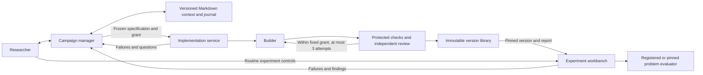

# Implementation service and campaign manager

This update separates implementing an algorithm from measuring its performance. The workbench consumes validated, immutable package versions. A shared local service owns implementation jobs, validation reports, runtime locks, and source artifacts. The campaign manager coordinates the two and keeps durable context across weeks of experiments.



## Run locally

The services share a local filesystem and run as the same trusted user. This is not a remote or multi-tenant execution service. Install the project with `uv sync --extra dev` and build the frontend with `npm --prefix frontend run build`. Linux bubblewrap, unprivileged user namespaces, `ldd`, `readelf`, and `ldconfig` are required for isolated package execution.

```bash
# Terminal 1: shared library. Model configuration is explicit, as for the workspace.
GRATING_LLM_PROVIDER=codex GRATING_LLM_ENABLED=true \
  uv run grating-implementations --directory runs/implementations --port 8766

# Terminal 2: point any local workspace at that library.
GRATING_IMPLEMENTATIONS_TOKEN_FILE="$PWD/runs/implementations/service.token" \
  uv run grating-lab --directory runs/workspace --port 8765
```

A user-systemd template is provided in `deploy/grating-implementations.service`; replace `@REPOSITORY@` with the checkout path before installing it. The current local deployment uses this unit and the default library directory.

Without an explicit directory, the library lives at `~/.local/share/grating-lab/implementations`. The implementation client defaults to `http://127.0.0.1:8766`; override `GRATING_IMPLEMENTATIONS_URL` when needed. Authentication uses the service's generated mode-0600 token file, read by the workspace server, never the browser. `GRATING_IMPLEMENTATIONS_TOKEN` is an alternative for the server process. Keep tokens out of campaign records and exports.

Model selection, activation, API prices, and subscription authentication use the existing workspace provider settings. There is no automatic paid-provider fallback. For a service without model calls, leave activation disabled; commissioning then reports the missing provider through the manager.

The service snapshots requested exact dependency versions from the installed environment, including their resolved dependencies and file hashes. Optional `--allow-wheel-downloads` permits acquisition of registry wheels with `uv`; source builds are prohibited. Missing wheels, native libraries, isolation, or evaluator capabilities remain explicit blockers. Native wheel dependencies are inspected with `readelf`, not executed by the host during inspection. Heavy ML runtimes may exceed the present sandbox's 4 GiB virtual-memory or 10-second operation limits and require a reviewed runtime/profile extension.

## Commission, validate, and reuse

1. Assign **Implementation compute cap (seconds)** in the charter. This is separate from experiment compute and physical validation reserves. The API dollar cap remains shared with manager reasoning.
2. Open an idea and choose **Request implementation**. Specify mechanism, acceptance criteria, evaluator capabilities, exact dependencies, supported parameters/schema, and job allocation. Importing a package can supply the first candidate instead of using the builder.
3. The service freezes behavior checks before candidate construction. It checks the declared candidate domain, seeded replay, checkpoint continuation, mechanism-specific cases, four bounded calls to the selected evaluator, and an independent model review against every criterion. A failed candidate can be repaired within the original grant and three-attempt limit.
4. A successful, still-current proposal receives the resulting version automatically. If the idea changed, the manager requests a binding decision. The library can attach that exact version to other campaigns and workspaces.
5. New experiments check current profile/evaluator identity and compatibility, then pin source, runtime identity, validation report, and evaluator code at enqueue. Package versions and schedules distinguish method groups in comparisons. Published versions do not silently replace previous trials or finalists.

`examples/implementation-reference/optimizer.py` is a small seeded NumPy one-bit search used to validate this infrastructure. It does not implement the Fourier, gradient, or adaptive portfolio proposals and makes no novel algorithm claim. Built-in methods retain their bundled regression validation and source identities. Legacy custom source retains its historical protocol-only verification; new runs use the package validation path.

Validation attests only to the declared scope and recorded checks. A semantic model review is fallible. There is no claim of general proof, convergence, empirical superiority, or independent electromagnetic solver agreement. Known physical conditions exposed during implementation development/validation follow the version into consuming campaigns; those conditions cannot become fresh confirmation evidence by copying the implementation.

The general framework also supports a distinct evaluator package kind, unresolved
problem declarations and immutable evaluator bindings. The
[evaluator commissioning guide](evaluator-commissioning.md) describes the current
browser workflow, independent fixture contract, typed commands and remaining
integration limits. Optimizer requests select their problem and exact evaluator
version; a proposal can remain a saved experiment draft until both are available.

## Durability and budgets

The service has its own SQLite queue, exclusive service lease, content-addressed artifact tree, and locked runtime tree. One job runs at a time. Workspace grants reserve resources before an idempotent POST; a lost response can be reconciled without duplicate work. Candidate, report, review, and usage checkpoints survive interruption. Successful attempts can finish publication without rebuilding after a crash.

Completed and failed jobs retain actual usage. An unobserved crash interval is conservatively charged within the fixed grant. Uncertain model calls enter `needs_reconciliation`; **Retain recorded usage and close** never replays them. Cancellation retains completed work and in-flight accounting. Long individual native/provider operations may finish at their bounded operation/transport boundary; the separate experiment stop channel remains available.

Revocation prevents new bindings and launches, including recovery attempts. Historical experiments keep their pinned artifacts and evidence; already running work retains its captured code and produces a manager issue. A changed evaluator (code or dependency versions), validation profile, package, or runtime requires fresh validation for new use.

The authenticated `POST /v1/versions/{id}/validations` endpoint accepts a `RevalidationRequest` naming the published version, an independent `checks` specification, a compute grant and an idempotency key. It makes no build or model call. API spend and model-call allowances are fixed at zero. Additional evaluator fixtures or optimizer behavior checks extend the retained check set; they cannot replace prior fixtures under the same name or conceal a counterexample. The old `JobRequest` envelope translates into this mechanical check path for compatibility. Corrected source or changed dependencies create a new executable version.

Reports are append-only and available at `GET /v1/versions/{id}/validations`. Failed rechecks block use, including when a later narrower request would otherwise pass. The workspace retains its own immutable record of when each executable evidence state became known. Confirmation and nomination reassessment consume that evidence without rewriting earlier observations, cutoff evidence or issued reports. Runtime availability affects new execution; losing an installation directory alone does not invalidate a historical measurement.

Back up the library database, `artifacts/`, and `runtimes/` together with workspace databases and trial directories. These backups preserve local recovery state. [Portable evidence bundles](evidence-bundles.md) provide a separate result/dependency transfer workflow.

## Local runtime resolution

New executable artifacts use schema 2. Their identities include source, frozen
specification, protocol and runtime content, but exclude installation locations.
The runtime pins the interpreter, platform/ABI, copied standard library,
dependency files and native libraries. Local bindings retain filesystem paths
and any loader aliases required by the operating system. The sandbox uses the
captured standard library; unexpected bytecode or changed dependency files fail
verification. Identical source and runtime content published in two directories
now produce the same executable identity.

In the implementation library, **Check local runtime** reports availability
independently of correctness evidence. **Resolve compatible runtime** uses the
shared `implementation.resolve_runtime` command to verify matching dependencies
already installed on the service. This operation does not call a model, download
dependencies, initialize candidate code, or replace validation reports. A damaged
installation is retained while a verified replacement receives a new local
binding. Before a prepared experiment launches or resumes, its operational
binding can be refreshed without rewriting its frozen bundle or specification.

Each explicit resolution has a durable operation and immutable receipt. The
workspace recovers an accepted receipt after a lost reply, including after later
campaign guidance, without repeating the operation. An interruption before the
receipt leaves elapsed work unknown. A mismatch remains unavailable and reaches
the campaign manager as one scoped issue. Intact source and historical evidence
remain inspectable when a local runtime binding is absent or damaged.

Legacy artifacts and runtime hashes remain unchanged and retain their existing
reader and execution path. Automatic conversion of legacy manifests with
embedded system paths is not implemented; relocating those runtimes requires an
explicitly verified converter. A matching schema-2 runtime can be resolved in a
new library directory. The [bundle workflow](evidence-bundles.md) stages and
publishes its source, reports and historical production receipts separately;
imported versions require local revalidation before new use.

## API boundaries

| Owner | Interface | Purpose |
|---|---|---|
| Workspace | `GET /api/state` | Backend readiness, manager context/issues/inbox, usage and cached library |
| Workspace | `POST /api/v1/commands` | Revision-checked, idempotent optimizer/evaluator commission, attachment and control; draft save/launch |
| Workspace | `GET /api/v1/evaluator-contracts` | Evaluator manifest, specification and package schemas |
| Workspace | `POST /api/hypotheses/{id}/implementation_jobs` | Reserve campaign grant and commission build/import |
| Workspace | `POST /api/hypotheses/{id}/implementation` | Attach an exact validated version |
| Workspace | `POST /api/implementation_jobs/{id}/control` | Cancel, resume eligible work, or close uncertain usage |
| Workspace | `GET /api/implementations` | Refresh shared version metadata |
| Workspace | `GET /api/v1/implementations/{id}/runtime?campaign_id=…` | Inspect local runtime availability, pending operations and resolution receipts |
| Workspace | `POST /api/manager/messages` | Durable serialized manager request; `/api/research` remains compatible |
| Workspace | `GET/PUT /api/campaigns/{id}/manager/context` | Inspect or compare-and-save guidance |
| Workspace | `GET /api/campaigns/{id}/manager/context/history` | Inspect revision history |
| Workspace | `POST /api/manager/issues/{id}/resolve` | Record resolution or deferral |
| Library | `POST /v1/jobs`, `GET /v1/jobs/{id}` | Idempotent service jobs and full attempt records |
| Library | `GET /v1/versions`, `GET /v1/versions/{id}/artifact` | Library metadata and verified artifacts |
| Library | `POST /v1/versions/{id}/validations`, `/revoke` | Revalidate exact source or withdraw a version |
| Library | `GET /v1/versions/{id}/runtime`, `POST /v1/versions/{id}/runtime/resolve` | Inspect availability or explicitly resolve exact installed runtime content |
| Library | `GET /v1/runtime-resolutions?workspace_id=…&idempotency_key=…` | Recover a previously accepted resolution receipt |
| Library | `GET /v1/events?after=…` | Ascending, cursor-based durable event stream |

## Existing workspace migration

The migration is additive. It does not rewrite campaigns, trials, hypotheses, messages, historical verification claims, or frozen protocols. Existing implementation compute defaults to zero. A dry run uses SQLite backup to copy a live database consistently and verifies historical record digests on that copy:

```bash
uv run python -m dqn_meent.workspace.migrate_manager \
  --directory runs/workspace --report /tmp/manager-migration.json

# Stop the workspace HTTP supervisor first; the migration requires its lease.
uv run python -m dqn_meent.workspace.migrate_manager \
  --directory runs/workspace --apply \
  --backup runs/backups/workspace-before-manager.sqlite3
```

Retain the database backup and old trial/library artifacts when rolling back application code. Manager projections are rebuildable from canonical SQLite records. Direct edits to projection files are not imported: use the versioned UI or context API to change guidance.

## Verification

`tests/test_implementation_service.py` exercises a real isolated NumPy package, a deliberately incorrect first candidate and bounded repair, MEENT validation, tamper refusal, reuse in two workspaces, exact continuation, revocation, cancellation, and interrupted accounting. `tests/test_campaign_manager.py` exercises thousands of events, retrieval after 150 messages and a restart, locked/derived evidence filtering, deduplicated issues, serialized requests, revision conflicts, and additive migration. Existing optimizer regression tests cover all seven built-ins.

The browser suite covers explanatory missing states, bounded commissioning, version selection, editable memory/history, and issue deferral through the manager. A separate disposable live workspace exercises real browser/API/worker controls; live model inference is a separately bounded acceptance check.
