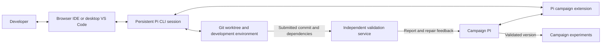

# Full Pi implementation workspace

Date: 2026-09-29
Status: Workspace and campaign integration deployed; H12 pilot active. Independent H12 validation awaits a submitted revision and a new authorized allocation.

The browser IDE is available through the existing TailNet route at
`http://strixhalo.tail096b61.ts.net:8765`. In the campaign's PI panel, select
**Implementation workspaces** and open the H12 workspace. The integrated
terminal attaches to its persistent native Pi session. This HTTP address is
limited to TailNet peers and encrypted by Tailscale transport; the browser does
not treat it as an HTTPS secure context, so clipboard and other secure-context
browser APIs may be limited. A dedicated HTTPS Serve port could not be added
without the host's Tailscale operator privilege; the existing routes were left
unchanged.

The deployed H12 pilot is `development_e4aca459d1412391863fcc78`, backed by
an isolated Docker worktree, Pi session, source editor, Git view, and development
terminal. Its host command receipts, questions, checkpoints, source submissions,
and usage are durable campaign records. The `campaign_submit` tool captures an
exact commit; no workspace edit can silently alter its submitted package. A
separate service performs protected validation under a numerical grant. The
existing 300-second implementation allocation remains fully committed by two
earlier blocked attempts, so no new validation grant was opened for this pilot.

The protected service now exposes H12 diagnostic fixtures for programmatic
full-mask Fourier decoding at all four modes, actual reconstructed covariance
spectral correction including the 5.475 counterexample, and checkpoint replay
with equal-score observations and changed evaluator contexts. A candidate
implements `diagnostic(operation, payload)` on `optimizer_v1`; the service owns
the fixture inputs and independent oracles. These checks establish scoped
correctness, not decoder parity with the released FLRL code or optimization
effectiveness. The coding session must submit a package and the PI must freeze
the full scientific validation plan before a new grant is requested.

Use **code-server with the original Pi CLI in a persistent terminal**, connected
to the campaign through a Pi extension. Provide desktop VS Code over SSH as an
alternative entrance to the same development workspace.

The unit of implementation is a full, persistent Pi coding session. The interface
includes how the developer and agents collaborate, how the PI delegates and
supervises work, and how agents use development tools. An editor alone does not
provide these capabilities.

## Problem and current limitations

Implementing a proposed optimizer can require substantial programming: reading
the paper and reference repositories, designing several modules, installing
dependencies, debugging, testing numerical behavior, and repairing failures over
many exchanges. The implementation worker must support that complete workflow.

The current integration constrains that work:

- [The Pi runtime](../agent-harness/src/runtime.ts) supplies only application
  tools and disables normal discovery of extensions, skills, prompts, and project
  instructions.
- [Implementation tools](../src/optimization_framework/agents/tools.py) expose
  a restricted file interface and a Python-only `workspace_run` operation capped
  at 30 seconds, with network access disabled.
- [The implementation adapter](../src/optimization_framework/agents/implementation.py)
  applies a grant deadline across the development exchange, including model and
  transport waits. A persistent session can outlive that exchange, but the job
  still exits when its deadline expires.
- A blocked host prerequisite can repeatedly return the user to a request for
  action without giving the implementation agent a usable development workspace.

These are limitations of our integration. The new implementation runtime must
restore the normal Pi coding workflow while preserving campaign accounting and
independent validation.

## Environment and access

Run code-server on strixhalo and expose it through authenticated TailNet access,
preferably HTTPS. Open the actual Pi CLI in a `tmux` session from its integrated
terminal. The developer can use the file editor, Git diff view, terminal, and
debugger alongside Pi's native interface. Closing the browser must not terminate
the coding session or its supervised development processes.

Each implementation gets a dedicated Git worktree, branch, development
environment, and Pi session. Desktop VS Code over SSH can open the same worktree
and attach to the same terminal session.

Provide an **Open implementation workspace** action in the campaign. It should
open the correct worktree and make the existing Pi session easy to attach to.
The Research notebook remains the place for campaign direction, task status,
questions, and results.

## Required interfaces

| Connection | Capabilities |
|---|---|
| Developer ↔ implementation agent | Supply instructions and context; inspect messages, tool calls, command output, and diffs; answer questions; steer ongoing work; interrupt, resume, and edit files. |
| PI ↔ implementation agent | Delegate a task with acceptance criteria; provide evidence and repository references; send corrections; receive progress, blockers, checkpoints, and submitted revisions. |
| Implementation agent ↔ development environment | Use normal Pi file and shell tools, Git, dependency installation, tests, debugging commands, long-running processes, project instructions, and skills. |
| Implementation ↔ validation service | Submit an exact revision and dependency identity; receive validation results; repair failures and submit a new revision. |

The developer must be able to discuss implementation decisions with the agent
throughout the task. A final-result form or a sequence of short script requests
does not satisfy this requirement.

## Session ownership and campaign integration

One process owns each active Pi session. The terminal, campaign extension, and
developer controls interact with that owner. Reattachment must preserve the
session identity; it must not start a second CLI or SDK process writing the same
active session file.

Use a small Pi extension with authenticated local communication to deliver PI
assignments and publish progress and results. Campaign control should use
structured messages and lifecycle events. Terminal screen scraping and injected
keystrokes are unsuitable as the control protocol.

The initial application contract should support these operations; the names
below are proposed application operations, not existing Pi API names:

| Operation | Behavior |
|---|---|
| Create or attach | Resolve an implementation identity to its worktree, session, and current state; repeated requests return the existing assignment. |
| Send instruction | Record sender, task revision, referenced artifacts, and delivery identity; distinguish acceptance from completion. |
| Steer or follow up | Apply a correction at the next supported interruption boundary, or queue work after the current run. |
| Pause, resume, or stop | Acknowledge the requested control and report when execution actually stops; retain files, history, and accounting. |
| Read events | Replay messages, tool activity, questions, state changes, and results from a durable cursor after reconnecting. |
| Submit revision | Record an immutable commit, dependency manifest, development test results, and unresolved limitations for validation. |

Show the author and delivery state of each instruction. Explicit developer
direction takes precedence over conflicting PI guidance, and the PI receives the
updated direction. Questions need a visible reply action in the campaign and
the session, with one durable answer record shared by both.

Control messages require idempotent receipts and a single session owner. A lost
HTTP response must be reconciled before repeating an assignment, command, or
validation request. A prompt acknowledgment is not evidence that work finished.

If a dedicated web conversation interface is introduced later, use Pi's RPC or
SDK with the complete coding capabilities and session controls. Verify parity
with the pinned Pi version, including extension dialogs and terminal-dependent
features, before replacing the native CLI interface.

## Context, persistence, and collaboration

Keep the specification, references, development journal, decisions, and next
steps in durable files and campaign artifacts. Store large command outputs as
files with references. Pi can retrieve relevant material as needed and compact
its conversation without discarding the underlying work.

Each delegated programming task gets its own focused session and worktree. The
PI receives progress summaries, blockers, artifact references, and commits. It
does not need every specialist's full transcript in its active context.

Browser reconnects should reattach to the live process. After a process or host
restart, recover the saved Pi session and workspace, reconcile any interrupted
commands, and resume from the last known state. Persistent history alone does
not make an interrupted command safe to replay.

Both the developer and agent can edit the workspace. The agent must reread files
that changed externally before applying further edits and preserve intervening
developer changes.

## Permissions and validation

Authorize ordinary development operations within a dedicated development account
or container: workspace edits, shell commands, dependency installation into its
environment, Git operations within the assigned scope, and development tests.
Provide the network access needed for approved sources, package acquisition, and
the configured model provider. Routine operations within that scope should not
produce repeated permission questions.

A Git worktree separates edits; operating-system permissions or container mounts
must enforce access boundaries. The builder must not be able to alter protected
validation fixtures or access unrelated personal files, service credentials, or
reviewer sessions. Provision the model authentication it needs without exposing
credentials through campaign artifacts or browser responses.

Preserve the independent validation service. Validate the submitted commit and
captured dependencies in a clean execution environment; development test results
are useful evidence but do not establish protected validation or effectiveness.
Repairs create new revisions, and campaign experiments pin the resulting
validated version.

The existing bubblewrap/AppArmor issue remains a separate validation prerequisite
until a successful capability check establishes availability. Opening a coding
workspace must not mark it resolved. Record an unavailable capability as one
persistent blocker, distinguish authorization from an action still required on
the host, and recheck it when appropriate. Resume eligible work after recovery
under the existing authorization.

## Budgets and graceful stopping

Separate session lifetime from resource consumption. A programming session may
span hours, reconnects, context compactions, and many developer–agent exchanges.
Track model usage, development execution, and simulator/validation execution
separately, with clearly stated units and applicable allocations.

Do not carry the current 30-second script interface or the implementation grant's
single wall deadline into the new development session contract. Long-running
commands need supervision, cancellation, observable output, and explicit resource
limits appropriate to the operation.

Approaching an allocation limit should trigger a checkpoint, a description of
unfinished work, and a pause of the affected execution. Preserve the session and
workspace so work can resume after an authorized allocation change. Budget limits
must still be enforced; graceful stopping does not permit unaccounted execution.

Migration must preserve existing usage and grants. Define the new accounting
semantics explicitly and reconcile outstanding grants before using them with the
new runtime. Do not silently increase or reinterpret an existing allocation.

## H12 pilot workflow

1. Resolve H12 to its recorded hypothesis and current specification, including
   applicable errata. Preserve exact identifiers and reference the saved evidence.
2. Create its worktree, branch, environment, and persistent Pi session. Supply the
   specification, relevant paper and FLRL references, MEENT evaluator contract,
   development checks, and acceptance criteria.
3. Let Pi implement and debug the method using normal coding tools. The developer
   can open the workspace, inspect changes, discuss decisions, and steer the same
   agent while the PI receives progress and blockers.
4. Submit a concrete commit and dependency manifest to independent validation
   when its required capabilities and allocation are available.
5. Return actionable failures to the development session. Retain each submitted
   revision and report; repeat within authorized resources.
6. Attach a successfully validated version to H12 and make it available for
   campaign experiments. Keep correctness and measured optimization performance
   as separate claims.

## Delivery phases and acceptance

1. **Workspace foundation.** Provision browser access, worktrees, the development
   environment, native Pi sessions, and campaign links. Demonstrate real file
   edits, a shell command, dependency installation, a long-running development
   command, and reattachment after closing the browser.
2. **Developer and PI interaction.** Add the extension and durable control/event
   interface. Demonstrate mid-task steering, follow-up messages, question replies,
   pause/resume, and reconnect replay. A retry must not create duplicate work.
3. **Recovery and accounting.** Separate resource accounting from session lifetime.
   Demonstrate checkpointing at a resource limit, process restart recovery,
   compaction with saved context retrieval, and capability recovery without a
   repeated permission loop.
4. **Validation and campaign handoff.** Submit immutable revisions to the existing
   validation service, return failures, and bind successful versions. Demonstrate
   that later workspace edits cannot change a submitted revision or its report.
5. **H12 pilot.** Carry its saved assignment through development and validation,
   documenting any remaining scientific or operational blockers. The pilot must
   exercise the actual developer–agent workflow and campaign handoff.

Roll out the new implementation session path behind a configuration switch.
Preserve existing sessions, artifacts, grants, and validation records. A rollback
stops new launches through the new path while retaining its worktrees and history
for inspection or later continuation.

## References

- [Current Pi campaign runtime](pi-agent-harness.md)
- [Current implementation service and validation contracts](implementation-service.md)
- [code-server: browser access to a server-hosted VS Code environment](https://coder.com/docs/code-server)
- [VS Code Remote SSH: remote development, terminals, and debugging](https://code.visualstudio.com/docs/remote/ssh)
