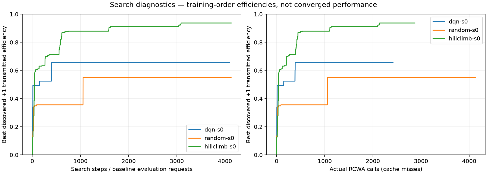
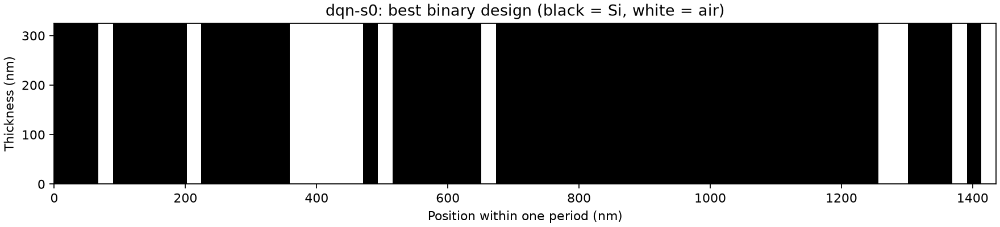

# Validation of the delivered DQN–MEENT setup

This validates an executable framework and the forward-physics mapping. It does not establish a reproduction of the paper's optimization performance or general DQN superiority.

## Executed environment and tests

- Linux, Python 3.12.14, CPU execution.
- MEENT 0.13.2; PyTorch 2.14.0; Gymnasium 1.3.0; NumPy 2.5.3; SciPy 1.18.1.
- `uv sync --frozen --extra dev` succeeded in a clean project virtual environment.
- **26 tests passed**, including independent uniform-interface and uniform-slab Fresnel formulas, lossless energy conservation, reflection symmetry and translation invariance, passive complex silicon, Green-table units/range, cache accounting, no aliasing of environment outputs, the observed horizon and terminal mask, telescoping difference rewards, Double DQN action-selection/evaluation separation, and exact CPU interruption/resume.
- All CLI paths were exercised: training, both baselines, higher-order and greedy-policy evaluation, design rendering, and comparison plotting.
- Exact package versions and source commit identifiers are in `environment.json`. Runtime timestamps come from the execution environment.

Re-run the tests with:

```bash
OPENBLAS_NUM_THREADS=1 OMP_NUM_THREADS=1 uv run pytest -q
```

## Independent published-design check

The authors' unchanged 64-cell reference design is in `tests/fixtures/`, with source attribution and their MIT license. It was converted from the authors' ±1 representation to binary 0/1 before simulation. This fixture was **never injected into training or replay**.

| Maximum Fourier order | Retained harmonics | MEENT +1 efficiency |
|---:|---:|---:|
| 15 | 31 | 98.2168% |
| 31 | 63 | 98.4875% |
| 40 | 81 | 98.4847% |
| 50 | 101 | 98.4240% |
| 65 | 131 | 98.4166% |

The authors label this design 98.4%. Agreement verifies the substrate-to-air orientation, target-order extraction and material setup. At F=40, R+T differs from unity by about 3e-14; the mirrored pattern swaps +1 and -1 efficiencies. This is a regression against a published design, **not** a new optimization result. Raw order-resolved data are in `examples/reference-design/evaluation.json`.

## New 64-cell training run

`configs/validation64.json` uses the paper's 1100 nm / 50-degree geometry, real silicon n=3.551726470588235, 325 nm height, and Fourier order 40. The Double DQN run executed **4096 actions, 32 episodes and 3585 optimizer updates**, with seed 0. It made 4128 forward-evaluation requests including initial/reset states. Both baselines were given 4128 requests.

| Search, seed 0 | Evaluation requests | Actual RCWA calls | Best at F=40 | Rechecked at F=80 |
|---|---:|---:|---:|---:|
| Double DQN | 4,128 | 2,419 | 65.5840% | 65.5593% |
| Uniform random | 4,128 | 4,128 | 55.1233% | 55.2701% |
| Restart hill climbing | 4,128 | 2,871 | 93.6891% | 93.6436% |

These are best-discovered designs from one seed and a short budget. Actual solver calls differ because repeated designs hit each run's own exact-design cache. **Hill climbing was substantially better than this short DQN run.** DQN exceeded uniform random in this run, but one seed does not support a general ranking. Request counts are matched; actual solver calls and wall-clock budgets are not matched.

The final deterministic DQN policy reached a best efficiency of **21.4393%** during a fresh all-Si rollout and ended at **2.3710%** (F=40). Its best rollout design evaluates to **21.4290%** at F=80. Thus the 65.56% design found during exploratory training is not reliably regenerated by the final greedy policy. The package explicitly reports both outcomes; additional learning and tuning are needed.

The four-order check (F=40,50,65,80) passes the implemented last-two-order tolerance for all three saved winners. Passing this diagnostic is not an independent-solver validation.





### Reproduce the new run

Use new output directories; supplied examples are retained evidence.

```bash
uv run dqn-meent train --config configs/validation64.json --output runs/validation64/dqn-s0
uv run dqn-meent baseline --config configs/validation64.json --output runs/validation64/random-s0 --method random --budget 4128 --seed 0
uv run dqn-meent baseline --config configs/validation64.json --output runs/validation64/hillclimb-s0 --method hillclimb --budget 4128 --seed 0
uv run dqn-meent evaluate --run runs/validation64/dqn-s0 --orders 40 50 65 80
uv run dqn-meent evaluate --run runs/validation64/random-s0 --orders 40 50 65 80
uv run dqn-meent evaluate --run runs/validation64/hillclimb-s0 --orders 40 50 65 80
```

CPU checkpoint-resume equivalence is tested within one environment; bitwise equivalence across BLAS, operating systems or different hardware is not claimed. Runs overlapped in this shared execution environment, and an initial BLAS-thread configuration issue was fixed during validation. Two interrupted baseline attempts were discarded and completed fresh after that fix. The archived DQN run predates the thread-control fix. Its physics/learning settings are unchanged; only thread control changed. Timings in the logs are provenance, not controlled performance measurements.

## Smoke test and Fourier-truncation warning

The 16-cell, F=5 smoke run performed 256 actions and 225 optimizer updates. Its purpose is integration testing. The best smoke random-search candidate fell from 64.61% at F=5 to 3.25% at F=40; its coarse reward was misleading despite energy conservation. This is direct evidence that saving the best training reward alone is insufficient. The DQN smoke candidate happened to be more stable (62.13% at F=5, 62.04% at F=40), which does not make F=5 reliable in general.

All smoke CSVs, designs, checkpoint and reevaluations are under `examples/validated-smoke/`.

## Remaining research work

1. Run multiple seeds and tune against fixed actual-solver or wall-clock budgets, preserving the distinction between discovery and policy quality.
2. Increase the learning budget; compare DQN, Double DQN and reward choices one change at a time. Defaults are a tested starting point, not optimized hyperparameters.
3. Check Fourier convergence for several top candidates, not just the low-order winner; a different candidate may rank higher after reevaluation.
4. Cross-check final devices with an independent EM solver and quantify sensitivity to fabrication/material variation before claiming physical robustness.
5. Train separate wavelength/angle cases with appropriate material dispersion. Conditional policies and transfer learning are future extensions, not implemented claims.

## Paper2Agent trial

Paper2Agent preparation, extraction of all seven pages, and review-aid generation succeeded. Its output remained `needs_agent_review`; no fully verified reading skill or MCP server was claimed. See `paper2agent-assessment.md` for exact commands, versions and limitations. The implemented training framework runs without Paper2Agent or an LLM service.
